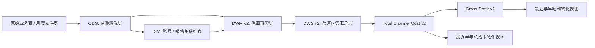
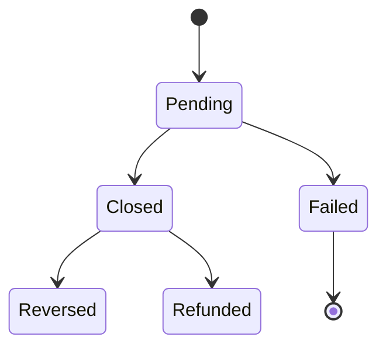
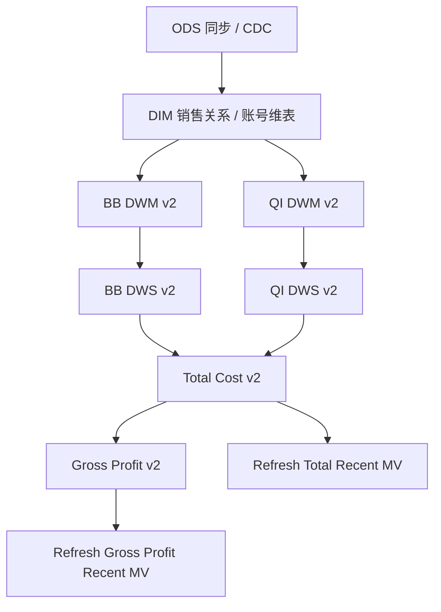

# Quantum V2 渠道成本数据流转与状态一致性设计

## 摘要

本方案定义 BB、QI 渠道成本 v2 的完整数据链路：从原始业务数据进入 ODS，再经过 DWM 明细层沉淀统一业务口径，最后进入 DWS 日/月汇总层，并继续供总渠道成本与毛利链路使用。

本次设计重点解决四类问题：

- BB、QI 不再落旧的 `dws_bb_card_finance_daily_p`、`dws_qi_card_finance_daily_p`，统一落 v2 表。
- DWM 与 DWS 需要显式处理状态机流转，例如 QI 的 `Pending -> Closed`、`Pending -> Failed`，避免历史状态残留。
- DWS 的 batch/cdc 均采用“识别影响范围 -> 删除目标范围 -> 从 DWM 重算插入”的幂等回刷模式，保证一致性。
- 总渠道成本和毛利层保留全量事实表，同时提供最近半年的物化视图用于查询加速。

## 背景

现有 `flink/quantum-v2` 已经开始拆 BB、QI 的 v2 脚本，但仍存在几个不稳定点：

- BB、QI 的部分 v2 脚本文件名已经带 `v2`，实际 sink 仍指向旧 DWS 表。
- QI 交易状态存在后续流转，`Pending` 可能变成 `Closed`，也可能变成 `Failed`。如果只做追加，DWS 会保留错误成本。
- BB 的授权月表 `bb_card_auth_detail_yyyy-mm` 到数时间不固定，且活跃卡费必须按月去重，不能按日去重后累加。
- 总渠道成本与毛利当前更偏向批量落表，后续查询会变大，需要区分“全量事实存储”和“最近窗口查询加速”。

## 目标

- 梳理 BB、QI 从原始数据到 `ods -> dim -> dwm -> dws` 的完整链路。
- 为 BB、QI 建立 v2 DWM/DWS 表，不再写旧 DWS 表。
- 明确状态机流转、软删除、硬删除、迟到数据的处理方式。
- 明确 batch/cdc 两套脚本的职责边界。
- 明确总渠道成本与毛利 v2 的表、视图、物化视图改造方向。

## 非目标

- 本方案不直接修改 BI 月度分析 SQL，例如 `bi_month/BB客户成本-202606.sql`、`bi_month/QI客户毛利2026-06.sql`。
- 本方案不继续推进 `ods_account_fee` 作为 QI 系数来源。QI 系数仍回到 `ods_bi_month_tag`。
- 本方案不改变 SL 现有 DWS 表结构，除非后续单独评审 SL v2。
- 本方案不把物化视图作为唯一事实来源。物化视图只做最近窗口查询加速。

## 总体数据流

核心原则：

- ODS 保留贴源事实和软删除信息。
- DIM 统一账号属性与销售关系。
- DWM 是状态归一后的明细事实层，记录当前有效状态和必要追踪字段。
- DWS 不做状态增量加减，统一按影响范围重算。
- Total/Gross 保留全量结果，MV 只加速最近半年查询。

## BB 数据链路

### 原始与 ODS 来源

BB 客户成本涉及以下来源：

| 业务来源 | ODS / DIM 目标 | 用途 |
|---|---|---|
| `account` | `dim_account` | 账号维度、账号类型、系统类型 |
| `salesAccountRelation` | `ods_sales_account_relation`、`dim_sale_account_relation_p` | 销售、AM 归属 |
| `user` | `ods_user` | 用户辅助维度 |
| `accountExtend` | `ods_account_extend` | 账号扩展属性 |
| `caas_open_api_extend` | ODS 对应表 | CAAS / API 扩展属性 |
| `quantum_card_transaction_extend` | `ods_quantum_card_transaction_extend` | 卡交易扩展属性 |
| `qbitCard` | `ods_qbit_card` | 卡信息、卡组织、卡主体 |
| `qbitCardSettlement` | `ods_qbit_card_settlement` | BB 清算金额与清算状态 |
| `bb_card_auth_detail_yyyy-mm` | DWM Auth v2 脚本读取月表 | Decline、AC Decline、Active Card |

### DWM 明细层

BB 保留两类 DWM v2 明细：

- `dwm.dwm_bb_card_transaction_detail_v2_p`
- `dwm.dwm_bb_card_auth_detail_v2_p`

`dwm_bb_card_transaction_detail_v2_p` 用于沉淀交易与清算口径：

- 粒度：交易 / 清算明细。
- 关键字段：`txn_id`、`settlement_id`、`source_id`、`card_transaction_id`、`account_id`、`card_id`、`transaction_time`、`business_type`、`billing_amount`、`settlement_post_date`、`settlement_txn_date`、`sale_id`、`am_id`。
- 状态字段：`is_valid_settle`、`is_clearing`、`is_reversal`、`is_refund`、`delete_time`。

`dwm_bb_card_auth_detail_v2_p` 用于沉淀授权月表口径：

- 粒度：授权流水。
- 关键字段：`auth_txn_guid`、`card_proxy`、`account_id`、`card_id`、`auth_time`、`response_code`、`reason_code`、`request_code`、`txn_amount`、`settle_amount`。
- 口径字段：`is_decline`、`is_account_verification`、`is_excluded_request`、`is_dom`。
- `source_table` 记录来源月表名，方便追溯迟到月表。

### DWS 汇总层

新增 v2 表：

- `dws.dws_bb_card_finance_daily_v2_p`

BB DWS 建议沿用现有旧表的业务字段集合，但 sink 改为 v2 表，避免影响生产旧模块。

BB DWS 粒度：

- `report_date`
- `account_id`
- `sale_id`
- `am_id`

BB 的活跃卡费有特殊约束：

- 活跃卡必须按月去重，不能按日去重后累加。
- 结果可以只落在当月 1 号的 `report_date`。
- 如果 `bb_card_auth_detail_yyyy-mm` 对应月表不存在，Decline、AC Decline、Active Card 相关字段按 0 处理。
- 如果月表后续迟到，需要 CDC/回刷脚本识别对应月份并重算当月。

## QI 数据链路

### 原始与 ODS 来源

QI 客户毛利涉及以下来源：

| 业务来源 | ODS / DIM 目标 | 用途 |
|---|---|---|
| `account` | `dim_account` | 账号维度、账号类型、系统类型 |
| `salesAccountRelation` | `ods_sales_account_relation`、`dim_sale_account_relation_p` | 销售、AM 归属 |
| `user` | `ods_user` | 用户辅助维度 |
| `accountExtend` | `ods_account_extend` | 账号扩展属性 |
| `caas_open_api_extend` | ODS 对应表 | CAAS / API 扩展属性 |
| `qbit_card_transaction` | `ods_qbit_card_transaction` | QI 卡交易主事实 |
| `quantum_card_transaction_extend` | `ods_quantum_card_transaction_extend` | 特殊码、地区、扩展标签 |
| `api_client_bill` | `ods_api_client_bill` | API 账单 |
| `api_client_bill_statement` | `ods_api_client_bill_statement` | API 账单 statement |
| `Transaction` | `ods_transaction` | 交易辅助事实 |
| `qbitCard` | `ods_qbit_card` | 卡信息 |
| `qbitCardWalletTransaction` | `ods_qbit_card_wallet_transaction` | 钱包交易辅助事实 |

### DWM 明细层

新增 v2 表：

- `dwm.dwm_qi_card_transaction_detail_v2_p`

QI DWM v2 基于现有 `dwm_qi_card_transaction_detail_p` 扩展并改名，不再复用旧表。

QI DWM v2 粒度：

- 每一笔卡交易明细。

关键字段：

- `transaction_id`
- `account_id`
- `transaction_time`
- `business_type`
- `status`
- `billing_amount`
- `card_id`
- `sale_id`
- `am_id`
- `is_qbit_provision`
- `is_hk_region`
- `is_consumption`
- `is_reversal_or_credit`
- `has_special_code`
- `is_vip_account`

状态追踪字段建议增加：

- `source_update_time`：来源记录更新时间。
- `source_delete_time`：来源记录删除时间。
- `is_current_valid`：当前是否仍可参与 DWS 计算。

`is_current_valid` 的建议规则：

- `delete_time IS NULL`
- 且状态属于当前口径允许集合。
- 具体成本公式仍按 BI 口径判断 `status IN ('Closed', 'Pending')`，但 DWM 要保留完整状态，方便 `Pending -> Failed` 后触发重算。

### DWS 汇总层

新增 v2 表：

- `dws.dws_qi_card_finance_daily_v2_p`

QI DWS 粒度：

- `report_date`
- `account_id`
- `sale_id`
- `am_id`

QI DWS 需要保留成本和返现计算所需的基数、系数、结果字段。

建议字段分组：

- 成本基数：`cost_reimbursement_base_amt`、`cost_service_base_amt`、`cost_acs_regular_base_cnt`、`cost_acs_vip_base_cnt`、`cost_vrm_base_cnt`
- 返现基数：`rebate_interchange_base_amt`、`rebate_incentive_base_amt`
- 成本系数：`cost_reimbursement_rate`、`cost_service_rate`、`cost_acs_regular_rate`、`cost_acs_vip_rate`、`cost_vrm_rate`
- 返现系数：`rebate_interchange_rate`、`rebate_incentive_rate`
- 计算中间量：`cost_reimbursement_vol`、`cost_service_vol`、`cost_acs_regular_count`、`cost_acs_vip_count`、`cost_vrm_count`、`rebate_interchange_vol`、`rebate_incentive_vol`
- 固定成本：`cost_fixed_fee`

QI 系数来源：

- 使用 `ods_bi_month_tag`。
- tag 命名需要业务可读，不使用 `QI_COST_RATE_A` 这类不可解释命名。
- 建议命名：
  - `QI_COST_REIMBURSEMENT_RATE`
  - `QI_COST_SERVICE_RATE`
  - `QI_COST_ACS_REGULAR_RATE`
  - `QI_COST_ACS_VIP_RATE`
  - `QI_COST_VRM_RATE`
  - `QI_REBATE_INTERCHANGE_RATE`
  - `QI_REBATE_INCENTIVE_RATE`

固定成本来源：

- 继续从 `ods_bi_month_tag` 独立取数。
- 固定成本建议允许独立回刷，不强绑主干交易 CDC。

## 状态机流转设计

### 需要处理的状态变化

QI 的重点状态流转：

成本口径特点：

- `Pending` 和 `Closed` 在当前 BI 口径中都可能参与计算。
- `Pending -> Closed` 多数情况下仍可参与计算，但金额、扩展属性可能变化，需要重算。
- `Pending -> Failed` 必须从 DWS 中移除之前的影响。
- `Closed -> Reversed/Refunded` 需要按业务类型和金额正负规则重算。

BB 的重点状态：

- 清算是否有效。
- reversal/refund 是否需要抵减。
- 授权月表是否迟到或缺失。
- 活跃卡按月去重，而不是按日累加。

### 状态一致性原则

DWM 层保存“当前状态事实”，DWS 层不做局部增量修补。

统一策略：

1. CDC 或 batch 先更新 DWM 当前事实。
2. 根据 DWM 变化识别受影响月份。
3. 删除 DWS v2 中受影响月份和渠道的数据。
4. 从 DWM v2 重新聚合插入 DWS v2。

这样可以同时覆盖：

- 状态从有效变无效。
- 状态从无效变有效。
- 金额或维度字段变化。
- 软删除。
- 迟到数据。

## 软删除与硬删除

### 软删除

软删除来源字段进入 DWM：

- DWM 保留 `delete_time` 或 `source_delete_time`。
- DWS 聚合时排除已删除数据。
- CDC 发现删除变化后按月份重算。

### 硬删除

硬删除无法只靠单条 CDC 事件稳定感知，需要补充对账式检测。

建议策略：

- DWM 保留来源主键快照。
- 定期对 ODS 当前有效主键与 DWM 当前有效主键做差异检测。
- 对差异记录标记为 `source_delete_time = CURRENT_TIMESTAMP` 或进入待回刷影响月份表。
- DWS 再按影响月份删除重算。

对硬删除，不能依赖目标表和原始表简单按金额对比，因为同月同账号可能多笔金额相同。应以来源主键为准。

## Batch 与 CDC 脚本职责

### Batch

Batch 用于定向回刷。

参数：

- `start_time`
- `end_time`

含义：

- 对 DWM 明细脚本，按业务时间或来源更新时间选择回刷窗口，具体由脚本职责定义。
- 对 DWS 汇总脚本，建议按 `ods_bi_month_tag.update_time` 或 DWM `update_time` 找到影响月份，再删除重算。

执行模式：

1. 计算受影响月份。
2. 删除目标 v2 表对应月份。
3. 从 DWM v2 或 ODS 重新计算。
4. 插入目标 v2 表。

### CDC

CDC 用于日常调度。

默认逻辑：

- 不要求传参。
- 默认扫描昨天的变化窗口。
- 对 QI/BB 主干交易，变化来源应优先来自 DWM/ODS 的 `update_time`。
- 对 `ods_bi_month_tag` 系数和固定成本，变化来源来自 `ods_bi_month_tag.update_time`。

CDC 不应该只追加结果，必须同样走删除重算。

### 固定成本

固定成本属于月度配置，和交易主干状态不是同一种变化源。

建议拆分：

- 主干 DWS CDC：处理交易、清算、授权等业务事实变化。
- 固定成本 CDC：处理 `ods_bi_month_tag.update_time` 变化，识别月份后重算对应 DWS 月份。

如果工程上希望减少任务数量，也可以在 DWS CDC 中合并两个影响月份来源，但 SQL 结构必须清晰区分：

- `changed_fact_months`
- `changed_config_months`
- `affected_months = UNION DISTINCT`

## 总渠道成本 v2

新增全量表：

- `dws.dws_total_channel_cost_daily_v2_p`

新增逻辑视图：

- `dws.vw_total_channel_cost_daily_v2`

新增最近半年物化视图：

- `dws.mv_total_channel_cost_daily_recent_v2`

设计原则：

- 全量表保存完整历史，是事实来源。
- 逻辑视图统一读取 BB/QI v2、SL 当前表、金融渠道成本等来源。
- 最近半年 MV 只服务查询加速，不承载历史事实。
- MV 窗口为最近 6 个月，按 `report_date >= date_trunc('month', CURRENT_DATE) - interval '5 months'` 或数据库兼容写法实现。

总成本 v2 来源：

- `dws_bb_card_finance_daily_v2_p`
- `dws_qi_card_finance_daily_v2_p`
- `dws_sl_card_finance_daily_p`
- `dwm_finance_channel_cost_p`

## 毛利 v2

新增全量表：

- `dws.dws_gross_profit_daily_v2_p`

新增逻辑视图：

- `dws.vw_gross_profit_daily_v2`

新增最近半年物化视图：

- `dws.mv_gross_profit_daily_recent_v2`

设计原则：

- 毛利全量表仍然保留全历史结果。
- 毛利计算读取 `dws_total_channel_cost_daily_v2_p` 或 `vw_total_channel_cost_daily_v2`。
- 最近半年 MV 用于看板或常用查询加速。
- 不建议让毛利只依赖 MV，否则半年以前历史查询会丢数据。

## 一致性校验

### ODS 到 DWM

按月校验：

- 来源记录数 vs DWM 明细数。
- 来源主键数 vs DWM source key 数。
- 有效金额汇总 vs DWM 金额汇总。
- 软删除记录数。
- DWM 中存在但 ODS 当前不存在的主键数，用于发现硬删除。

### DWM 到 DWS

按月、账号、销售、AM 校验：

- DWM 可计算明细金额 vs DWS 基数。
- DWM 状态分布 vs DWS 有效状态口径。
- BB 活跃卡 `COUNT(DISTINCT card_proxy/card_id)` vs DWS 月初 1 号活跃卡字段。
- QI `Pending/Closed/Failed` 状态变化后，DWS 对应月份是否删除重算。

### DWS 到 Total/Gross

按日校验：

- BB/QI/SL/金融渠道成本汇总是否等于 total cost。
- revenue 与 cost join 后是否存在缺失维度。
- 最近半年 MV 与全量表在窗口内结果一致。

## 代码改造清单

### 新增表结构脚本

建议新增：

- `flink/quantum-v2/bb/table-scripts/dws_bb_card_finance_daily_v2_p.sql`
- `flink/quantum-v2/qi/table-scripts/dwm_qi_card_transaction_detail_v2_p.sql`
- `flink/quantum-v2/qi/table-scripts/dws_qi_card_finance_daily_v2_p.sql`
- `flink/total_cost/table-scripts/dws_total_channel_cost_daily_v2_p.sql`
- `flink/total_cost/table-scripts/vw_total_channel_cost_daily_v2.sql`
- `flink/total_cost/table-scripts/mv_total_channel_cost_daily_recent_v2.sql`
- `flink/profit/table-scripts/dws_gross_profit_daily_v2_p.sql`
- `flink/profit/table-scripts/vw_gross_profit_daily_v2.sql`
- `flink/profit/table-scripts/mv_gross_profit_daily_recent_v2.sql`

### BB 脚本改造

需要调整：

- `flink/quantum-v2/bb/batch/dws_online_bb_card_finance_daily_v2-batch-sql.sql`
- `flink/quantum-v2/bb/cdc/dws_online_bb_card_finance_daily_v2-cdc-sql.sql`

改造点：

- sink 从旧 `dws_bb_card_finance_daily_p` 改为 `dws_bb_card_finance_daily_v2_p`。
- 删除逻辑按影响月份删除 v2 表。
- 活跃卡费按月去重，只落月初 1 号。
- auth 月表缺失时 auth 相关指标按 0。
- auth 月表迟到时可以通过 batch 指定月份回刷，也可以通过 CDC 识别来源变更后重算。

### QI 脚本改造

需要调整或新增：

- `flink/quantum-v2/qi/batch/dwm_online_qi_card_transaction_detail_v2-batch-sql.sql`
- `flink/quantum-v2/qi/cdc/dwm_online_qi_card_transaction_detail_v2-cdc-sql.sql`
- `flink/quantum-v2/qi/batch/dws_online_qi_card_finance_daily_v2-batch-sql.sql`
- `flink/quantum-v2/qi/cdc/dws_online_qi_card_finance_daily_v2-cdc-sql.sql`

改造点：

- DWM sink 改为 `dwm_qi_card_transaction_detail_v2_p`。
- DWM 保留完整状态和来源更新时间。
- DWS sink 改为 `dws_qi_card_finance_daily_v2_p`。
- DWS 从 DWM v2 读取，不直接从旧 DWM 表读取。
- DWS 计算保留 BI 口径中的 `status IN ('Closed', 'Pending')`。
- 系数从 `ods_bi_month_tag` 读取。
- 固定成本从 `ods_bi_month_tag` 读取，但建议能独立识别配置变更月份。

### Total Cost 改造

需要调整：

- `flink/total_cost/dws_online_total_channel_cost_daily-batch-sql.sql`

改造点：

- 读取 BB/QI v2 表。
- 输出 `dws_total_channel_cost_daily_v2_p`。
- 保留旧表脚本或新增 v2 脚本，避免影响当前生产链路。
- 新增视图和最近半年 MV。

### Gross Profit 改造

需要调整：

- `flink/profit/dws_online_gross_profit_daily-batch-sql.sql`

改造点：

- 成本来源切到 total cost v2。
- 输出 gross profit v2 表。
- 新增视图和最近半年 MV。
- 收入源如果没有 `account_category`，毛利层不强依赖该字段，可从成本侧或账号维表补齐。

## 调度建议

推荐任务链路：

调度规则：

- 每日 CDC 默认处理昨天变化。
- 定向回刷使用 batch `start_time/end_time`。
- DWS 每次按影响月份删除重算。
- Total/Gross 在 BB/QI/SL/金融渠道成本完成后运行。
- MV 在全量事实表更新后刷新。

## 风险与约束

- 阿里云 Flink SQL 对部分 `SET`、复杂 join、临时视图优化不稳定，脚本需要尽量拆成简单阶段。
- `bb_card_auth_detail_yyyy-mm` 是月表，CDC 感知能力取决于是否有统一入口或任务编排触发。
- 硬删除必须依赖来源主键快照对账，不能只靠 update_time。
- MV 刷新能力取决于实际数据库版本。如果不支持增量刷新，则只刷新最近半年窗口。
- BB/QI v2 和旧表会并存一段时间，需要明确下游切换节奏。

## 验收标准

- BB、QI v2 DWM/DWS 脚本不再写旧 DWS 表。
- QI 任意交易从 `Pending -> Failed` 后，重跑对应月份 DWS，成本不再保留。
- BB 活跃卡费按月去重，只在月初 1 号承载，不因日粒度重复放大。
- `ods_bi_month_tag` 系数或固定成本更新后，可以识别月份并重算对应月。
- Total Cost v2 最近半年 MV 与全量表窗口内结果一致。
- Gross Profit v2 最近半年 MV 与全量表窗口内结果一致。
- 2026-06 BB/QI 结果可与 BI 月度 SQL 做抽样对账。

## 实施顺序

1. 新建 BB/QI v2 DWS/DWM 表结构脚本。
2. 改 BB DWS v2 batch/cdc sink 与活跃卡月去重逻辑。
3. 改 QI DWM/DWS v2 batch/cdc 状态流转与系数读取逻辑。
4. 新建 Total Cost v2 全量表、视图、最近半年 MV。
5. 新建 Gross Profit v2 全量表、视图、最近半年 MV。
6. 按 2026-06 与当前 BI SQL 做对账。
7. 再决定旧表下游切换和废弃节奏。
