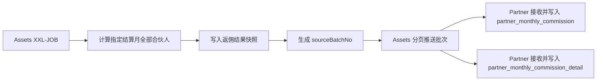

# 合伙人首页范围与返佣批次化改造方案

> 本文记录 2026-09-16 对合伙人首页查询范围和月度返佣同步链路的新增设计，不覆盖原有毛利返佣口径。

## 1. 改动背景

当前合伙人项目的月度返佣任务按合伙人逐个调用 Assets 接口，再在合伙人项目汇总并落库。合伙人数量和客户数量增长后，单次接口响应可能过大，也会造成重复查询、重复计算和失败重试成本上升。

同时，二代合伙人通过用户角色标识区分：`user.userType = 'Agent'`。这类合伙人在首页只能查看自己邀请码下的客户；其他合伙人则查看自己账户下全部有效邀请码对应的客户。

## 2. 目标

1. 统一首页接口的客户范围解析规则。
2. 二代 `Agent` 合伙人只查询本人邀请码下的客户。
3. 非二代合伙人按 `accountId` 查询全部有效邀请码下的客户。
4. 将返佣计算前移到 Assets，并以批次方式向合伙人项目提供结果。
5. Assets 项目分页推送批次结果，Partner 项目分批接收，避免单次传输全部明细。
6. 三种返佣模式统一计算、统一返回、统一批次落库：毛利返佣、底价加价、弹性加价。
7. 支持定时执行、指定合伙人修复、指定月份补算和批次重试。

## 3. 首页客户范围

### 3.1 范围判断

Partner 项目从当前登录上下文获取 `userId` 和 `accountId`，查询用户类型后决定邀请码范围：

```text
user.userType = Agent
    -> referralCode.userId = 当前 userId
    -> 只使用当前用户关联的邀请码

其他 userType
    -> referralCode.accountId = 当前 accountId
    -> 使用当前合伙人账户下全部有效邀请码
```

邀请码必须满足 `deleteTime IS NULL`。客户账户也必须满足 `deleteTime IS NULL`，通过客户的 `referralCodeId` 关联到上述邀请码。

### 3.2 统一应用方式

首页的以下查询必须使用同一份邀请码范围：

- 首页余额总览
- 推荐客户 KYC 状态统计
- 白标企业客户开通统计
- 量子卡收支趋势

Assets 接口建议接收解析后的 `referralCodeIds`，由 Partner 项目负责权限范围解析，避免 Assets 根据不完整的 `accountId` 再次推断可见客户。

### 3.3 API 客户

API 客户同样先通过客户账户的 `referralCodeId` 关联合伙人邀请码，再通过 API 账户关系扩展查询其子账户。不能因为客户不存在普通 API 关系记录就排除其主账户；主账户和 API 子账户都必须纳入统计，但要使用去重后的账户 ID 集合。

## 4. 返佣批次化架构



### 4.1 Assets 计算任务

新增或改造 Assets 侧 XXL-JOB：

- Cron：`0 0 8 21 * ?`
- 默认结算月：上个月月初。
- 默认快照日：当月 21 日。
- 不传 `partnerAccountId`：计算全部新版合伙人。
- 传入 `partnerAccountId`：只计算指定合伙人，供修复数据使用。
- 三种返佣模式在同一批次中计算。
- 毛利返佣按已有客户业务线快照和配置计算；负毛利不产生负佣金。
- 底价加价、弹性加价从 `partner_commission_fee_transaction` 汇总。
- 使用 `sourceBatchNo` 标识本次计算结果。

任务参数建议：

```json
{
  "settlementMonth": "2026-08",
  "snapshotDate": "2026-09-21",
  "partnerAccountId": null,
  "force": false
}
```

### 4.2 批次状态

建议增加返佣批次记录，至少包含：

- `source_batch_no`
- `settlement_month`
- `snapshot_date`
- `partner_account_id`，批量任务时为空
- `status`：`INIT`、`PROCESSING`、`SUCCESS`、`FAILED`
- `total_count`
- `success_count`
- `failed_count`
- `error_message`
- `create_time`、`update_time`

同一结算月和快照日正常只生成一个正式批次。补算或强制重算生成新批次，Partner 只同步任务指定的批次，避免新旧结果混用。

## 5. 跨项目接口

### 5.1 创建计算批次

```http
POST /v1/feign/partner/commission/batch/create
```

Assets 完成计算后返回批次信息：

```json
{
  "sourceBatchNo": "PARTNER_COMMISSION:2026-08:20260921080000",
  "settlementMonth": "2026-08-01",
  "snapshotDate": "2026-09-21",
  "status": "SUCCESS",
  "totalCount": 1200
}
```

### 5.2 分页推送批次结果

```http
POST /v1/feign/partner/commission/batch/push
```

Assets 每次推送一页结果：

```json
{
  "sourceBatchNo": "PARTNER_COMMISSION:2026-08:20260921080000",
  "partnerAccountId": null,
  "pageNo": 1,
  "pageSize": 500,
  "hasNext": true,
  "grossMarginItems": [],
  "baseMarkupItems": [],
  "elasticMarkupItems": []
}
```

响应需要一次返回三种模式：

- `grossMarginItems`
- `baseMarkupItems`
- `elasticMarkupItems`

每条结果应携带：

- `partnerAccountId`
- `partnerType`
- `partnerName`
- `partnerDisplayId`
- `customerAccountId`
- `customerName`
- `businessType`
- `commissionAmount`
- `grossProfit`
- `commissionMode`
- `feeType`
- `sourceDetailId`
- `sourceBatchNo`
- `referredCustomerCount`

Partner 返回本页接收结果，并携带 `sourceBatchNo` 和 `pageNo`。

Assets 负责保存推送进度；Partner 以 `sourceBatchNo + pageNo` 做幂等校验，重复推送同一页不能重复写入数据。

## 6. Partner 接收任务

Partner 项目不再保留主动拉取 Assets 的月度返佣任务、拉取接口和重复计算逻辑。主流程由 Assets XXL-JOB 主动推送，Partner 只负责接收、落库和批次补偿：

1. Assets 创建目标批次并完成计算。
2. Assets 按页调用 Partner 的批次推送接口。
3. Partner 校验批次号、结算月和快照日。
4. Partner 按 `sourceBatchNo + pageNo` 校验页面幂等性。
5. Partner 按 `sourceBatchNo + partnerAccountId + settlementMonth` 幂等写入主表。
6. Partner 按 `sourceBatchNo + sourceDetailId` 幂等写入详情表。
7. Partner 返回当前页面成功或失败。
8. Assets 所有页面推送成功后，将批次标记为同步完成。

Partner 不再重新计算毛利阶梯，也不再为每个合伙人发起一次全量查询。旧拉取流程不做兼容模式，也不与新推送流程并行。历史已落库数据保持不变；历史月份需要修复时，由 Assets 重新生成指定批次并主动推送。

## 7. 重跑与修复

- 普通重试：Assets 继续推送原 `sourceBatchNo` 的失败页，不生成重复数据。
- Assets 计算失败：批次标记 `FAILED`，修复后可重新执行同一参数。
- 需要重新计算：设置 `force=true` 生成新的批次号。
- 指定合伙人修复：传入 `partnerAccountId`，只计算并同步该合伙人。
- 指定快照日：传入 `snapshotDate`，否则使用目标月份对应的正式快照。
- Partner 接收页面失败时，Assets 从失败页继续推送；若无法确认页面状态，则重新推送该页，依靠幂等键覆盖。

## 8. 执行顺序

建议 Assets 与 Partner 的任务错峰：

1. Assets：每月 21 日 08:00 计算并完成批次。
2. Assets：计算完成后从 08:15 开始分页推送 Partner。
3. Partner：接收页面并实时落库；接收失败由 Assets 重试，Partner 仅负责异常批次补偿。

## 9. 验收标准

- `Agent` 合伙人只能查到自己 `userId` 关联邀请码下的客户。
- 非 `Agent` 合伙人可以查到自己 `accountId` 下全部有效邀请码客户。
- 普通客户、API 主账户和 API 子账户统计不重复、不漏算。
- Assets 一次批量计算后，可分页推送全部三种返佣模式。
- 单次接口不会返回全部合伙人全量明细。
- 同一批次重复执行不会产生重复主表或详情表记录。
- 指定月份、快照日和合伙人参数可以完成修数和重跑。
- Partner 项目不再执行毛利返佣重复计算，也不再保留旧的主动拉取流程。

## 10. 待办计划

### 10.1 Assets 项目

- [ ] 新增返佣批次表，记录 `sourceBatchNo`、结算月、快照日、状态和处理数量。
- [ ] 抽取 Assets 侧三种返佣的统一计算服务。
- [ ] 改造 `PartnerGrossMarginCommissionJob`，支持不传合伙人 ID 时批量计算全部合伙人。
- [ ] 支持指定合伙人、指定月份、指定快照日和 `force` 重算参数。
- [ ] 计算完成后按页主动推送 Partner。
- [ ] 记录每页推送状态，失败页面支持单独重试。
- [ ] 补充批次计算、分页推送和重复推送幂等测试。

### 10.2 公共 API 项目

- [ ] 新增批次创建请求和响应 DTO。
- [ ] 新增批次推送请求和响应 DTO。
- [ ] 新增 Partner 批次推送 Feign 接口。
- [ ] 补充三种返佣结果、合伙人信息、推荐客户数和批次号字段。
- [ ] 发布公共 API 版本，并同步更新 Assets、Partner 依赖版本。

### 10.3 Partner 项目

- [ ] 新增批次推送 Controller，Controller 只负责参数接收和结果返回。
- [ ] 在 Service 中完成批次校验、页面幂等校验和主表/详情表落库。
- [ ] 将 `sourceBatchNo` 和 `referredCustomerCount` 写入月度佣金数据。
- [ ] 复用现有 `partner_monthly_commission_detail`，不新增重复明细表或重复字段。
- [ ] 将 Assets 返回的非毛利账单字段完整映射到现有详情字段。
- [ ] 增加异常批次补偿 XXL-JOB，不重新计算 Assets 返佣。
- [ ] 删除旧的主动拉取 Job。
- [ ] 删除旧的 Assets 拉取 Feign 接口和调用代码。
- [ ] 删除 Partner 侧旧的毛利返佣汇总计算逻辑。
- [ ] 补充推送接收、重复页面、断点重试和事务回滚测试。

### 10.3.1 非毛利账单明细映射

`partner_monthly_commission_detail` 已按照渠道月度佣金账单 Excel 的明细结构设计，底价加价和弹性加价不需要新增表。Assets 推送数据时，Partner 必须写入以下现有字段：

| Excel 账单字段 | Partner 详情字段 | 数据来源/处理方式 |
|---|---|---|
| 产品类型 | `business_type` | Assets 产品线枚举映射 |
| 费用类型 | `fee_type` | `fee_name` |
| BIN | `card_bin` | 交易或费率配置 |
| 卡组织 | `card_scheme` | 交易或费率配置 |
| 交易量阶梯 | `tier_lower_bound`、`tier_upper_bound` | 费率配置阶梯 |
| Interlace 底价 | `interlace_base_rate` | `rate` |
| 我的加价 | `partner_markup_rate` | `markup_rate` |
| 对客最终费率 | `customer_final_rate` | `total_rate` |
| 佣金分成 | `commission_share_rate` | 非毛利分佣比例 |
| 佣金金额 | `commission_amount` | `markup_fee` |

当前同步代码已写入客户、产品线、费用类型、分佣模式、佣金金额和批次号，但部分 Excel 展示字段尚未从 Assets DTO 传递并落库。后续只补充 DTO、查询结果模型、Partner 领域明细模型和现有 Entity 映射，不调整 `partner_monthly_commission_detail` 表结构。

### 10.4 首页数据范围（P0，最高优先级）

- [ ] P0：增加当前登录用户 `userId` 和 `accountId` 的范围解析。
- [ ] P0：`userType = Agent` 时只查询当前 `userId` 关联的邀请码。
- [ ] P0：非 `Agent` 时查询当前 `accountId` 下全部有效邀请码。
- [ ] P0：将统一邀请码范围应用到余额、KYC、白标客户和量子卡趋势接口。
- [ ] P0：校验 API 主账户和子账户去重逻辑。
- [ ] P0：增加二代合伙人和普通合伙人的接口测试。

> 执行顺序：P0 首页数据范围完成并验证通过后，再开始返佣批次化开发。

### 10.5 上线前检查

- [ ] 确认 Assets XXL-JOB 在每月 21 日 08:00 执行。
- [ ] 确认 Assets 计算完成后再开始推送 Partner。
- [ ] 确认 Partner 接收接口支持单页事务落库。
- [ ] 确认同一 `sourceBatchNo + pageNo` 重复推送不会重复落库。
- [ ] 确认历史月份可以通过新批次重新推送修复。
- [ ] 确认旧拉取任务已从 XXL-JOB 调度中心移除。
- [ ] 完成三个项目的接口联调和数据核对。
