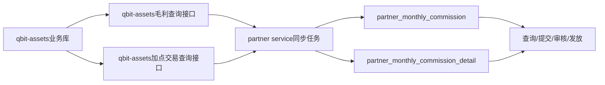

# 合伙人客户毛利物化视图与月度快照设计

## 摘要

基于现有销售毛利返佣物化视图，新增一套面向合伙人渠道的客户毛利数据链路：先按账户根客户归集各产品、渠道和费用项的收入与成本，形成可查询的近期毛利物化视图；每月 21 号从该视图固化上个月的客户毛利快照，并同时写入合伙人客户毛利汇总和可追溯的快照详情。

本期同时落地量子账户和加密资产的毛利返佣配置，以及按合伙人、客户、业务线、结算月记录返佣结果的结果表。客户毛利数据层仍不提前截断负数。

## 三种返佣模式统一同步

合伙人项目每月 21 日 08:00 执行 XXL-JOB 时，通过一次 Assets 正式结算查询同时获取三类数据：

- 毛利返佣：查询 `partner_gross_margin_commission_p`，按合伙人、客户、业务线、结算月返回已计算的佣金结果；
- 底价加价：查询 `partner_commission_fee_transaction` 中 `commission_mode = 'BasePriceMarkup'` 的 `markup_fee`；
- 弹性加价：查询 `partner_commission_fee_transaction` 中 `commission_mode = 'FlexibleMarkup'` 的 `markup_fee`。

合伙人项目不再分三次调用接口，而是接收一个包含 `grossMarginItems`、`baseMarkupItems`、`elasticMarkupItems` 的统一响应，再分别汇总写入 `partner_monthly_commission` 的 `gross_profit_commission`、`base_markup_commission`、`elastic_markup_commission`，总额为三者之和。详情表保留对应的 `fee_type` 和 `commission_mode`，便于按客户、业务线和返佣模式查询。

当前月预估接口也沿用三种模式统一返回；底价加价和弹性加价暂时没有可用的预估口径时返回 `0`，不影响正式结算任务读取交易表落库。任务支持传入结算月份和快照日期进行补数据、修数据和重跑。

## 1. 背景与目标

### 1.1 背景

现有 `dws.mv_sales_commission_recent_estimate` 服务于销售返佣，包含销售/AM 归属、佣金阶段、佣金规则和佣金金额等字段。合伙人客户毛利的计算单元不同：需要以合伙人推荐的 root account 为客户单元，先记录客户真实毛利，再按合伙人维度汇总。

### 1.2 目标

1. 新增合伙人客户毛利近期估算物化视图。
2. 保留账户层面的收入、成本、毛利和渠道结果值来源。
3. 毛利快照只处理 `crypto`、`group_account`、`qbit_card` 三种产品，并映射到对应业务线。
4. 排除 `item = 'month_revenue'` 的 API 实收数据；后续可扩展时再加入。
5. 增加 `root_account_referral_id`，便于后续按合伙人结算。
6. 每月 21 号固化上个月数据，形成快照主表和快照详情表。

## 2. 范围与非目标

### 2.1 本期范围

- 收入来源沿用 `dws.dws_metrics_sales_revenue_monthly`。
- 成本来源沿用现有销售返佣视图使用的渠道成本和产品成本表。
- 数据主粒度为 `root_account_id + product + provider + item + source_type + settlement_month`，并携带合伙人归属。
- 快照主表按 `root_account_referral_id + root_account_id + product + settlement_month` 汇总。
- 快照详情保留视图明细粒度，确保主表金额可由详情重算。

### 2.2 非目标

- 本期不处理返佣发放状态或支付流水。
- 本期不纳入 `month_revenue` API 实收；不改变现有销售返佣视图的口径。
- 本期不改变现有销售佣金表、销售佣金规则或销售看板接口。

## 3.3 合伙人毛利返佣配置

沿用 `public.partner_gross_margin_config` 和 `public.partner_gross_margin_config_detail`：配置主表按合伙人、客户、业务线和生效时间管理，详情表保存阶梯区间和比例。本期为 `QUANTUM_ACCOUNT`、`CRYPTO_ASSETS` 增加相同的默认配置：`0–20,000` 为 10%，`20,000` 以上为 20%。

返佣结果按超额累进计算，负毛利不产生返佣，最终金额按 0 做下限；具体计算由独立的返佣批任务写入结果表。

## 3. 业务口径

### 3.1 名词定义

| 术语 | 定义 |
|---|---|
| 渠道结果值 | 合伙人推荐客户在某产品、渠道/费用项、结算月产生的收入或成本净值，可正可负。 |
| 客户当月毛利 | 同一 root account、产品、结算月下全部渠道结果值的代数和。 |
| 合伙人客户月度毛利汇总 | 同一合伙人、产品、结算月下全部推荐客户的客户当月毛利之和。 |

### 3.2 毛利计算

```text
渠道结果值
  -> 客户当月毛利 = SUM(全部渠道结果值，可正可负)
  -> 合伙人客户月度毛利汇总 = SUM(推荐客户毛利，可正可负)
```

客户层和合伙人层都不提前将负数归零。负毛利客户必须保留，并在合伙人维度参与代数和。任何返佣下限规则由后续独立的返佣结算层处理。

### 3.2.1 API 实收与有渠道毛利池

合伙人客户毛利不读取销售佣金物化视图，而是复用销售 v2 的底层收入、成本、返现及调整事实口径独立计算。API 仅处理实际到账数据，`month_receivable`（`api_monthly_billing`）属于应收，不进入合伙人客户毛利。

有渠道的 `real_time` 实收与有渠道的 API 月结手续费实收共同组成渠道毛利池：

```text
渠道毛利 = real_time 实收 + API 月结手续费实收 - COGS - 返现
```

渠道毛利小于等于 0 时，`real_time` 与 API 月结手续费两类明细的 `gp` 均为 0；渠道毛利大于 0 时按反向实收占比分拆：

```text
real_time gp = 渠道毛利 × API 月结手续费实收 / 总实收
API 月结手续费 gp = 渠道毛利 × real_time 实收 / 总实收
```

API 月费、API 一次性手续费属于 API 实收明细，需保留给页面展示及后续直接按费率计算佣金，但不进入上述渠道毛利池，也不进入毛利阶梯返佣的 `total_gp`。当前源数据无法进一步区分月费和一次性手续费时，统一以 `item = api_monthly_fee` 保留。

## 4. 数据模型

### 4.0 首页当前月预估查询 SQL

Assets 预估接口查询当前月客户毛利基础数据。底价加价和弹性加价当前没有可用统计数据，接口直接返回数值 `0`；提现带结算金额由合伙人项目计算，不在本 SQL 中查询。

```sql
WITH current_month_profit AS (
    SELECT
        root_account_referral_id AS partner_account_id,
        settlement_month,
        SUM(COALESCE(gp, 0))::numeric(20, 4) AS gross_profit
    FROM dws.mv_partner_account_profit_recent_estimate
    WHERE settlement_month = date_trunc('month', CURRENT_DATE)::date
      AND root_account_referral_id IS NOT NULL
    GROUP BY root_account_referral_id, settlement_month
)
SELECT
    partner_account_id,
    settlement_month,
    gross_profit,
    -- gross_profit 由 Assets 返佣服务按合伙人业务线阶梯计算
    0::numeric(20, 4) AS base_markup_commission,
    0::numeric(20, 4) AS elastic_markup_commission,
    now() AS estimated_at
FROM current_month_profit;
```

说明：`gross_profit` 不是最终毛利返佣金额，不能直接作为 `grossProfitCommission` 返回；Assets 服务层需要继续按“合伙人 + 业务线”调用毛利阶梯计算，得到 `grossProfitCommission`。如果当前月没有毛利数据，三种预估佣金均返回 `0`。

### 4.1 近期毛利物化视图

建议名称：`dws.mv_partner_account_profit_recent_estimate`。

视图仅保留近 6 个月可查询数据，刷新方式沿用现有物化视图刷新函数/调度模式。

| 字段 | 类型建议 | 说明 |
|---|---|---|
| id | bigint | 按报告日、月份、客户、产品、渠道、费用项、来源类型生成确定性行 ID。 |
| report_date | date | 物化视图刷新/报告日期。 |
| settlement_month | date | 结算月份月初。 |
| root_account_id | varchar(64) | 顶层客户 ID。 |
| root_account_referral_id | varchar(64) | 顶层客户当前邀请码归属用户/合伙人 ID，来源 `dim.dim_account_analysis.referral_user_id`。 |
| product | varchar(64) | 产品编码，只允许 `crypto`、`group_account`、`qbit_card`。 |
| source_product | varchar(64) | 原始产品编码，用于底层追溯。 |
| provider | varchar(255) | 渠道/服务商。 |
| item | varchar(64) | 收费项；排除 `month_revenue`。 |
| source_type | varchar(64) | 收入或成本来源类型。 |
| effective_revenue | numeric(20,4) | 渠道结果值中的收入部分。 |
| cogs | numeric(20,4) | 渠道结果值中的成本部分。 |
| gp | numeric(20,4) | 毛利，统一按 `effective_revenue - cogs` 计算。 |
| version | int | 版本号。 |
| remarks | varchar(1000) | 来源及处理说明。 |
| create_time/update_time/delete_time | timestamp | 审计字段。 |

说明：用户要求的字段全部保留；`source_product` 是为产品合并后的底层追溯字段。若现有成本收入口径将成本表示为负数，则统一在标准化层转换为 `cogs` 成本正值并计算 `gp = effective_revenue - cogs`，避免同一指标在不同来源符号不一致。

### 4.2 客户毛利快照详情表

建议名称：`dws.dws_partner_account_profit_snapshot_detail_p`，按 `snapshot_date` 分区。

字段以物化视图字段为主，增加快照字段：

- `snapshot_date`：固定为每月 21 号，表示固化动作日期。
- `root_account_referral_id`：快照时固化的合伙人 ID，不随之后账户邀请码变化而回溯改变。
- `source_product`：原始产品来源。
- `effective_revenue/cogs/gp`：该详情行的收入、成本、毛利。
- `version/remarks/create_time/update_time/delete_time`：版本和审计字段。

详情主键建议为 `(id, snapshot_date)`；ID 指纹至少包含 `snapshot_date、settlement_month、root_account_referral_id、root_account_id、product、source_product、provider、item、source_type`。

### 4.3 合伙人客户毛利快照主表

建议名称：`dws.dws_partner_account_profit_snapshot_p`，按 `snapshot_date` 分区。

主表汇总粒度为：

```text
root_account_referral_id + root_account_id + product + settlement_month
```

建议字段：

| 字段 | 类型建议 | 说明 |
|---|---|---|
| id | bigint | 快照、月份、合伙人、客户、产品的确定性 ID。 |
| snapshot_date | date | 每月 21 号。 |
| settlement_month | date | 被固化的上个月月份。 |
| root_account_referral_id | varchar(64) | 合伙人/渠道 ID。 |
| root_account_id | varchar(64) | 推荐客户 root account。 |
| product | varchar(64) | 统一产品线。 |
| total_effective_revenue | numeric(20,4) | 客户产品月度收入合计。 |
| total_cogs | numeric(20,4) | 客户产品月度成本合计。 |
| total_gp | numeric(20,4) | 客户产品月度毛利合计，可为负。 |
| version/remarks/create_time/update_time/delete_time | - | 版本和审计字段。 |

主表不提前执行毛利下限，不把负毛利客户过滤掉；没有收入但有成本的客户也必须保留。

### 4.4 合伙人客户业务线返佣表

建议名称：`public.partner_gross_margin_commission_p`，属于业务库，不属于数仓；粒度为 `partner_id + account_id + product_line_type + settlement_month + snapshot_date`。该表只记录新版合伙人类型对应的客户毛利返佣结果，不记录旧版渠道或其他销售渠道数据。

该表记录 `gross_profit`、`commission_before_floor`、`commission_amount` 和实际命中的 `config_id`。其中 `commission_before_floor` 是阶梯计算结果，`commission_amount` 是最终不小于 0 的返佣金额。

## 5. 数据处理流程

1. 从现有销售返佣视图的收入和成本 CTE 复用业务口径，抽出客户毛利基础层。
2. 将账户关系归一到 root account；新版合伙人归属以客户账户的 `referralCodeId` 为准，关联 `referralCode.id` 后取合伙人账户，不直接使用快照中的当前推荐人字段。
3. 仅保留合伙人账户类型为 `InterlacePartnerReferral`、`InterlacePartnerSalesAgent`、`InterlacePartnerWhiteLabel` 的客户数据。其他渠道或旧版合伙人数据不写入新版毛利返佣结果表。
4. 标准化产品：保留 `source_product`，只允许 `crypto`、`group_account`、`qbit_card`。
5. 过滤 `item = 'month_revenue'`。由于现有视图可能将该来源转换为 `source_type = past_due_invoice/billing_decline_fee`，实现时应以原始 `metric_code` 或明确的来源标记过滤，不能只依赖转换后的 item。
6. 按视图明细粒度聚合 `effective_revenue`、`cogs`，计算 `gp = effective_revenue - cogs`。
7. 物化视图按近 6 个月刷新，提供当前月和历史未固化月份查询。
8. 每月 21 号读取 `settlement_month = 当前月月初 - 1 个月` 的物化视图，先写详情，再由详情/同一输入聚合写主表。
9. 主表与详情在同一 Flink batch 作业中使用 statement set/upsert 写入，避免两张表出现不同批次版本。
10. 返佣批任务读取快照主表，仅处理 `crypto`、`group_account`、`qbit_card` 三种产品，分别映射为 `CRYPTO_ASSETS`、`GLOBAL_ACCOUNT`、`QUANTUM_ACCOUNT`，关联配置详情后按阶梯计算并写入返佣结果表。

## 6. 快照调度、幂等与补跑

- 调度日期：每月 21 号；`snapshot_date` 固定为当月 21 号，而不是任务实际补跑日期。
- 目标月份：当前月份的上个月月初。例如 2026-09-21 固化 `2026-08-01`。
- 幂等键：详情使用快照日期 + 明细业务指纹；主表使用快照日期 + 合伙人 + 客户 + 产品 + 结算月。
- 补跑策略：同一快照日期再次执行使用 upsert 覆盖同一业务键；若需重算，必须先确认物化视图已刷新到目标月份的最新数据。
- 历史稳定性：快照写入时固化 `root_account_referral_id`，后续邀请码或客户关系变化不修改已固化月份。
- 空结果：目标月份没有数据时不生成伪造汇总行，任务记录成功且输出 0 行。

## 7. 数据质量校验

上线前和每月快照后执行以下校验：

1. 产品校验：输出 `product` 只能是 `crypto`、`group_account`、`qbit_card`。
2. 过滤校验：结果中不存在原始 `metric_code = month_revenue` 的 API 实收。
3. 关系校验：同一 `root_account_id + settlement_month` 的有效合伙人归属符合当前维表；无归属的客户保留记录且 `root_account_referral_id` 为空，供异常清单处理。
4. 金额校验：详情按主表粒度聚合后，`SUM(effective_revenue/cogs/gp)` 与主表一致，误差不超过 0.0001。
5. 毛利校验：每条记录满足 `gp = effective_revenue - cogs`；负毛利不得在客户层被截断。
6. 快照校验：快照日期为当月 21 号，结算月为上个月月初；重复补跑不产生重复业务行。

## 8. 实现文件建议

在目标项目目录新增并按职责拆分：

- `table-scripts/mv_partner_account_profit_recent_estimate.sql`：物化视图、索引、刷新函数依赖说明。
- `table-scripts/dws_partner_account_profit_snapshot_p.sql`：快照主表和年度分区。
- `table-scripts/dws_partner_account_profit_snapshot_detail_p.sql`：快照详情表和年度分区。
- `batch/dws_partner_account_profit_snapshot-batch-sql.sql`：参数化快照任务，支持 `snapshot_date`、`settlement_month`。
- `cdc/dws_partner_account_profit_snapshot-month-cdc-sql.sql`：每月 21 号自动计算目标月份的调度任务。
- `table-scripts/partner_gross_margin_config_quantum_crypto.sql`：业务库量子账户/加密资产默认费率配置。
- `table-scripts/partner_gross_margin_commission_p.sql`：业务库合伙人客户业务线返佣结果表。
- `batch/partner_gross_margin_commission-batch-sql.sql`：返佣结果计算批任务。
- `plans/2026-09-02-partner-account-profit-plan.md`：实现步骤、验证项和进度。

## 9. 风险与待确认事项

1. 当前新版合伙人归属通过客户账户的 `referralCodeId -> referralCode.accountId -> partner account` 关联获得。如果业务要求严格按历史生效时间还原合伙人归属，需要补充邀请码历史表或有效期字段。
2. 同一 root account 若存在多个产品来源，合并为 `qbit_card` 后必须依赖 `source_product` 进行审计，不能再假设产品编码唯一代表来源。
3. 当前默认费率为两档配置；后续若不同合伙人或业务线使用不同阶梯，可继续通过配置表按生效时间覆盖。

## 10. 验收标准

- 物化视图包含用户要求的 11 个业务字段及 `root_account_referral_id/source_product` 扩展字段。
- `month_revenue` API 实收被过滤，后续可通过单独配置重新启用。
- `crypto`、`group_account`、`qbit_card` 三种产品均可正常输出并映射到对应业务线。
- 客户层的正负渠道结果值可相抵，合伙人客户汇总保留正负毛利，不在本数据层截断。
- 每月 21 号可幂等固化上个月数据，主表与详情表金额一致。
- 量子账户和加密资产配置可幂等写入，返佣结果按合伙人、客户、业务线和月份唯一固化。
- 设计不修改现有销售返佣表和现有销售返佣视图的对外口径。

## 11. 跨项目整体设计

本方案涉及 `qbit-assets` 和 `interlace_partner_service` 两个项目。由于两边使用不同数据库，不直接建立跨库表连接，采用“qbit-assets 提供事实数据，interlace_partner_service 负责计算、落库和结算流程”的方式。



扫描确认的现有代码位置：

- qbit-assets 合伙人任务：`qbit-core/src/main/java/com/qbit/job/partner/PartnerCommissionJob.java`。
- qbit-assets 对外 Feign 规范：`qbit-assets-api/src/main/java/com/qbit/assets/api/v1/commission/feign/PartnerCommissionClient.java`。
- partner service 月度佣金查询仓储：`interlace-partner-service-infra/src/main/java/money/interlace/partner/infra/commission/repository/CommissionRepository.java`。
- partner service 当前按月分润明细查询仍为 TODO，应在本次同步链路中补齐。

## 12. qbit-assets 毛利查询接口

### 12.1 接口定义

建议在 qbit-assets-api 新增：

```http
POST /v1/feign/partner/profits/monthly
```

请求参数：

```json
{
  "accountIds": ["customer-account-id-1", "customer-account-id-2"],
  "startTime": "2026-08-01T00:00:00Z",
  "endTime": "2026-09-01T00:00:00Z",
  "partnerAccountId": "partner-account-id"
}
```

时间范围统一使用左闭右开区间 `[startTime, endTime)`，结算月使用月份月初表示。

### 12.2 返回数据

接口按“客户 + 业务线 + 结算月”返回汇总结果，并保留稳定的明细来源编号：

```json
{
  "settlementMonth": "2026-08",
  "currency": "USD",
  "items": [
    {
      "sourceDetailId": "gp-202608-partner-customer-product",
      "partnerAccountId": "partner-account-id",
      "customerAccountId": "customer-account-id",
      "businessType": "QUANTUM_ACCOUNT",
      "effectiveRevenue": "10000.00",
      "cogs": "3000.00",
      "grossProfit": "7000.00",
      "sourceBatchNo": "GP-202608-20260921"
    }
  ]
}
```

接口内部按以下方式计算：

```text
customerGrossProfit = SUM(effectiveRevenue - cogs)
```

负毛利原样返回，不在 qbit-assets 接口层归零。

接口必须完成以下校验：

- `accountIds` 必须属于 `partnerAccountId`。
- 调用方不能仅通过传入 `partnerAccountId` 绕过客户归属校验。
- `startTime`、`endTime` 必须合法，且查询范围不能超过限制。
- 金额统一使用 `BigDecimal`，禁止使用浮点类型。

### 12.3 产品和费用项处理

- 只返回 `crypto`、`group_account`、`qbit_card` 三种产品。
- 额外返回 `sourceProduct`，用于底层来源追溯。
- 排除 `item = 'month_revenue'` 的 API 实收数据。
- 如果原有 SQL 会把该数据转换成其他 `source_type`，必须在原始来源层过滤，不能只依赖转换后的 `item`。

## 13. qbit-assets 加点佣金接口

用户提供的 `public.partner_commission_fee_transaction` 是加点交易数据源。建议新增：

```http
POST /v1/feign/partner/commissions/markup/monthly
```

返回基础加点和弹性加点的月度明细。字段映射建议如下：

| qbit-assets 字段 | partner detail 字段 |
|---|---|
| `source_id` | `source_detail_id` |
| `account_id` | `customer_account_id` |
| `commission_mode` | `commission_mode` |
| `fee_name` | `fee_type` |
| `amount` | `base_amount` |
| `rate` | `base_rate` |
| `add_rate` | `markup_rate` |
| `add_fee` | `commission_amount` |
| `create_time` | `effective_date` |

`total_fee` 不建议直接作为合伙人佣金，因为它可能包含平台原始费用。应使用实际加点部分 `add_fee`；具体符号和状态复用现有扣费逻辑。`BasePriceMarkup` 和 `FlexibleMarkup` 必须分别汇总。

## 14. partner service 月度同步任务

在 partner service 新增：

```text
partner_monthly_commission_sync_job
```

建议每月 21 日执行，毛利快照准备完成后再执行。任务参数支持：

```json
{
  "settlementMonth": "2026-08",
  "force": false
}
```

参数为空时默认同步上个月。执行流程：

1. 查询有效合伙人及其推荐客户。
2. 调用 qbit-assets 毛利接口。
3. 调用 qbit-assets 加点佣金接口。
4. 按合伙人、结算月、业务线分组。
5. 计算各业务线毛利返佣。
6. 合并基础加点和弹性加点佣金。
7. 在一个事务中写入 partner 主表和详情表。
8. 执行金额校验、重复数据校验和对账。
9. 输出成功、跳过、失败及异常客户清单。

qbit-assets 侧可新增独立的 `PartnerGrossMarginCommissionJob`，参考现有 `PartnerCommissionJob` 的写法。职责是接收 XXL-JOB 参数、触发毛利返佣计算 Service、记录执行日志和异常；具体查询、汇总、阶梯计算和落库逻辑放在 Service 中。

```java
package com.qbit.job.partner;

import com.xxl.job.core.context.XxlJobHelper;
import com.xxl.job.core.handler.annotation.XxlJob;
import lombok.RequiredArgsConstructor;
import lombok.extern.slf4j.Slf4j;
import org.springframework.context.annotation.Configuration;

/**
 * 合伙人毛利返佣计算任务。
 */
@Configuration
@RequiredArgsConstructor
@Slf4j
public class PartnerGrossMarginCommissionJob {

    private final PartnerGrossMarginCommissionService commissionService;

    /**
     * 计算上月或指定月份的合伙人毛利返佣。
     *
     * <p>XXL-JOB 参数为空时默认计算上个月；指定参数时支持补算指定结算月。</p>
     */
    @XxlJob("partner_gross_margin_commission_job")
    public void execute() {
        String jobParam = XxlJobHelper.getJobParam();
        log.info("合伙人毛利返佣计算任务开始，参数：{}", jobParam);
        try {
            PartnerGrossMarginCommissionJobParam param =
                    PartnerGrossMarginCommissionJobParam.parse(jobParam);
            PartnerGrossMarginCommissionJobResult result = commissionService.calculate(param);
            XxlJobHelper.log("合伙人毛利返佣计算完成，结算月：{}，成功：{}，跳过：{}，失败：{}",
                    result.getSettlementMonth(), result.getSuccessCount(),
                    result.getSkippedCount(), result.getFailedCount());
        } catch (RuntimeException exception) {
            log.error("合伙人毛利返佣计算任务失败，参数：{}", jobParam, exception);
            XxlJobHelper.handleFail(exception.getMessage());
            throw exception;
        }
    }
}
```

说明：这里不再重复添加 `@EnableScheduling`。现有 `PartnerCommissionJob` 已经启用 Spring 定时调度；本任务使用 `@XxlJob`，由 XXL-JOB 调度中心触发，不依赖 `@Scheduled`。

建议任务参数对象支持以下格式：

```json
{
  "settlementMonth": "2026-08",
  "force": false
}
```

`snapshotDate` 可以不传；不传时自动选择该结算月最新的有效快照，只有需要补算指定快照版本时才传入具体日期。

其中 `force = false` 时遵守待提交状态保护；已提交、审核中或已支付的数据不得覆盖。

partner service 侧任务负责跨项目拉取和最终落库时，也应采用同样的 XXL-JOB Bean 写法，但两边任务职责分开：qbit-assets 负责毛利返佣结果计算，partner service 负责同步到 `partner_monthly_commission` 和 `partner_monthly_commission_detail`。

## 15. partner 月度佣金表写入规则

### 15.1 主表

`partner_monthly_commission` 一条记录代表：

```text
partner_account_id + settlement_month
```

字段计算：

```text
gross_profit_commission = 各业务线毛利返佣之和
base_markup_commission = BasePriceMarkup 加点佣金之和
elastic_markup_commission = FlexibleMarkup 加点佣金之和
total_commission_amount = 三者之和
```

### 15.2 详情表

详情表包含三类记录：

1. `GrossProfitShare`：客户 + 业务线 + 结算月的毛利详情。
2. `BasePriceMarkup`：来自加点交易表的基础加点详情。
3. `FlexibleMarkup`：来自加点交易表的弹性加点详情。

毛利详情至少保存客户毛利、所属业务线、合伙人业务线毛利、命中的阶梯配置和最终佣金金额。加点详情保存交易来源、费用项、计费基数、基础费率、加点费率和加点佣金金额。

主表和详情表必须遵守现有同步协议：不传入数据库自增 `id`，使用稳定的 `sourceBatchNo` 和 `sourceDetailId` 实现幂等。

## 16. 跨项目同步事务和状态控制

- 主表业务唯一键：`partner_account_id + settlement_month`。
- 详情唯一键：`monthly_commission_id + source_detail_id`。
- 同一批次重跑不能累加佣金。
- 只有 `PENDING_SUBMISSION` 状态允许覆盖。
- 已提交、审核中、已通过或已支付的数据不覆盖，并记录跳过原因。
- 重跑时软删除当前待提交详情，再完整插入新批次详情。
- 主表、旧详情软删除、新详情插入必须在同一事务中完成。
- 金额校验失败时整个事务回滚，不能产生半批数据。
- 不直接写审批、操作日志、交易账单等 partner service 工作流表。

## 17. 费率配置口径待统一

现有 `partner_gross_margin_config` 的配置键包含：

```text
partner_id + account_id + product_line_type
```

但当前确认的计算规则是：

```text
合伙人 + 业务线 + 结算月
    -> 汇总全部客户毛利
    -> 对合伙人业务线毛利套用一次阶梯
```

推荐新增或调整为合伙人业务线级配置，核心唯一维度为：

```text
partner_id + product_line_type + effective_time
```

客户级配置可以继续保留，用于记录客户归属或参与资格，但不能在客户层分别计算返佣。

如果暂时不调整表结构，则必须保证同一合伙人同一业务线下的所有客户有效阶梯完全一致；当配置不一致时，批任务应失败并输出异常，而不能随意选择某一个客户的费率。

## 18. 负数和多业务线规则

负数只在最终应付层做下限处理：

```text
客户毛利为负：保留
合伙人业务线毛利为负：保留
阶梯计算基数 <= 0：应发佣金 = 0
返佣金额 = MAX(应发佣金, 0)
```

不做负向倒扣，默认不把负毛利结转到下月。

不同业务线独立计算：

```text
最终毛利返佣 = SUM(各业务线 MAX(业务线应发佣金, 0))
```

一个业务线的负毛利不能抵扣另一个业务线的正毛利。

## 19. 实施顺序

1. 确认毛利阶梯配置最终采用客户业务线级还是合伙人业务线级。
2. 在 qbit-assets-api 增加毛利和加点佣金 DTO、Feign Client。
3. 在 qbit-assets 实现两个查询接口。
4. 增加 qbit-assets 毛利数据准备 Job。
5. 完成 partner service `queryMonthlyProfitShareDetails`。
6. 增加 partner service 月度佣金同步 Job。
7. 完善主表、详情表事务同步和状态保护。
8. 增加负数、跨客户抵消、跨业务线隔离、幂等重跑测试。
9. 通过对账后接入现有审批和发放流程。

## 20. 合伙人项目 XXL-JOB 同步开发方案

### 20.1 目标

在 `interlace_partner_service` 中增加月度毛利返佣同步任务，每月 21 日早上 08:00 由 XXL-JOB 触发，调用 `qbit-assets` 获取上个月客户各业务线毛利，计算合伙人毛利返佣，并写入：

```text
partner_monthly_commission
partner_monthly_commission_detail
```

同时支持指定结算月份和快照日期进行补数据、修数据和重跑。

### 20.2 服务边界

```text
qbit-assets
  -> 提供客户业务线毛利事实数据
  -> 根据 customer.referralCodeId 关联新版合伙人
  -> 只返回 crypto/group_account/qbit_card

interlace_partner_service
  -> XXL-JOB 调度
  -> 调用 qbit-assets API
  -> 汇总毛利、计算阶梯返佣、客户分摊
  -> 写入 partner 月度佣金主表和详情表
```

partner service 禁止直接访问 qbit-assets 数据库表。

### 20.3 XXL-JOB 任务

合伙人项目当前没有 XXL-JOB，需要在 boot 模块引入 `xxl-job-core` 并注册 Executor。

Job 位置：

```text
interlace-partner-service-boot/src/main/java/
money/interlace/partner/settlement/job/PartnerMonthlyCommissionXxlJob.java
```

Handler：

```text
partner_monthly_commission_sync_job
```

Job 只负责读取参数、调用应用层 Service、输出日志和报告失败，不直接访问 Feign、Mapper 或数据库。

XXL-JOB 控制台配置：

```text
Cron: 0 0 8 21 * ?
时区: Asia/Shanghai
路由策略: 故障转移
阻塞处理: 单机串行
```

### 20.4 任务参数

不传参数时自动构建：

```text
settlementMonth = 当前月份的上一个自然月
snapshotDate = 不传，由 qbit-assets 取该结算月最新快照
force = false
```

指定月份重跑：

```json
{
  "settlementMonth": "2026-08",
  "force": false
}
```

指定快照版本重跑：

```json
{
  "settlementMonth": "2026-08",
  "snapshotDate": "2026-09-21",
  "force": false
}
```

不提供 `partnerAccountIds`，任务自动处理全部新版合伙人：

```text
InterlacePartnerReferral
InterlacePartnerSalesAgent
InterlacePartnerWhiteLabel
```

### 20.5 qbit-assets 毛利接口

建议接口：

```http
POST /v1/feign/partner/profits/monthly
```

请求字段：

```json
{
  "accountIds": ["customer-account-id"],
  "startTime": "2026-08-01T00:00:00+08:00",
  "endTime": "2026-09-01T00:00:00+08:00",
  "partnerAccountId": "partner-account-id",
  "snapshotDate": "2026-09-21"
}
```

`snapshotDate` 为可选字段。不传时使用结算月最新有效快照，传入时支持历史快照重跑。

qbit-assets 通过以下关系确定合伙人：

```text
customer.account.referralCodeId
    -> referralCode.id
    -> referralCode.accountId
    -> partner.account.id
```

接口只处理以下产品：

| product | business_type |
|---|---|
| `crypto` | `CRYPTO_ASSETS` |
| `group_account` | `GLOBAL_ACCOUNT` |
| `qbit_card` | `QUANTUM_ACCOUNT` |

接口按“客户 + 业务线 + 结算月”返回 `sourceDetailId`、`partnerAccountId`、`customerAccountId`、`businessType`、`settlementMonth`、`currency`、`effectiveRevenue`、`cogs`、`grossProfit` 和 `sourceBatchNo`。

客户毛利计算：

```text
customerGrossProfit = SUM(effectiveRevenue - cogs)
```

负毛利必须保留，`month_revenue` API 实收继续过滤。

### 20.6 Service 分层

```text
boot
  PartnerMonthlyCommissionXxlJob

app
  PartnerMonthlyCommissionSyncService

domain
  PartnerMonthlyCommissionSyncCommand
  PartnerMonthlyCommissionSyncResult
  IMonthlyCommissionSyncRepository

infra
  PartnerGrossProfitFeignRepository
  MonthlyCommissionSyncRepository
  PartnerGrossProfitInfraConverter
```

职责划分：

- Boot：XXL-JOB 入站、参数读取、日志。
- App：同步用例、毛利汇总、阶梯计算、客户分摊和事务边界。
- Domain：业务模型和仓储端口，不依赖技术组件。
- Infra：Feign 调用、DTO 转换、主表锁定、详情软删除和数据写入。

### 20.7 计算和客户分摊

```text
partnerBusinessGrossProfit
    = SUM(该合伙人该业务线全部客户毛利)

businessCommission
    = MAX(progressiveTier(partnerBusinessGrossProfit), 0)
```

详情表按客户记录，因此正向佣金按正毛利占比分摊：

```text
positiveGrossProfitTotal = SUM(MAX(customerGrossProfit, 0))
customerCommission = businessCommission
    * customerPositiveGrossProfit / positiveGrossProfitTotal
```

规则：

- 负毛利客户保留毛利，佣金为 0。
- 业务线毛利小于等于 0 时，该业务线返佣为 0。
- 金额使用 `BigDecimal`，分摊保留 4 位小数。
- 最后一条正毛利客户使用余额法修正舍入差额。
- 客户详情佣金之和必须等于该业务线返佣。
- 不同业务线之间不互相抵扣。

### 20.8 主表和详情表写入

主表唯一业务键：

```text
partner_account_id + settlement_month
```

第一阶段只写毛利返佣：

```text
gross_profit_commission = 各业务线毛利返佣之和
base_markup_commission = 0
elastic_markup_commission = 0
total_commission_amount = gross_profit_commission
```

详情使用：

```text
commission_mode = GrossProfitShare
```

每条详情对应“客户 + 业务线 + 结算月”，保存客户毛利、分摊比例、佣金金额、来源明细 ID 和批次号。

### 20.9 事务、幂等和重跑

每个合伙人和结算月独立事务：

1. 按业务键查询主表并 `FOR UPDATE`。
2. 主表不存在时插入并获取数据库生成的主表 ID。
3. 非 `PENDING_SUBMISSION` 状态时，整张账单跳过。
4. 待提交账单软删除旧详情并插入完整新详情。
5. 校验主表与详情金额一致后提交。

幂等规则：

- 不传数据库自增 ID。
- `sourceBatchNo` 稳定标识同步批次。
- `sourceDetailId` 对同一客户、业务线和月份稳定。
- 重跑不能累加佣金。
- 任一明细失败时主表和详情全部回滚。
- `force=true` 也不能绕过非待提交状态保护。

### 20.10 配置和测试

XXL-JOB 配置通过环境变量或 Nacos 注入：

```yaml
xxl:
  job:
    admin:
      addresses: ${XXL_JOB_ADMIN_ADDRESSES}
    access-token: ${XXL_JOB_ACCESS_TOKEN}
    executor:
      appname: interlace-partner-service
      port: ${XXL_JOB_EXECUTOR_PORT:9999}
      log-path: ${XXL_JOB_LOG_PATH:/data/applogs/xxl-job/jobhandler}
```

不在配置文件中写 Token、数据库密码等敏感信息。

测试覆盖：

- 空参数默认计算上个月。
- 指定结算月份和快照日期。
- 三种产品和新版合伙人过滤。
- 负毛利、跨客户抵消和客户佣金分摊。
- 主表/详情表金额对账。
- 重跑幂等。
- 非待提交账单跳过。
- qbit-assets 调用失败时事务回滚。

Job 测试参考现有 `PartnerCommissionJobTest`，直接注入并调用 `execute()`。

### 20.11 实施顺序

1. 增加 XXL-JOB 依赖和 Executor 配置。
2. 在 qbit-assets-api 增加毛利查询 DTO、Feign Client 和可选 `snapshotDate`。
3. qbit-assets 实现毛利查询及新版合伙人过滤。
4. partner service 实现 Feign 适配和客户毛利汇总。
5. 实现阶梯计算、客户分摊和月度主表/详情表事务写入。
6. 增加 XXL-JOB Job 和直接调用测试。
7. 先手动指定月份执行验证，再配置每月 21 日 08:00 自动执行。

## 11. 跨项目整体设计

本方案涉及 `qbit-assets` 和 `interlace_partner_service` 两个项目。由于两边使用不同数据库，不直接建立跨库表连接，采用“qbit-assets 提供事实数据，interlace_partner_service 负责计算、落库和结算流程”的方式。


扫描确认的现有代码位置：

- qbit-assets 合伙人任务：`qbit-core/src/main/java/com/qbit/job/partner/PartnerCommissionJob.java`。
- qbit-assets 对外 Feign 规范：`qbit-assets-api/src/main/java/com/qbit/assets/api/v1/commission/feign/PartnerCommissionClient.java`。
- partner service 月度佣金查询仓储：`interlace-partner-service-infra/src/main/java/money/interlace/partner/infra/commission/repository/CommissionRepository.java`。
- partner service 当前按月分润明细查询仍为 TODO，应在本次同步链路中补齐。

## 12. qbit-assets 毛利查询接口

### 12.1 接口定义

建议在 qbit-assets-api 新增：

```http
POST /v1/feign/partner/profits/monthly
```

请求参数：

```json
{
  "accountIds": ["customer-account-id-1", "customer-account-id-2"],
  "startTime": "2026-08-01T00:00:00Z",
  "endTime": "2026-09-01T00:00:00Z",
  "partnerAccountId": "partner-account-id"
}
```

时间范围统一使用左闭右开区间 `[startTime, endTime)`，结算月使用月份月初表示。

### 12.2 返回数据

接口按“客户 + 业务线 + 结算月”返回汇总结果，并保留稳定的明细来源编号：

```json
{
  "settlementMonth": "2026-08",
  "currency": "USD",
  "items": [
    {
      "sourceDetailId": "gp-202608-partner-customer-product",
      "partnerAccountId": "partner-account-id",
      "customerAccountId": "customer-account-id",
      "businessType": "QUANTUM_ACCOUNT",
      "effectiveRevenue": "10000.00",
      "cogs": "3000.00",
      "grossProfit": "7000.00",
      "sourceBatchNo": "GP-202608-20260921"
    }
  ]
}
```

接口内部按以下方式计算：

```text
customerGrossProfit = SUM(effectiveRevenue - cogs)
```

负毛利原样返回，不在 qbit-assets 接口层归零。

接口必须完成以下校验：

- `accountIds` 必须属于 `partnerAccountId`。
- 调用方不能仅通过传入 `partnerAccountId` 绕过客户归属校验。
- `startTime`、`endTime` 必须合法，且查询范围不能超过限制。
- 金额统一使用 `BigDecimal`，禁止使用浮点类型。

### 12.3 产品和费用项处理

- 只返回 `crypto`、`group_account`、`qbit_card` 三种产品。
- 额外返回 `sourceProduct`，用于底层来源追溯。
- 排除 `item = 'month_revenue'` 的 API 实收数据。
- 如果原有 SQL 会把该数据转换成其他 `source_type`，必须在原始来源层过滤，不能只依赖转换后的 `item`。

## 13. qbit-assets 加点佣金接口

用户提供的 `public.partner_commission_fee_transaction` 是加点交易数据源。建议新增：

```http
POST /v1/feign/partner/commissions/markup/monthly
```

返回基础加点和弹性加点的月度明细：

```json
{
  "settlementMonth": "2026-08",
  "items": [
    {
      "sourceDetailId": "markup-source-id",
      "partnerAccountId": "partner-account-id",
      "customerAccountId": "customer-account-id",
      "businessType": "QUANTUM_ACCOUNT",
      "commissionMode": "BasePriceMarkup",
      "feeType": "payment_fee",
      "amount": "1000.00",
      "baseRate": "0.010000000000",
      "markupRate": "0.002000000000",
      "commissionAmount": "2.00",
      "sourceBatchNo": "MARKUP-202608"
    }
  ]
}
```

建议字段映射如下：

| qbit-assets 字段 | partner detail 字段 |
|---|---|
| `source_id` | `source_detail_id` |
| `account_id` | `customer_account_id` |
| `commission_mode` | `commission_mode` |
| `fee_name` | `fee_type` |
| `amount` | `base_amount` |
| `rate` | `base_rate` |
| `add_rate` | `markup_rate` |
| `add_fee` | `commission_amount` |
| `create_time` | `effective_date` |

`total_fee` 不建议直接作为合伙人佣金，因为它可能包含平台原始费用。应使用实际加点部分 `add_fee`；具体符号和状态仍需复用现有扣费逻辑确认。`BasePriceMarkup` 和 `FlexibleMarkup` 必须分别汇总。

## 14. partner service 月度同步任务

在 partner service 新增：

```text
partner_monthly_commission_sync_job
```

建议每月 21 日执行，毛利快照准备完成后再执行。任务参数支持：

```json
{
  "settlementMonth": "2026-08",
  "force": false
}
```

参数为空时默认同步上个月。执行流程：

1. 查询有效合伙人及其推荐客户。
2. 调用 qbit-assets 毛利接口。
3. 调用 qbit-assets 加点佣金接口。
4. 按合伙人、结算月、业务线分组。
5. 计算各业务线毛利返佣。
6. 合并基础加点和弹性加点佣金。
7. 在一个事务中写入 partner 主表和详情表。
8. 执行金额校验、重复数据校验和对账。
9. 输出成功、跳过、失败及异常客户清单。

qbit-assets 侧可新增 `PartnerGrossProfitDataJob`，职责是准备或校验毛利数据、确认目标月份快照和生成稳定批次号；partner service 侧任务负责跨项目拉取和最终落库。

## 15. partner 月度佣金表写入规则

### 15.1 主表

`partner_monthly_commission` 一条记录代表：

```text
partner_account_id + settlement_month
```

字段计算：

```text
gross_profit_commission = 各业务线毛利返佣之和
base_markup_commission = BasePriceMarkup 加点佣金之和
elastic_markup_commission = FlexibleMarkup 加点佣金之和
total_commission_amount = 三者之和
```

### 15.2 详情表

详情表包含三类记录：

1. `GrossProfitShare`：客户 + 业务线 + 结算月的毛利详情。
2. `BasePriceMarkup`：来自加点交易表的基础加点详情。
3. `FlexibleMarkup`：来自加点交易表的弹性加点详情。

毛利详情至少保存客户毛利、所属业务线、合伙人业务线毛利、命中的阶梯配置和最终佣金金额。加点详情保存交易来源、费用项、计费基数、基础费率、加点费率和加点佣金金额。

主表和详情表必须遵守现有同步协议：不传入数据库自增 `id`，使用稳定的 `sourceBatchNo` 和 `sourceDetailId` 实现幂等。

## 16. 跨项目同步事务和状态控制

- 主表业务唯一键：`partner_account_id + settlement_month`。
- 详情唯一键：`monthly_commission_id + source_detail_id`。
- 同一批次重跑不能累加佣金。
- 只有 `PENDING_SUBMISSION` 状态允许覆盖。
- 已提交、审核中、已通过或已支付的数据不覆盖，并记录跳过原因。
- 重跑时软删除当前待提交详情，再完整插入新批次详情。
- 主表、旧详情软删除、新详情插入必须在同一事务中完成。
- 金额校验失败时整个事务回滚，不能产生半批数据。
- 不直接写审批、操作日志、交易账单等 partner service 工作流表。

## 17. 费率配置口径待统一

现有 `partner_gross_margin_config` 的配置键包含：

```text
partner_id + account_id + product_line_type
```

但当前确认的计算规则是：

```text
合伙人 + 业务线 + 结算月
    -> 汇总全部客户毛利
    -> 对合伙人业务线毛利套用一次阶梯
```

推荐新增或调整为合伙人业务线级配置，核心唯一维度为：

```text
partner_id + product_line_type + effective_time
```

客户级配置可以继续保留，用于记录客户归属或参与资格，但不能在客户层分别计算返佣。

如果暂时不调整表结构，则必须保证同一合伙人同一业务线下的所有客户有效阶梯完全一致；当配置不一致时，批任务应失败并输出异常，而不能随意选择某一个客户的费率。

## 18. 负数和多业务线规则

负数只在最终应付层做下限处理：

```text
客户毛利为负：保留
合伙人业务线毛利为负：保留
阶梯计算基数 <= 0：应发佣金 = 0
返佣金额 = MAX(应发佣金, 0)
```

不做负向倒扣，默认不把负毛利结转到下月。

不同业务线独立计算：

```text
最终毛利返佣 = SUM(各业务线 MAX(业务线应发佣金, 0))
```

一个业务线的负毛利不能抵扣另一个业务线的正毛利。

## 19. 实施顺序

1. 确认毛利阶梯配置最终采用客户业务线级还是合伙人业务线级。
2. 在 qbit-assets-api 增加毛利和加点佣金 DTO、Feign Client。
3. 在 qbit-assets 实现两个查询接口。
4. 增加 qbit-assets 毛利数据准备 Job。
5. 完成 partner service `queryMonthlyProfitShareDetails`。
6. 增加 partner service 月度佣金同步 Job。
7. 完善主表、详情表事务同步和状态保护。
8. 增加负数、跨客户抵消、跨业务线隔离、幂等重跑测试。
9. 通过对账后接入现有审批和发放流程。
