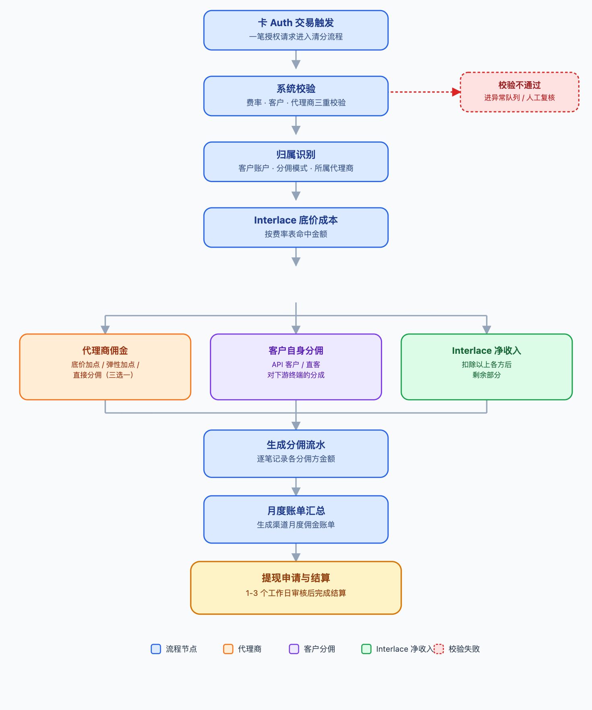

# 合伙人 \& 白标渠道后台需求说明文档

# 文档说明

[interlace\_partner\_suite\.html](图片和附件/interlace_partner_suite.html)

**实现功能模块如下：**

- 注册登录模块：

- 合伙人模块

- 白标客户

- Admin 

- 费率模块改造  \-最为复杂的模块，需要技术先行

**1\.1 目的**

本文档旨在系统性地梳理 Interlace Channel Program（渠道合作伙伴计划）产品原型中已确认的功能需求、页面结构与核心业务规则，作为后续技术方案设计、开发排期与测试验收的依据。

**1\.2 适用范围**

- 企业/个人合伙人门户（Partner Portal）：面向直接与 Interlace 签约、通过自有渠道推介客户获取佣金的企业/个人合伙人。

- 白标渠道后台（White\-label Console）：面向使用 Interlace 白标能力对外提供量子卡 / 全球账户 / 加密资产等产品，并可管理下游渠道方与商户的白标客户。

**1\.3 名词说明**

|**术语**|**说明**|
|---|---|
|企业/个人合伙人（Partner）|通过推介客户获取佣金收益的合作方，登录后进入「企业/个人合伙人后台」。 |
|白标客户 / 渠道方（White\-label / Distributor）|使用 Interlace 白标系统对外运营，并可发展下游渠道方、管理商户的合作方。|
|||
|推介客户|企业合伙人推荐给 Interlace 开户的商户客户。|
|商户 / 子商户账户，可以是api客户/直客|实际使用量子卡、全球账户、加密资产等产品并产生交易的账户主体。|

# 产品背景与角色定义

Interlace Channel Program 面向两类角色提供差异化的后台产品：

|**角色**|**核心诉求**|**分佣模型**|**对应后台**|**kyc要求**||**支持版本**|
|---|---|---|---|---|---|---|
|合伙人|推介客户、查看交易与费率明细、按月核对并提现佣金|企业合伙人：直接分佣 / 底价加点 / 弹性加点，三选一，变更需 Interlace 审核 个人合伙人：直接分佣|合伙人后台 |企业合伙人：收集部分字段（合规提供） 个人合伙人：full kyc   要求过名单筛查|**公司代理商KYC要求** **参考目前直客CDD\-KYC\-基础信息模块，根据注册国家有略微字段区别**  **信息** 企业名称 企业类型 公司注册编号 商业登记号码（HK）/ EIN（美国），其他注册地没有 注册日期 注册地址 实际经营地址 **文件** 公司注册书/营业执照（大陆主体）\-\>这个是为了确保下这个公司真的是他们自己的 而不是随便网上搜一个填进来  **合规要求** - 企业代理商要走目前直客名单筛查逻辑（World Check API），合规审核kyc的时候也要处理名单筛查case - cdd需要打标所属客户对应的代理商标签 - 审核逻辑及决策参考直客，需要跟代理商商户端交互 - 不再需要风险评级等其他模块了 - 代理商和直客不去重 如果代理商或者白标客户后续想使用我们的产品，需要走直客注册（仍打标对应代理商/白标客户标签）|interlace|
|白标 / 渠道方|以自有品牌运营量子卡等产品，管理商户与下游渠道方，自定义白标物料|以 Markup 加点为主，可对下游渠道方结算返佣 |白标渠道后台 |收集部分字段（合规提供） 要求过名单筛查||interlace|

两套后台均采用统一的登录入口，登录时按身份 Tab 选择进入对应后台；页面风格保持一致，均需要兼h5,因为涉及到个人合伙人登录，企业合伙人和个人合伙人注册/kyc不同；

# 3\.  **渠道 / 合伙人分润模式说明**

为便于渠道 BD、销售与产品配置理解现有分润体系，本说明汇总了目前三种主要的渠道 / 合伙人分润模式：底价加价模式、弹性加价模式、毛利返佣模式。三者在定价权归属、加价范围、销售介入程度及分润计算方式上均有差异，具体如下。

除了底价\+加价是有代理商后台配置，其余两种模式均需要在 interlace admin 后台进行配置及走常规的审核流程！！！！！

# 3\.1 底价加价模式

给渠道设定一个底价，渠道可在底价基础上自行加价后报价给客户。

## 规则要点

- 除 Scheme fee 不可加价外，其余任意费率理论上均允许渠道加价。

- 渠道对客户通常具备一定议价能力，由渠道自行与客户谈定最终价格，销售基本不需要介入。

- 典型适用对象为 Distributor（分销商）与白标客户。

## 计算逻辑

客户实际费率 = 底价费率 \+ 渠道加价

渠道分润 = 渠道加价 × 计费基数（如交易量 / 交易额）

# 3\.2 弹性加价模式

渠道要求在我方给客户的标准价格基础上，为其保留一定的点数利润，即我方实际给客户的优惠力度小于标准力度，差额部分作为渠道分润。

## 规则要点

- 渠道对客户同样具备一定议价能力，会协助销售与客户谈定价格（而非完全自行谈价）。

- 留给渠道的点数可按客户差异化设置，不同客户对应的留点比例可以不同。

- 除 Scheme fee 不可加价外，其余费率理论上均可加价，实际多见于一次性接入费及按 volume 比例收取的费率。

## 计算逻辑

客户实际费率 = 标准费率 − 渠道留点

渠道分润 = 渠道留点 × 计费基数

示例：标准情况下应给客户返点 1%，渠道要求实际只给客户返点 0\.8%，则渠道留点为 0\.2%，该 0\.2% 即为渠道在对应计费基数上获得的分润。

# 3\.3 毛利返佣模式

为与 BD 的提成计算方式区分，本模式下渠道（合伙人）的返佣阶梯采用「超额累进」方式计算，类似个人所得税的计税逻辑：某一档比例只作用于落入该档区间内的那部分毛利，而不是对全部毛利统一适用该档比例。阶梯阈值与对应分润比例为系统默认配置，同时支持渠道 BD 或销售根据实际情况自行调整配置。

## 默认阶梯配置\-逻辑上每个客户都可能不一样

|**总推荐客户每月毛利贡献区间 \(USD\)**|**该区间对应分润比例**|**分润周期**|
|---|---|---|
|0 \~ 3,000|10%|持续|
|3,000 \~ 9,000|12%|持续|
|9,000 \~ 15,000|14%|持续|
|15,000 \~ 24,000|16%|持续|
|24,000 \~ 30,000|18%|持续|
|30,000 以上|20%|持续|

## 计算逻辑

渠道当月分润 = 各阶梯区间内毛利额 × 对应该区间的分润比例，逐档计算后累加。

分润 = Σ \[ min\(总毛利, 该档上限\) − 该档下限 \] × 该档比例

（仅对总毛利落入的每个区间分别计算，负值区间不计）

## 计算示例（当月毛利贡献 25,000 USD）\-\-毛利是否加点需要老板确认

|**毛利区间**|**落入该区间的毛利额**|**适用比例**|**该档分润**|
|---|---|---|---|
|0 \~ 3,000|3,000|10%|300|
|3,000 \~ 9,000|6,000|12%|720|
|9,000 \~ 15,000|6,000|14%|840|
|15,000 \~ 24,000|9,000|16%|1,440|
|24,000 \~ 25,000|1,000|18%|180|
|**合计**|**25,000**|**—**|**3,480**|

按上述默认阶梯逐档计算：0\~3,000 部分按 10%、3,000\~9,000 部分按 12%、9,000\~15,000 部分按 14%、15,000\~24,000 部分按 16%、24,000\~25,000 部分按 18%，五档合计分润为 3,480 USD（即 300 \+ 720 \+ 840 \+ 1,440 \+ 180）。

|**维度**|**底价加价模式**|**弹性加价模式**|**毛利返佣模式**|
|---|---|---|---|
|**定价权归属**|渠道自主加价定价|渠道在既定价格上要求留点|无需渠道定价，按毛利结果结算|
|**加价 / 留点范围**|Scheme fee 外的任意费率 |Scheme fee 外的任意费率（多见于一次性接入费、按 volume 计费的费率）|不涉及加价，按毛利阶梯比例结算|
|**销售介入程度**|渠道自行与客户谈价，销售基本不介入|渠道协助销售与客户谈价|无需就定价与客户谈判|
|**典型适用对象**|Distributor、白标客户|有一定议价能力、需个性化留点的渠道客户|常规推荐合伙人 / 渠道 BD|
|**分润计算方式**|客户价 − 底价 = 渠道加价收益|标准费率 − 客户实际费率 = 渠道留点收益|超额累进（类个税）：各阶梯比例只作用于该阶梯区间内的毛利部分|
|**费率是否可按客户差异化**|由渠道自主定价决定|支持，不同客户可设置不同留点比例|阶梯阈值与比例可由渠道 BD 或销售自行配置（默认沿用系统阶梯）|

# 清分清算逻辑

此逻辑适用于caas ,baas ,waas 三种产品校验规则；

# 导航结构

## 5\.1 合伙人后台功能概览

|**一级菜单**|**二级菜单**|**说明**|
|---|---|---|
|首页|—|佣金总览、分佣模式子指标、企业合伙人客户概览、佣金趋势图|
|推介客户|推介客户列表|客户主体列表，按客户类型 / 状态 / 分佣模式筛选|
|推介客户|推介客户交易明细|按产品线（量子卡 / 全球账户 / 加密资产）查询交易流水|
|推介客户|推介客户费率明细|按分佣模式（底价加点 / 直接分佣 / 弹性加价）查看费率与分润|
|佣金结算|渠道月度佣金|按月汇总佣金收益，支持下载账单 Excel 与申请提现|
|佣金结算|推荐客户手续费统计|按客户 / 产品线维度统计手续费与分佣收益构成|
|佣金结算|佣金账单|按月查看结算账单，支持查看明细与下载|
|分佣模式设置|—|三种分佣模式选择与费率查看（NEW）|
|成员管理|—|团队成员的添加、编辑、删除|
|账号设置|—|账号信息与密码管理|

## 5\.2 白标渠道后台功能概览

|**一级菜单**|**二级菜单**|**说明**|
|---|---|---|
|首页|—|企业商户总数概览、量子卡收支趋势|
|商户管理|商户列表|白标下商户列表，含已开通产品、KYC / 账户状态、Markup 配置入口|
|量子卡|量子储值卡 / 量子额度卡 / 交易查询|量子卡各卡型的账户与交易管理|
|加密资产|—|钱包列表 / 交易明细 双 Tab|
|白标配置|—|域名、Logo、轮播图、客服信息、自定义邮件模板等白标物料配置|
|全球账户|账户列表 / 交易明细|全球账户资金与流水管理|
|渠道方管理|渠道明细查询 / 客户交易明细 / 推介客户列表 / 渠道返佣明细 / 渠道收入统计|管理下游渠道方及其返佣，支持新增渠道方|

# 功能需求 · 合伙人后台

## 6\.1 首页

- 本月预计佣金总额卡片，含 4 个子指标：直接分佣 / 底价加点 / 弹性加点 / 待结算金额。

- 企业推介客户概览：环形图展示客户状态分布（已开通 / 申请中 / 已拒绝）。

- 佣金趋势模块：支持按起止日期、分佣模式（全部 / 直接分佣 / 底价加点 / 弹性加点）筛选，柱状图展示近 6 个月佣金走势，右上角提供「查看明细」跳转至渠道月度佣金页面。

## 6\.2 推介客户列表

- 列表字段：主体名称、账户 ID、客户类型、已开通产品、分佣模式、状态、注册时间、操作。

- 查询条件：主体名称、账户 ID、客户类型（全部 / API 客户 / 直客）、状态（全部 / 已激活 / 审核中 / 已拒绝）。

- 已开通产品列：展示客户已开通的产品线（如「量子卡 / 全球账户」），审核中账户展示「—」。

- 操作列：仅当分佣模式为「底价加点」且状态为「已激活」时，展示「Markup 配置」入口，跳转至商户费率维护页面。

## 6\.3 商户费率维护

由推介客户列表「Markup 配置」进入，用于对底价加点客户按产品 / 交易类型 / BIN 维度精细化配置加点费率：

- 分组结构：产品大类（量子卡业务 / 加密业务）→ 费用分类（卡片发行费 / 交易手续费 / 处罚费）→ 具体费用类型（可折叠）。

- 量子卡类费用按 BIN \+ 卡组织（VISA / Mastercard）维度展示多行费率；加密类费用支持按交易量阶梯（Tier）维度展示。

- 每行展示 Interlace 底价、可编辑的加点值、实时计算的总计费率，支持逐行编辑保存。

- 页面顶部提供「Markup 费率记录」入口，用于追溯历史调整记录。

- 若商户子账户为「月结」结算方式，则不支持配置 Markup。

## 6\.4 推介客户交易明细

- 顶部按产品线分 Tab：全部 / 量子卡 / 全球账户 / 加密资产；每个产品线的查询条件、表格字段、导出模板均不同。

- 「量子卡」「加密资产」Tab 下设二级子 Tab（如量子卡：量子账户 / 量子储值卡 / 量子额度卡 / 员工卡；加密资产：钱包列表 / 交易明细），切换子 Tab 时查询条件、表格列、数据行均随之切换。

- 支持导出当前 Tab / 子 Tab 对应数据为 CSV，导出文件含导出时间、用户信息等元数据行。

## 6\.5 推介客户费率明细

按分佣模式分为三个页签，展示逻辑与颗粒度均不同：

### 6\.5\.1 底价加点客户

- 按「账户 ID → 产品类型 → 费用类型」的可折叠树状结构展示。

- 量子卡产品下的费用类型按 BIN 维度定价，并支持按交易量阶梯分档计费；费用类型展开后展示 BIN / 卡组织、交易量阶梯、Interlace 底价、我的加点、对客最终费率、生效日期、状态。

- 支持按账户 ID、产品类型筛选。

### 6\.5\.2 直接分佣客户

- 展示「弹性毛利分佣梯度」全局配置表：按总推荐客户每月毛利润贡献（USD）划分 6 档区间，对应分润比例 10%\~20%。

- 分润金额按阶梯累进（marginal）计算，即毛利润在每个区间内的部分分别按对应区间比例计算后累加，而非整体套用单一比例。

- 「直接分佣客户当月分润计算」表格支持按月份、客户 ID、客户名称筛选，展示主体名称、账户 ID、结算月份、本月毛利贡献、预计分润金额、生效日期、状态。

### 6\.5\.3 弹性加价客户

- 业务逻辑：渠道在给客户的报价中为自己留存一部分点数（例如标准返点 1%，渠道给客户报价 0\.8%，留存 0\.2%），报价与留存比例可按客户 / 费用类型分别配置，由 Interlace 后台统一配置生效，合伙人不可自行修改。

- 展示形式与底价加点客户一致：按「账户 ID → 产品类型 → 费用类型」可折叠树状结构，量子卡按 BIN \+ 交易量阶梯展开，展示账户费率（对客）、佣金分成、佣金金额、生效日期、状态。

## 6\.6 佣金结算

### 6\.6\.1 渠道月度佣金

- 列表字段：结算月份、推介客户数（按月累计该合伙人推荐的客户总数）、直接分佣收益、底价加点收益、弹性加点收益、合计收益、结算状态、操作。

- 查询条件：月份、结算状态。

- 结算状态四态流转：核算中（账单尚未生成）→ 待结算（账单已生成，可申请提现）→ 结算中（已发起提现申请，等待 Interlace 审核付款）→ 已结算（付款完成）。

- 操作规则：核算中无任何操作；待结算展示「账单明细」与可点击的「申请提现」；结算中展示「账单明细」与灰显禁用的「申请提现」；已结算仅展示「账单明细」，不再展示提现入口。

- 页面顶部提示文案：「每个月 10 日之前生成上一个月返佣账单，请您在 15 日之前核对返佣总额及明细，然后点击申请提现，我司会在 1\-3 个工作日完成审核，请您及时查看佣金结算状态。」

- 「账单明细」按钮点击后生成并下载 Excel 文件，内容包含两个工作表：「当月汇总」（按客户展示分佣模式与当月佣金金额）与「费率明细」（按客户返佣模式展开至产品 / 费用类型 / BIN / 阶梯级别的费率明细）。

### 6\.6\.2 推荐客户手续费统计

- 按客户 / 产品线维度统计手续费收入与加点收益构成，展示分佣模式、客户产生手续费、我的分佣 / 加点收益及占比。

### 6\.6\.3 佣金账单

- 支持按月 / 按季度 / 按周三种周期维度切换查询，可按账户名称筛选。

- 列表展示各周期账户的期初余额、期末余额、净变动、结算状态。

- 「查看明细」弹窗以对账单（Reconciliation Statement）格式展示：Statement Date / Account Name / Account ID / Statement Type 等信息，以及按账户类型（量子卡账户 / 全球账户 / 加密资产账户）拆分的 Debit / Credit / Currency / Frozen Amount / Unfrozen Amount / Beginning Balance / Ending Balance 明细与合计行。

- 支持从列表或明细弹窗中下载对应周期的 CSV 账单。

## 6\.7 分佣模式设置

企业合伙人可在三种分佣模式间选择，变更需 Interlace 审核后生效：

|**模式**|**业务逻辑**|**配置方式**|
|---|---|---|
|直接分佣模式|按客户在各产品线产生的业务利润，由 Interlace 按约定比例支付佣金；费率由 Interlace 统一配置，合伙人无需自行定价。|只读展示：产品分佣费率表（按产品 / 交易类型）\+ 弹性毛利分佣梯度表与累进计算公式说明。|
|底价加点模式|Interlace 为各产品线提供底价，合伙人在底价基础上自主设置加点，差额即为收益，可按客户 / 产品线分别配置。|引导跳转至「推介客户列表」→「Markup 配置」进行按商户精细化配置。|
|弹性加点模式|先按费用类型向客户报价（账户费率），再从每个费用类型的账户费率中抽取一部分作为佣金分成；费率与分成比例由 Interlace 后台统一配置，合伙人不可自行修改。|只读展示：按账户 ID → 产品类型 → 费用类型的可折叠树，量子卡按 BIN \+ 交易量阶梯展开，展示佣金金额；支持按账户 ID / 产品类型筛选。|

## 6\.8 成员管理 / 账号设置

- 成员管理：支持添加、编辑、删除团队成员，配置登录账号（邮箱 / 手机号）。

- 账号设置：账号基础信息展示与密码重置。

# 功能需求 · 白标渠道后台

## 7\.1 首页

- 余额总览卡片：含量子卡 / 全球账户 / 加密资产三个子指标。

- 企业商户总数环形图：已开通 / 申请中 / 已拒绝分布。

- 量子卡收支趋势：支持按日期区间、商户名称筛选，柱状图展示充值 / 消费 / 退款 / 撤销及已激活虚拟卡 / 实体卡数量。

## 7\.2 商户管理 · 商户列表

- 列表字段：主体名称、账户 ID、所属行业、已开通产品、KYC 状态、账户状态、创建时间、操作。

- 查询条件：主体名称、账户 ID、状态（已开通 / 审核中 / 已拒绝 / 已冻结）。

- 已通过 KYC 且已开通的商户，操作列展示「Markup 配置」入口，跳转至与合伙人门户结构一致的商户费率维护页面（BIN / 阶梯维度配置）。

## 7\.3 量子卡

- 量子储值卡 / 量子额度卡：统计指标带（Stat Band）展示核心数据，支持按商户名称搜索，列表按「使用中 / 所有 / 其他状态」等状态 Tab 切换。

- 交易查询：按量子账户 / 量子储值卡 / 量子额度卡切换查询条件与字段，支持导出记录。

## 7\.4 加密资产

- 钱包列表 / 交易明细双 Tab，切换时查询条件、表格字段、数据行均完整切换（数据驱动，非仅样式切换）。

## 7\.5 白标配置

用于配置白标系统对外展示的物料：

|**分组**|**配置项**|
|---|---|
|白标系统物料|域名、首页 Logo（84×30）、登录 Logo（142×51）、登录轮播图（609×483，两张）、用户条款、客服邮箱、客服热线、白皮书|
|自定义邮箱（可选）|自定义邮箱名称、邮件签名、邮件图片（700×172）、邮件内容、团队描述、邮件底部介绍|

## 7\.6 全球账户

- 账户列表：展示账户 ID、主体名称、币种、可用余额、冻结余额、状态。

- 交易明细：展示交易时间、账户 ID、主体名称、交易类型（入金 / 出金）、币种、金额、余额快照。

## 7\.7 渠道方管理

- 渠道明细查询：渠道方主列表，支持「新增渠道方」，弹窗填写渠道方名称、联系人、联系手机号（含区号）、联系邮箱。

- 客户交易明细：按渠道方 / 账户 / 主体名称查询交易流水。

- 推介客户列表：渠道方名下推介客户列表及状态。

- 渠道返佣明细：渠道方对客户的返佣明细（Interlace 底价、白标加点、客户实付费率）。

- 渠道收入统计：按渠道方维度统计收入构成。

# 核心业务规则

## 8\.1 佣金结算状态流转

|**状态**|**触发条件**|**可见操作**|**流程说明**|
|---|---|---|---|
|账单生成|当月尚未结束或账单尚未生成|无||
|待结算|每月 10 日前系统生成上一个月账单|账单明细（下载）、申请提现（可点击）||
|结算中|合伙人点击「申请提现」后|账单明细（下载）、申请提现（灰显禁用）|需要多级审核，流程待确认|
|已结算|Interlace 完成付款后|账单明细（下载）|资金打款|

## 8\.2 权限与状态联动规则

- 推介客户列表中，仅「分佣模式=底价加点」且「状态=已激活」的客户展示「Markup 配置」入口；已拒绝、审核中客户不展示。

- 直接分佣与弹性加点模式下的费率、分成比例均由 Interlace 后台统一配置，合伙人 / 白标客户不可自行修改或申请调整，页面仅提供只读查看。

# 9\.Admin 后台相关功能

# 产品定位与总体结构

Admin 内部管理台承担三项核心职责：

Caas\.:底价与佣金规则维护：按渠道 / 卡 BIN / 交易国家配置 Interlace 底价费率及代理商佣金加点，是合伙人「底价加点」「弹性加点」模式的唯一计算依据。

baas/waas 按照费用类型配置，复用现有的账户费率体系；

- Kyc 资质审核：支持合伙人/白标客户门户申请，合规需要在后台进行 KYC 审核职责。

- 月度佣金结算审批：对每个合伙人 / 白标渠道商按月生成的佣金账单，执行「销售提交 → 运营 → BI → 财务 → 老板」五级审核 \+ 资金打款的闭环流程；

## 9\.1   功能菜单

|**一级分组**|**二级菜单**|**对应模块 ID**|**说明**|
|---|---|---|---|
|新代理商管理|代理商佣金费率配置|rateManage|维护底价费率、代理商佣金加点、直接分佣提成公式|
|新代理商管理|合伙人管理|partnerAdmin|只读镜像企业合伙人后台，含合伙人 KYC 审核|
|新代理商管理|白标管理|wlAdmin|只读镜像白标渠道后台，含白标客户 KYC 审核|
|新代理商管理|月账单佣金结算审核|commSettlement|五级审核 \+ 打款的月度佣金结算审批流程|

## 9\.2 模块一：代理商佣金费率配置（rateManage）

本模块包含「账户费率管理」「直接分佣费率配置」两个页签，分别对应「按费率梯度收费」与「按客户\+产品线约定提成公式」两种计费模型。

### 9\.2\.1账户费率管理

**查询条件：**

- 客户名称、客户ID、代理商名称、代理商ID（文本模糊匹配）

- 费用名称、渠道、卡 BIN、状态（下拉精确匹配，选项来源于当前数据去重）

**列表字段（19列）：**

客户名称 / 客户ID / 代理商名称 / 代理商ID / 费用类型 / 费用分类 / 渠道 / 卡 BIN·卡组织 / 交易国家 / 扣费节点 / 费率类型 / 费率值 / 佣金类型 / 佣金值 / 最小金额 / 最大金额 / 生效日期 / 状态 / 操作（编辑、删除）。

**新增 / 编辑弹窗字段：**

- 费用名称、渠道、卡 BIN（可选“不适用（非卡类费用）”）、交易国家、扣费节点：下拉选择

- 费率类型：固定值 / 阶梯值

- 费率值 / 佣金（阶梯化配置）：支持添加多档（“\+ 添加一档”），每一档独立包含 最小金额、最大金额、费率值、佣金类型（底价加点 / 弹性加点）、佣金值 五个字段，删除单档需保留至少 1 档

- 生效日期：文本输入（YYYY\-MM\-DD HH:mm:ss），留空默认取当前时间

**核心业务规则：**

- 佣金类型与佣金值按“档”配置，而非整条费率共用一个佣金设置——同一费率的不同交易量阶梯，可以分别设置为“底价加点”或“弹性加点”，且加点值互不相同。

- 保存时校验：任一档费率值为空 → 提示“请完整填写费率值”；任一档佣金值为空 → 提示“请完整填写各阶梯的佣金值”；均需完整填写才可提交。

- 多档费率保存后会拆分为多条独立记录写入列表（编辑时原记录被替换为拆分后的新记录集合）。

- 新增费率若未关联具体客户 / 代理商，客户名称等字段默认展示“—”；编辑时沿用原记录的客户 / 代理商归属。

- 费用分类由费用名称自动判定：加密承兑费 / 稳定币充值手续费 / 跨链手续费 → “加密业务”，其余 → “量子卡业务”。

- 删除操作目前无二次确认弹窗，点击后立即生效，建议后续补充确认交互。

### 9\.2\.2直接分佣费率配置

按“客户 \+ 产品线”维度配置直接分佣的提成流水与毛利计算方式，不同客户 / 不同产品可设置不同的收入与毛利公式。

**查询条件：**

客户名称、客户ID、代理商名称、代理商ID（模糊匹配）；产品线、状态（下拉，产品线含 加密资产 / 全球账户 / 量子账户）。

**列表字段（11列）：**

客户名称 / 客户ID / 代理商名称 / 代理商ID / 产品线 / 提成流水名称 / 收入计算方式 / 毛利计算方式 / 生效日期 / 状态 / 操作（编辑、删除）。

**新增 / 编辑弹窗字段：**

- 客户（下拉）、代理商（下拉）、产品线（下拉）

- 提成流水名称（文本，如“交易手续费提成”）

- 收入计算方式、毛利计算方式（多行文本，支持自由公式表达，如“收入 = 合伙人名下所有客户此段时间加密资产交易手续费总和”“毛利 = 收入 \- 交易量 \* 0\.06%”）

- 生效日期（文本，留空默认取当天）

校验规则：提成流水名称 / 收入计算方式 / 毛利计算方式三者任一为空 → 提示“请完整填写提成流水名称及收入 / 毛利计算方式”，禁止提交；保存后状态固定为“生效中”。

## 9\.3 模块二：合伙人管理（partnerAdmin）

*本模块按企业合伙人门户的功能结构做只读镜像，供 Interlace 运营人员核对与审阅数据；额外增加合伙人列表与 KYC 审核能力，为合伙人门户所不具备。*

包含 4 个页签：合伙人列表、推介客户列表、佣金结算、成员管理。

### 9\.3\.1合伙人列表

查询条件：合伙人类型（企业 / 个人）、合伙人名称、销售名称（模糊）、状态（已激活 / 审核中 / 已拒绝）。

列表字段：合伙人类型、合伙人名称、销售名称、联系人、联系电话、联系邮箱、KYC 证件类型、KYC 证件号码、KYC 状态、注册时间、状态、操作（合伙人审核）。

### 9\.3\.2推介客户列表

查询条件：主体名称、账户ID、代理商名称、代理商ID、销售名称（模糊）；客户类型（API 客户 / 直客）、状态（已激活 / 审核中 / 已拒绝）。

列表字段：主体名称、账户ID、代理商名称、代理商ID、销售名称、客户类型、已开通产品、分佣模式、状态、注册时间、操作（客户详情）。销售名称通过代理商归属关联至合伙人列表中对应的销售负责人。

### 9\.3\.3佣金结算

查询条件：结算月份、结算状态（核算中 / 待结算 / 结算中 / 已结算）。

列表字段：结算月份、推介客户数、直接分佣收益、底价加点收益、弹性加点收益、合计收益、结算状态。数据与合伙人门户「渠道月度佣金」共用同一数据源，实现两端一致。

### 9\.3\.4 成员管理

查询条件：姓名 / 邮箱关键字。列表字段：成员姓名、邮箱、手机号、角色、状态。

### 9\.3\.5 合伙人审核弹窗

点击「合伙人审核」打开只读信息 \+ 审核操作弹窗，展示字段：合伙人类型、合伙人名称、销售名称、联系人、联系电话、联系邮箱、KYC 证件类型、KYC 证件号码、当前状态；若类型为「企业」，额外展示“企业 KYC 信息”区块（见第 8\.2 节）。

操作：驳回（状态置为已拒绝，KYC 状态置为已驳回）/ 通过（状态置为已激活，KYC 状态置为已通过），操作后立即刷新列表并 Toast 提示。

## 9\.4模块三：白标管理（wlAdmin）

### 9\.4\.1  白标列表

查询条件：白标客户类型（企业 / 个人）、白标名称、客户名称、客户ID、销售名称、状态。

列表字段：白标客户类型、白标名称、客户名称、客户ID、销售名称、联系人、联系电话、联系邮箱、KYC 证件类型、KYC 证件号码、KYC 状态、注册时间、状态、操作（白标客户审核）。相比合伙人列表，白标列表额外区分“白标名称”与其下属的“客户名称 / 客户ID”。

### 9\.4\.2  商户列表

查询条件：主体名称、账户ID、账户状态。列表字段：主体名称、账户ID、所属行业、已开通产品、KYC 状态、账户状态、创建时间、操作（客户详情）。

### 9\.4\.3  量子卡

顶部统计卡：量子账户余额（合计）、卡内总余额（合计）、交易处理中金额、实体卡可开卡数。

查询条件：卡号后四位、持卡主体名称。列表字段：卡号（掩码）、持卡主体、卡类型、币种、额度、状态。

### 9\.4\.4 加密资产

查询条件：单一关键字（商户名称 / 钱包ID / 交易ID），同时过滤钱包表与交易表。展示两张表：钱包列表与交易明细，字段与结构复用白标渠道后台加密资产页签的数据源。

### 9\.4\.5 白标配置

只读展示白标客户在自有后台提交的白标物料，不提供筛选与编辑：

- 白标系统物料：域名、首页 Logo、登录 Logo、登录轮播图、用户条款、客服邮箱、客服热线、白皮书

- 自定义邮箱（可选）：自定义邮箱名称、邮件签名、邮件图片、邮件内容、团队描述、邮件底部介绍

### 9\.4\.6 全球账户

查询条件：账户ID、主体名称。展示两张表：账户列表（账户ID、主体名称、币种、可用余额、冻结余额、状态）与交易明细（交易时间、账户ID、主体名称、交易类型、币种、金额、余额快照）。

### 9\.4 \.7渠道方管理

查询条件：渠道方名称、状态。列表字段：渠道方名称、联系人、联系电话、联系邮箱、创建时间、渠道方团队总人数、总推介客户数、状态。

### 9\.4 \.8 白标客户审核弹窗

展示字段：白标类型、白标名称、客户名称、客户ID、销售名称、联系人、联系电话、联系邮箱、KYC 证件类型、KYC 证件号码、当前状态；企业类型额外展示“企业 KYC 信息”区块。操作与状态流转规则同「合伙人审核弹窗」（驳回 / 通过）。

### 9\.5 模块四：月账单佣金结算审核（commSettlement）

对每个合伙人 / 白标渠道商每月生成的佣金账单，提供总额 \+ 明细展示，并驱动「一级销售提交 → 二级运营审核 → 三级BI审核 → 四级财务审核 → 五级老板审核 → 资金打款」的六环节审批流程，支持批量提交与批量结算。

### 9\.5\.1 结算状态模型

列表页展示的“结算状态”为归类后的 6 种状态，审核弹窗内的“审核流程”阶梯图展示更细粒度的 6 个环节。两者对应关系如下：

|**结算状态（列表展示）**|**对应审核环节**|**说明**|
|---|---|---|
|待提交|（尚未开始）|一级销售尚未提交账单，列表操作列展示「提交」快捷入口|
|审核中|二级运营审核 / 三级BI审核 / 四级财务审核 / 五级老板审核|提交后到五级老板审核通过前，统一归类展示为“审核中”，操作列展示「审核」快捷入口|
|待结算|资金打款（尚未确认）|五级老板审核通过、等待资金打款，操作列展示「结算」快捷入口|
|已结算|资金打款（已完成）|打款完成，流程结束，操作列不再展示快捷操作|
|已驳回|（退回至一级销售）|任一审核环节驳回后，状态整体退回“待提交”，需一级销售重新提交|
|已取消|—|预留状态，当前数据未包含实际场景，需业务方补充触发条件|

**关键状态流转规则：**

- 提交（一级销售）：账单从“待提交”进入“审核中”，写入一条提交记录（操作人、时间、备注）。

- 审核通过（二 \~ 五级）：依次推进到下一环节，最终五级老板审核通过后进入“待结算”。

- 确认打款（资金）：将“待结算”推进为“已结算”，流程终止，不可再操作。

- 驳回（二 \~ 五级均可发起）：无论在哪一级驳回，账单一律退回至最初的“待提交”状态，需一级销售补充说明后重新提交；驳回时审核意见为必填项，未填写不可提交驳回。

### 9\.5\.2 列表页

查询条件：结算月份、类型（合伙人 / 白标）、名称 / ID（模糊）、结算状态（待提交 / 审核中 / 待结算 / 已结算 / 已驳回 / 已取消）。

列表字段：勾选框（含全选）、类型、名称、ID、结算月份、佣金总额（USD）、结算状态、操作。

**操作列固定展示三个入口：**

- 查看：只读展示基础信息，不含审核流程与操作面板

- 佣金明细：仅展示佣金明细拆分表（产品线 / 费用类型 / 金额），不含审核流程与历史记录

- 审核操作日志：展示完整审核流程阶梯图、佣金明细、历史审核记录；点击「审核」按钮后展开操作面板（审核意见 \+ 对应操作按钮）

操作列另按结算状态展示 1 个快捷操作（待提交→提交；审核中→审核；待结算→结算；其余状态不展示）。

批量操作：勾选多条记录后，可点击「批量提交」（仅对“待提交”记录生效）或「批量结算」（仅对“待结算”记录生效）；勾选记录中不符合条件的会被自动跳过，并 Toast 提示实际处理笔数。

### 9\.5\.3 审核操作日志弹窗

**展示内容：**

- 基础字段：类型、ID、结算月份、佣金总额、结算状态

- 审核流程阶梯图：6 个环节（一级销售提交 / 二级运营审核 / 三级BI审核 / 四级财务审核 / 五级老板审核 / 资金打款），已完成环节标记对勾，当前环节高亮，若处于驳回状态则标红

- 佣金明细：产品线 / 费用类型 / 金额，含合计行

- 审核记录：时间、操作人（角色）、动作（提交 / 通过 / 驳回 / 打款完成）、备注

**操作面板（点击「审核」后展开）：**

|**当前环节**|**展示按钮**|**说明**|
|---|---|---|
|待提交（一级销售）|提交至运营审核|提交后进入二级运营审核|
|二 \~ 五级审核中|驳回 / 审核通过|驳回需填写审核意见；通过则推进至下一环节|
|待资金打款|确认打款|确认后进入“已结算”，流程终止|
|已结算|（无按钮，展示提示：已完成五级审核并打款）|—|

## 

