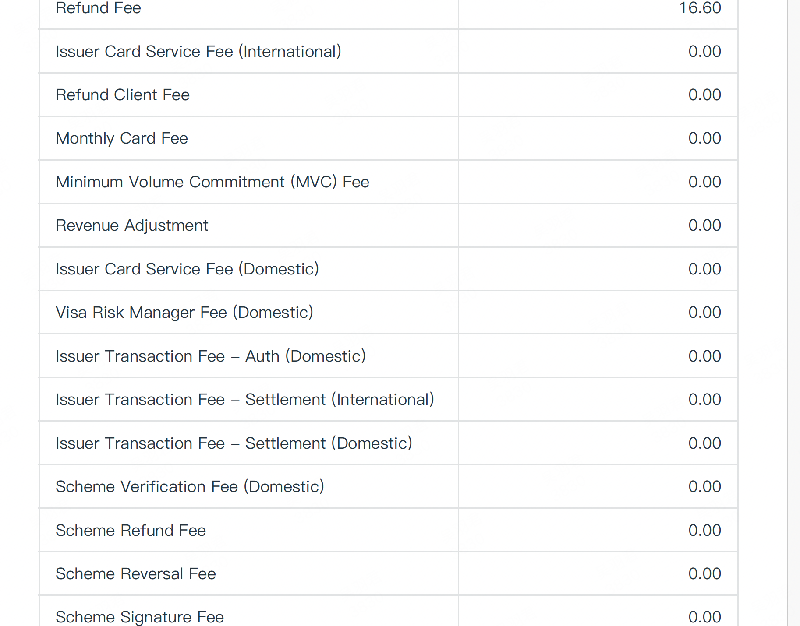
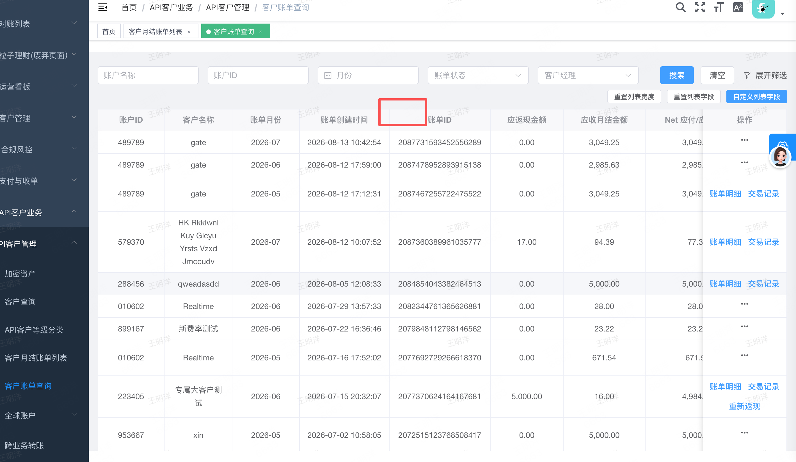

# 月差额账单优化

# 1\.月账单下载（包含客户端\&admin）

需求说明：如下图，如果客户未开通月结账单的费用类型，即为 0 ，需要底层过滤掉；

# 2 \.返现类型需要增加毛利返现的费用类型

需求说明：需要将毛利分佣返现增加在返现账单上并入差额计算，系统目前有三类返现，量子卡消费返现/量子卡开卡返现/加密资产交易返现\+量子卡毛利返现

- 返现PDF上展示所有渠道汇总的总额返现即可：

- 返现明细：

增加 sheet 4：Infinity Card  Revenue Sharing Rebate

需要技术协助帮忙导下目前毛利返现的表明细结构字段，目前明细表里已经存在，只是没有暴露给客户，我需要细致对下！

# 3 \.客户账单查询需要增加账单更新时间

需求说明：兜底情况下，财务 20 后更改月账单，会自动更新差额订单，此情况会导致差额重新计算，所以下图红框内需要增加账单变更时间以便记录差额订单时间修改过；

# 4  \.月账单需要新增一个展示明细的地方

sheet 2：Infinity Card  Active Card Details

请注意：一旦直客账单并入差额则原直客不发邮件（下图），按差额邮件发；需要支持中英；

[活跃卡费邮件通知优化](https://axss9gjoff.feishu.cn/wiki/PS15wIT2zirKlOk9qyoce2dvndh)

