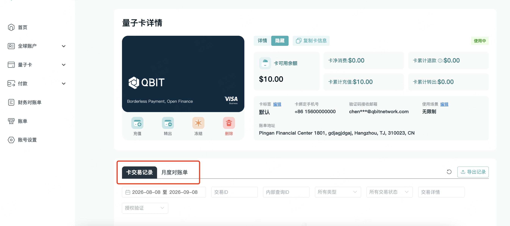
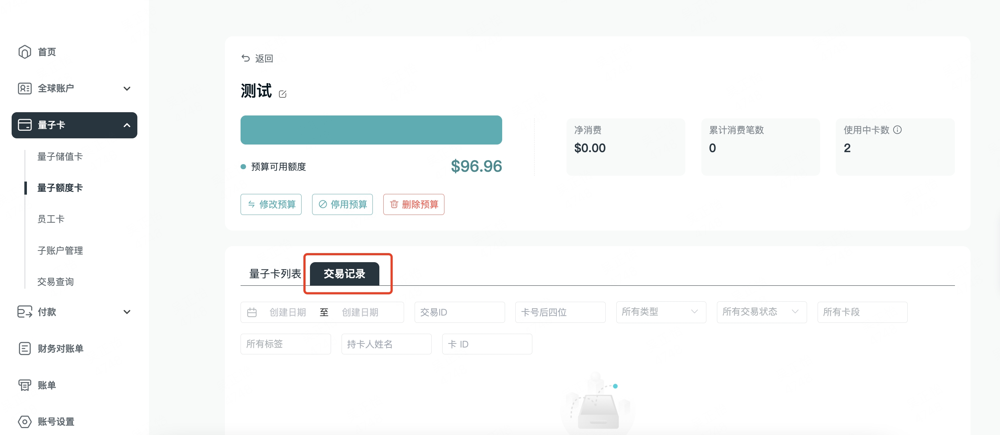
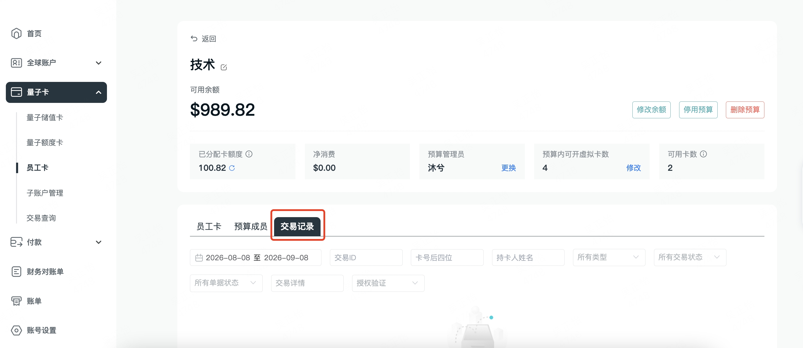
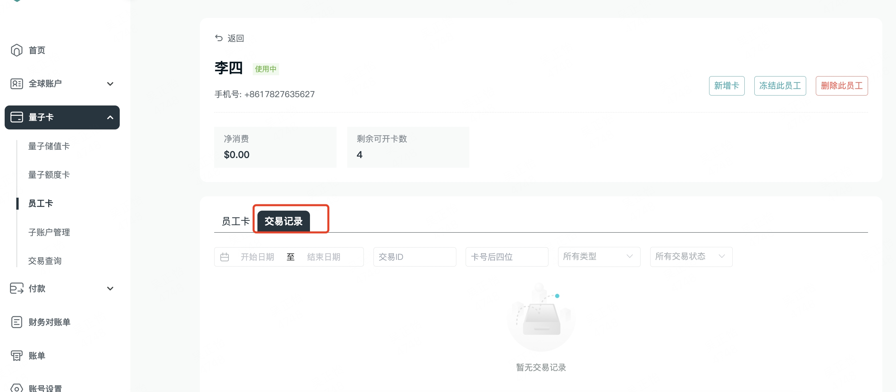
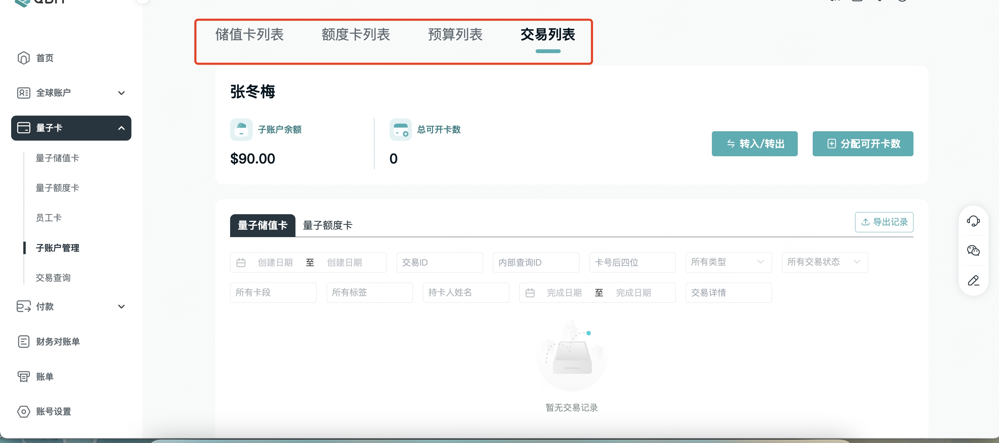
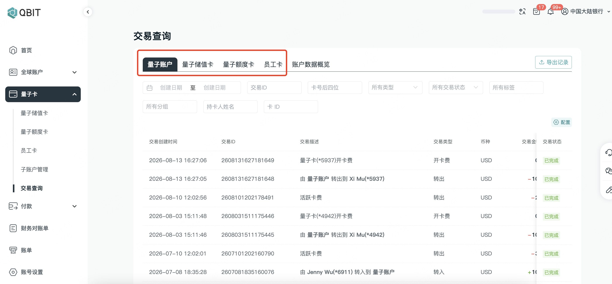
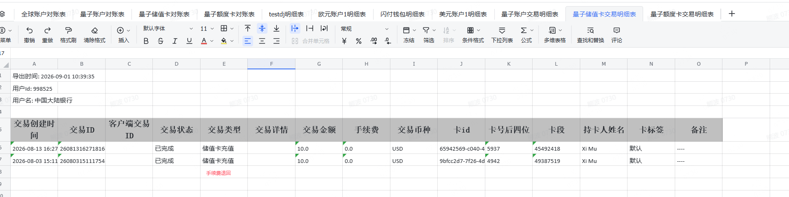

# 手动退回功能

**需求背景：**

量子卡业务运营过程中，因系统计费异常、重复扣款、价格调整等原因，可能出现向客户多收费用的情况。当前系统缺乏标准化的手动退回能力且需要原路退回的能力，工作人员无法高效、合规地处理此类资金退回诉求。

**目标：\(本期还不涉及，本期先做底层\)**

1. 建立标准化的手动退款申请与复核流程，确保资金退回操作可追溯、可审计

2. 支持多路径退款（卡内余额 / 客户账户 / 原支付渠道），满足不同业务场景

3. 实现双人复核机制，降低资金操作风险

4. 提供完整的退款记录与状态追踪，便于后续对账与合规审查

**需求范围：**

|**模块**|**需求点**|**优先级**|
|---|---|---|
||||
||||
||||
||||
||||
||||

公共服务原型：http://www\.axshare\.site/ok0k15

# 新增交易类型

需要在量子账户交易、量子卡交易、预算组交易三个模块中，增加**“手续费退回”/“FeeRefund”**类型。

## 定义

**手续费退回定义**：将前期已扣收的各类交易手续费资金退回客户，产生独立资金流水；常见于原交易退款、错扣补偿场景。该流水金额仅为手续费，不含订单本金。

在量子账户交易、量子卡交易、预算组交易三套交易类型枚举中，同步新增 FeeRefund 类型。该类型表示一笔独立的手续费退回资金流水，与原交易退款（Refund）和手续费扣收（Fee）区分开。手续费退回流水在生成时需关联原手续费扣收流水或原交易记录。\(暂定退回的金额值，落在amount字段上\)

枚举值定义如下表所示，量子账户、量子卡、预算组使用相同枚举值：

|模块|枚举值|中文名/英文名|资金方向|
|---|---|---|---|
|量子账户|FeeRefund|手续费退回 Fee Refund|入账\(客户加钱\)|
|量子卡|FeeRefund|手续费退回 Fee Refund|入账\(客户加钱\)|
|预算组|FeeRefund|手续费退回 Fee Refund|入账\(客户加钱\)|

字段层面，`FeeRefund` 流水需包含以下关联字段，用于追溯原手续费扣收记录和原交易：

*产品的小建议，但是还是看目前实际的表结构。*

|字段名|说明|
|---|---|
|original\_txn\_id|关联的原始订单id|
|refund\_reason|退回原因：TXN\_REFUND（原交易撤销/失败触发）、WRONG\_DEDUCT（错扣补偿）、MANUAL\_ADJUST（人工调整）|
|fee\_type|手续费类型，也就是退回的手续费类型，比如：settlement fee|
|fee\_amount|退回手续费金额，必须 \> 0，且 ≤ 原手续费扣收金额|

## 触发场景

# 需要同步修改

## Openapi Webhook

当 FeeRefund 流水生成后，系统通过 OpenAPI Webhook 向已订阅交易通知的客户推送事件。由于新增了交易类型枚举值，客户侧需要适配新的 type 字段值 FeeRefund，否则可能因未识别类型而导致通知处理失败或丢弃。

> 以及看一下，是否需要返回 `original_txn_id` 、 `refund_reason` 、 `fee_type`，这块结构还是看具体情况，开发自行决定
> 
> 

## 商户端

我列出来的页面不一定全，如果有发现遗漏的，可以同步修改掉。

包括商户端、gateway平台、distributor平台

**储值卡、额度卡、员工卡【卡详情】内卡交易记录及月账单**

**预算详情内交易记录**

**员工预算详情内交易记录**

**员工详情内交易记录**

**子账户内储值卡、额度卡、预算详情内的交易记录，及交易列表**

**交易查询**

## admin

我列出来的页面不一定全，如果有发现遗漏的，可以同步修改掉。

**【支付与收单】—【量子卡】—【量子卡交易列表】**

**【支付与收单】—【量子卡】—【预算交易列表】**

**【支付与收单】—【量子卡】—【量子账户交易列表】**

## 对账单

**【商户资金对账单】**

如图所示处，账户余额类型= 量子账户余额、预算余额、储值卡卡总余额，三个入金汇总金额需要加上“手续费退回”交易类型的金额。

期初期末余额处，入股是通过反推计算的话，也是需要同步加上手续费退回的金额。

如图公式需要修改为：

量子账户入金=充值\+内部划转入\+卡转出\+预算转出\+手续费退回；

预算入金=充值到预算\+额度卡退款\+手续费退回；

储值卡卡总余额入金=充值到卡\+储值卡退款\+手续费退回；

如图，明细处，需要展示交易类型=手续费退回的所有流水记录

**【月度对账单】**

如下例量子卡业务相关的sheet中的数据取值、公式展示、统计等内容进行相应的修改。子母账户的对账单也是一样的逻辑进行同步修改。

## Interlace API \- 商户资金对账单

Lydia在文中备注处也需要同步修改

[ Interlace API\-商户资金对账单 重构设计](https://axss9gjoff.feishu.cn/wiki/IOxswD1REivRPKkncsZcc8GVnQb)

