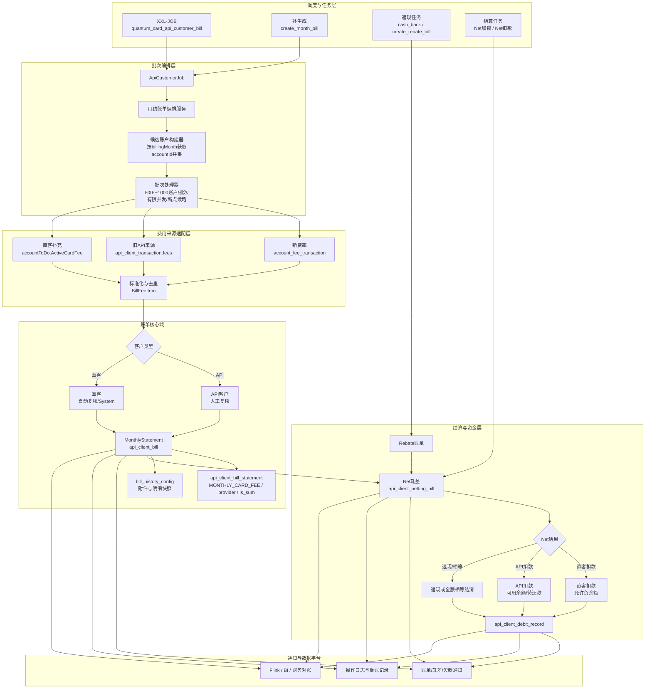
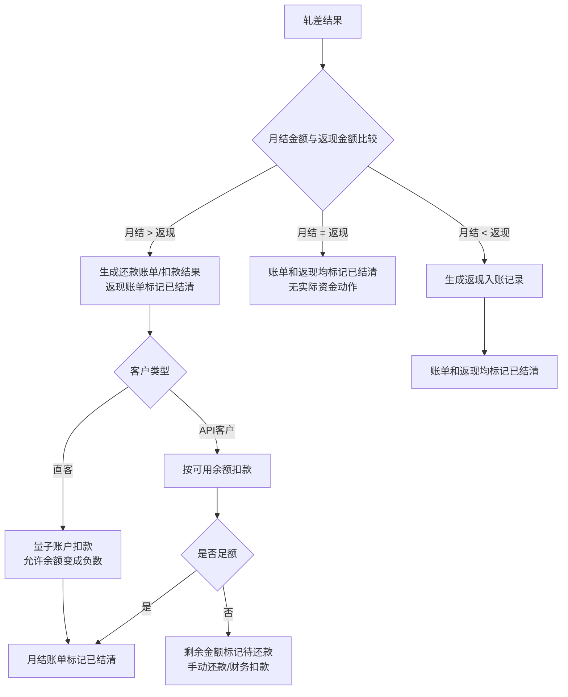

# 直客账单开发方案

> 本方案对应《直客账单需求分析》，用于开发评审、任务拆分、联调和上线执行。
>
> 更新日期：2026-09-18

## 1. 开发目标

在不重命名现有 `api_client_*` 表、字段和任务的前提下，将直客月结费用接入现有客户账单、返现、Net 轧差和扣款链路。

本次开发的核心不是新增一套直客账单，而是：

1. API 客户按迁移情况同时查询新费率 `account_fee_transaction` 和旧 API 来源 `api_client_transaction`。
2. 直客不进入 `api_client_transaction`；直客普通费用查询 `account_fee_transaction`，活跃卡费额外查询 `accountToDo.ActiveCardFee`。
3. 将三类来源统一转换为现有账单明细模型。
4. 复用 `MonthlyStatement`、`Rebate`、Net 和扣款记录的生命周期。
5. 只在客户类型、复核方式和扣款余额策略上做差异化处理。

## 2. 已确定的业务规则

### 2.1 客户和账单准入

- 直客通过 `accountId` 识别，定义为非 API 客户。
- API 客户需要同时查询新费率和旧 API 来源；直客不进入 `api_client_transaction`，只查询新费率并补查 `ActiveCardFee`。
- 只有账单周期内存在符合月结查询条件的月结费用（`status = 'Closed'`）的客户才生成 `MonthlyStatement`。
- 无月结费用时不生成空账单，也不生成 Net。
- 直客有月结费用但没有返现账单时，仍生成 `NettingDebit`，`rebate_amount = 0`、`rebate_id = NULL`。
- `api_client_bill.customer_type` 记录账单生成时的客户类型快照，固定使用 `API` 或 `DIRECT`，账户后续类型变化不影响历史账单。

### 2.2 三类费用来源

| 来源 | 适用范围 | 关键条件 |
|---|---|---|
| `account_fee_transaction` | API 和直客的量子卡业务 | 账单月份匹配、`deduction_node = 'monthly'`、`status = 'Closed'`，且 `business_id` 必须关联 `qbitCard` |
| 旧 API 月结来源 | API 客户 | `api_client_transaction.fees`，按现有 API 账单逻辑聚合 |
| `accountToDo.ActiveCardFee` | 直客 | `key = 'ActiveCardFee'`，按 JSON `billingMonth` 归属月份 |

### 2.3 活跃卡费明细

活跃卡费最终与 API 客户使用相同的账单明细类型：

```java
MONTHLY_CARD_FEE("monthlyCardFee", "活跃卡月费", "Monthly Card Fee", null)
```

`BlueBancCardRecharge` 是原始供应商信息，不是账单类型。写入 `api_client_bill_statement` 时：

| 行类型 | `type` | `provider` | `is_sum` |
|---|---|---|---|
| 渠道明细行 | `monthlyCardFee` | 按 API 规则映射，例如 `BB` | `false` |
| 汇总行 | `monthlyCardFee` | `null` | `true` |

账单金额汇总查询依赖 `is_sum = true`，因此汇总行不能省略。明细金额取 `feeDetails[].amount`，`totalFee` 仅用于校验明细合计。

## 3. 总体架构

```text
XXL-JOB
  → ApiCustomerJob
  → 月结账单编排服务
  → getApiClientMonthlySettlementFee(filter)
      ├─ 查询新费率来源
      ├─ API客户查询 api_client_transaction
      ├─ 合并和去重 API 新旧结果
      └─ 直客补查 accountToDo.ActiveCardFee
  → 统一费用对象
  → MonthlyStatement / api_client_bill_statement
  → Rebate
  → api_client_netting_bill
  → api_client_debit_record
```

### 3.1 设计原则

- 账单 Service 负责业务编排，不直接拼接三类来源的 SQL。
- 每个费用来源独立查询、独立转换、独立记录异常。
- 所有来源合并后再生成账单，不能每个来源单独生成账单。
- 账单、Net 和扣款必须使用同一账户、账单月份和来源追踪信息。
- 不修改现有 API 客户的状态枚举和资金逻辑，优先新增兼容分支。

### 3.2 系统架构图



架构边界说明：

- `O3/O4` 负责性能控制，只处理有费用的候选账户，不全量逐账户扫描。
- `F1` 对 API 和直客执行；`F2` 只对 API 客户执行；`F3` 只对直客候选账户执行。
- `F4` 完成来源合并和去重后，账单核心域不再区分费用来自新表还是旧表。
- `B2/B3` 是客户类型差异的主要位置；账单、明细、返现和 Net 模型继续共用。
- `N2` 才是资金策略分支位置，不能在费用查询阶段复制 API/直客两套账单逻辑。
- `T3` 必须保留来源、客户类型、账单月份和 Net 关联，保证 Flink、BI 和财务对账可追溯。

## 4. 代码改造范围

| 文件/模块 | 改造内容 |
|---|---|
| `qbit-core/src/main/java/com/qbit/job/qbitcard/ApiCustomerJob.java` | 保持账单和返现任务入口；确认 API/直客进入各自适用的来源组合 |
| `qbit-core/src/main/java/com/qbit/common_all/api/client/bill/service/impl/ApiClientBillServiceImpl.java` | 账单编排、客户类型快照、直客自动复核、账单幂等 |
| `qbit-core/src/main/java/com/qbit/common_all/api/client/bill/service/impl/ApiClientBillStatementServiceImpl.java` | 明细写入、`MONTHLY_CARD_FEE`、`provider`、`is_sum`、明细幂等 |
| `qbit-core/src/main/java/com/qbit/openapi/service/impl/ApiClientTransactionServiceImpl.java` | 改造 `getApiClientMonthlySettlementFee(QueryFilterDTO filter)`，API 客户查询新费率和 `api_client_transaction`，直客查询新费率并补充 ActiveCardFee |
| `qbit-core/src/main/java/com/qbit/openapi/domain/enums/ApiClientFeeEnum.java` | 复用 `MONTHLY_CARD_FEE`，不新增直客枚举 |
| `qbit-core/src/main/resources/mapper/quantum/card/ApiClientBillStatementMapper.xml` | 保证总额按 `is_sum = true`，明细查询保留渠道明细 |
| `qbit-core/src/main/java/com/qbit/job/qbitcard/ArrearsRecoverJob.java` | 核对直客欠款通知、还款、补扣和负余额平账覆盖范围 |

如现有 Service 已经承担过多来源查询和金额组装职责，建议将来源查询和转换拆到账单领域内的具体协作者，不在 Controller 或 XXL-JOB 中增加业务逻辑。

## 5. 统一费用对象

建议定义内部 `BillFeeItem`，避免将不同来源的 Entity 或 JSON 直接传入账单 Service：

```text
BillFeeItem
  accountId
  billingMonth
  sourceSystem          NEW_RATE / LEGACY_RATE / ACTIVE_CARD_TODO
  sourceId              transactionId / accountToDoId / detailId
  feeType               MONTHLY_CARD_FEE 等统一类型
  provider              API 映射后的 provider
  sourceProvider        原始 provider
  amount
  adjustAmount
  isSettled
  isSum
  detailData            firstSix、rate、count、activeCard 等
  detailFileUrl         activeCardDetailsFile
```

统一转换步骤：

1. 新费率来源转换为 `BillFeeItem`。
2. 旧费率来源转换为 `BillFeeItem`。
3. API 客户合并新费率和 `api_client_transaction`，按稳定业务键去重；直客不读取 `api_client_transaction`。
4. 直客补查 `ActiveCardFee`，使用 JSON 的 `billingMonth`。
5. 每条 `feeDetails` 使用 `amount` 转成渠道明细。
6. `BlueBancCardRecharge` 按 API 规则映射为 `provider`，但 `feeType` 固定为 `MONTHLY_CARD_FEE`。
7. 生成 `is_sum = false` 的渠道明细和 `is_sum = true` 的汇总行。

## 6. `getApiClientMonthlySettlementFee` 改造方案

该方法是本次最关键的改造点：

```java
List<ApiClientMonthFeeVO> getApiClientMonthlySettlementFee(QueryFilterDTO filter);
```

目标流程：

```text
getApiClientMonthlySettlementFee(filter)
  ├─ validateFilter(filter)
  ├─ queryNewRateMonthlyFees(filter)
  ├─ queryLegacyMonthlyFees(filter)
  ├─ mergeAndDeduplicate(newFees, legacyFees)
  ├─ convertToApiClientMonthFeeVO(mergedFees)
  ├─ if account is direct customer:
  │    queryActiveCardFeeTodo(accountId, filter.billingMonth)
  │    convertActiveCardFee()
  │    appendActiveCardSummary()
  └─ return all fee rows
```

注意事项：

- 同一客户适用的来源查询使用相同的账户范围和账单月份。
- API 客户不能根据迁移字段跳过新费率或 `api_client_transaction` 任一查询。
- 直客不能查询 `api_client_transaction`，因为直客交易不进入该表。
- API 同一客户同一月份可能同时存在新旧来源，必须按来源主键或稳定业务键去重。
- 查询结果需要记录来源统计和异常统计。
- 任一来源不完整时，该客户不能静默生成部分账单，应进入失败/待处理状态；不影响其他正常客户。
- ActiveCardFee 不是新旧费率双查询的替代品，而是直客活跃卡费的补充来源。

## 7. 月结账单开发流程

### 7.1 查询和准入

1. 根据任务参数确定 `billingMonth` 和 `accountIds`。
2. API 客户执行新费率和 `api_client_transaction` 查询。
3. 直客执行新费率查询，并额外查询 `accountToDo.ActiveCardFee`。
4. 按客户适用来源合并、去重和校验 `status = 'Closed'` 状态。
6. 没有任何有效月结费用的客户跳过账单生成。

### 7.2 主记录和明细

1. 按 `accountId + billingMonth + MonthlyStatement` 做账单幂等。
2. 写入客户类型快照和账单来源信息。
3. 写入普通费用明细。
4. 写入 `MONTHLY_CARD_FEE` 活跃卡费渠道明细。
5. 写入 `provider = null、is_sum = true` 的汇总行。
6. 保存 `bill_history_config`、来源 ID、原始 provider 和 Active Card Details 文件链接。
7. 生成附件失败时保留主记录并支持安全重试，不能产生第二张有效账单。

### 7.3 复核和展示

- 直客：生成后自动复核，操作人 `System`。
- API 客户：继续沿用人工复核流程。
- 复核前不可展示为最终可支付账单。
- 复核后进入客户端查询、下载、通知和 Net 计算链路。

### 7.4 `account_fee_transaction` 月结交易明细与 CSV

`api_client_bill_statement` 负责账单页面的费用汇总和展示；月结交易明细 CSV 不直接从账单明细汇总表生成，而是根据账单月份重新查询费用交易来源。

API 和直客涉及 `account_fee_transaction` 的 CSV 明细，都需要保留原始关联字段，不能只按 `account_id + fee_name + provider` 汇总：

```text
account_fee_transaction.business_id
  └─ 量子卡费用：关联 qbitCard.id，获取卡和 provider

account_fee_transaction.transaction_id
  ├─ 关联 qbit_card_transaction.transactionId，获取量子卡交易明细
  └─ 关联 "Transaction".id，获取主交易信息

account_fee_transaction.source_id
  └─ 关联具体费用来源业务记录，具体表由 fee_name 和业务场景决定
```

量子卡费用的查询关系：

```sql
LEFT JOIN "qbitCard" qc
    ON qc."id"::varchar = aft.business_id::varchar
LEFT JOIN "qbit_card_transaction" qct
    ON qct."transactionId"::varchar = aft.transaction_id::varchar
   AND qct."cardId"::varchar = aft.business_id::varchar
LEFT JOIN "Transaction" t
    ON t.id::varchar = aft.transaction_id::varchar
```

导出查询建议新增独立的明细查询方法，不改造现有月结汇总查询：

```text
selectMonthlySettlementFees()
  └─ 账单汇总，按费用类型和 provider 聚合

selectMonthlySettlementDetails()
  └─ CSV 明细，保留 account_fee_transaction 原始记录和交易关联信息
```

直客 CSV 的来源为：

```text
account_fee_transaction
  + qbitCard（量子卡费用流水）
accountToDo.ActiveCardFee
  + 现有活跃卡明细查询逻辑生成独立 CSV
```

本次账单显示和月结处理只覆盖量子卡业务。全球账户、加密资产等非量子卡费用不进入本次 `account_fee_transaction` 月结账单和 CSV 明细；如后续需要展示，应另行设计对应账单口径。

CSV 导出规则如下：

1. API 账单保留 `api_client_transaction` 旧来源，同时查询量子卡 `account_fee_transaction` 新来源。
2. 两个来源按 `transaction_id/source_id` 做兼容去重；同一标识同时存在时，以 `account_fee_transaction` 为准，旧来源只作为补充。
3. 直客不复用 API 交易导出方法，只导出量子卡 `account_fee_transaction`；`ActiveCardFee` 使用现有活跃卡明细查询逻辑生成独立 CSV，最终与直客费用 CSV 一起打包为 ZIP。
4. API 和直客的 `account_fee_transaction` 查询都必须限定量子卡费用名称，并要求 `business_id` 关联 `qbitCard`，不导出全球账户和加密资产费用。

## 8. 返现、Net 和扣款方案

### 8.1 返现账单

复用 `create_rebate_bill` 生成 `api_client_bill.type = Rebate`。开发时确认该任务筛选范围是否覆盖直客；没有返现数据不阻断月结账单和 Net。

### 8.2 Net 轧差

```text
MonthlyStatement + Rebate(可为空)
  → api_client_netting_bill
  → 计算 NettingDebit / NettingRebate / NettingEqual
  → 20日00:00加锁
  → 20日10:00扣款或返现
```

轧差结果分支按现有业务图处理：



实现要求：

- 月结金额大于返现时，生成扣款型 Net；直客允许扣款后余额为负，API 客户余额不足部分进入待还款。
- 月结金额等于返现时，账单和返现都直接结清，不产生实际扣款或返现资金动作。
- 月结金额小于返现时，生成返现入账记录，并将账单和返现标记为已结清。
- 账单、返现、Net 和实际资金记录必须保持关联，重试不得重复扣款或重复返现。

### 8.3 按账单客户类型处理复核和扣款

新增 `api_client_bill.customer_type` 后，复核和扣款分支必须使用账单生成时保存的客户类型，不再根据当前 `account.type` 判断。客户类型固定值为：

```text
API
DIRECT
```

#### 月结账单复核

```text
api_client_bill.customer_type
        │
        ├── DIRECT
        │   └── 自动复核通过
        │
        └── API
            └── 保持人工复核
```

直客月结账单生成时直接写入复核完成状态；API 客户继续沿用现有人工复核流程。

#### Net 扣款

当月结账单金额大于返现金额时，先通过 `api_client_netting_bill.bill_id` 查询对应的 `api_client_bill.customer_type`：

```text
账单金额 > 返现金额
        │
        ├── customer_type = DIRECT
        │   └── 允许量子账户余额扣成负数
        │       └── 账单标记已结清
        │
        └── customer_type = API
            └── 按可用余额扣款
                ├── 足额：账单结清
                └── 不足：PartSettled，进入待还款
```

以下两种轧差结果不因客户类型产生额外分支：

- 账单金额等于返现金额：账单和返现都标记为已结清，不产生实际资金动作。
- 账单金额小于返现金额：生成返现入账记录，并将账单和返现标记为已结清。

实现要求：

- `ApiClientDebitRecordServiceImpl` 的直客扣款判断改为读取关联月结账单的 `customer_type`。
- Net 查询、加锁、扣款和客户端展示均不能重新读取当前账户类型覆盖历史账单类型。
- 不在 `api_client_netting_bill` 重复增加客户类型字段，统一通过 `bill_id` 关联 `api_client_bill.customer_type`。
- 历史账单 `customer_type` 不按当前账户类型推断。生产数据已确认历史 `api_client_bill` 同时存在 `ApiClient`、`MasterAccount`、`Merchant` 和 `TestAccount`；迁移脚本按账户类型回填，`TestAccount` 按 `DIRECT` 处理；新生成直客账单写入 `DIRECT`。

直客无返现时：

```text
MonthlyStatement
  → rebate_id = NULL
  → rebate_amount = 0
  → NettingDebit
```

### 8.3 扣款

| 客户 | 处理 |
|---|---|
| 直客 | 复用量子账户负余额能力，允许透扣后直接结清；不进入欠款通知、还款和负余额强制平账任务 |
| API 客户 | 复用现有可用余额扣款，不足部分进入待还款/补扣 |

每笔实际动作写入 `api_client_debit_record`，必须关联 Net、账单月份、账户、客户类型和扣款来源。

## 9. XXL-JOB 改造和配置

| 任务 | 开发要求 |
|---|---|
| `quantum_card_api_customer_bill` | API 客户执行新旧来源查询；直客执行新费率并额外查询 ActiveCardFee |
| `create_month_bill` | 当前 STOP，仅作为受控补生成入口；必须限制客户和月份 |
| `cash_back` / `create_rebate_bill` | 复用返现链路，确认直客客户范围 |
| `quantum_card_api_customer_netting_bill_debit_lock` | 复用加锁，排除无月结费用和已结算记录 |
| `quantum_card_api_customer_netting_bill_debit` | 复用扣款/返现，增加直客负余额分支和扣款幂等 |
| `debitBillNotify` / `debitBillRepayment` | 确认直客覆盖和未结清状态过滤 |
| `processForceDeductionNegativeBalance` | 确认直客负余额是否纳入，避免重复平账 |
| `month_bill_debit_notice` / `month_netting_bill_debit_notice` | 复用通知，增加账单来源和发送去重 |

当前 STOP 的普通账单扣款任务不能直接作为直客新流程入口。原有直客待办扣款链路已确认不再继续运行；`ActiveCardFee` 只负责提供活跃卡月费数据，后续统一通过月结账单和 Net 扣款，不再由待办直接扣款。

## 10. 批量处理和性能方案

统一任务入口不代表全量遍历所有账户，也不采用“每个账户逐个查询新费率、旧费率和 `ActiveCardFee`”的串行方式。实际执行采用候选账户集合和批处理：

```text
按账单月份批量查询新费率月结费用
按账单月份批量查询旧费率月结费用
按账单月份获取直客 ActiveCardFee 候选
        ↓
合并 accountId 并去重
        ↓
按批次处理 500～1000 个账户
        ↓
生成账单、明细和历史快照
```

执行要求：

- 只处理本账单周期存在候选费用的账户，不扫描全部账户。
- 各适用来源查询使用账单月份、`status = 'Closed'` 和账户范围条件，并确认数据库索引；`api_client_transaction` 只处理 API 客户。
- 先得到候选 `accountId` 并集，再按批次查询明细和生成账单。
- `ActiveCardFee` 只对候选直客查询，不对所有账户扫描 `accountToDo`。
- 新旧来源可以有限并行，但必须配置并发上限，避免同时压垮数据库。
- 每批记录候选数、读取数、去重数、生成数、失败数和耗时。
- 任务超时后支持从批次断点继续；已生成账单的账户通过幂等判断跳过。
- 使用 `accountId + billingMonth + billType` 避免重复生成账单，使用来源 ID 避免重复写入明细。

因此最终执行模型是：一个统一账单任务、批量获得候选账户、有限并发分批处理，API 客户和直客只在批次内部按来源和客户类型做差异化处理。

## 11. 幂等、事务和失败处理

- 账单生成锁：`accountId + billingMonth + billType`。
- 来源去重：`sourceSystem + sourceId/detailId`；ActiveCardFee 使用待办 ID + 明细 ID。
- 账单重跑：存在有效主记录时只补齐缺失数据，不重复插入主记录。
- Net 扣款：按 Net ID 和扣款阶段幂等，成功记录存在时禁止再次调用资金扣款。
- 账单主记录、明细和历史配置保持一致；外部资金动作不放在长事务中。
- 新旧查询任一失败时记录批次状态和失败原因，不能静默生成不完整账单。
- ActiveCardFee JSON 解析失败、`billingMonth` 缺失、明细金额为空或 `totalFee` 校验不一致时，记录账户、待办 ID 和异常详情。
- 通知失败不回滚资金交易，支持按通知记录重试。

## 12. 测试方案

| 场景 | 预期 |
|---|---|
| 新费率 API 客户 | 查询新费率和 `api_client_transaction`，按去重后结果生成账单 |
| 未迁移 API 客户 | 旧费率来源正常生成账单 |
| API 新旧来源同时有数据 | 合并后不重复计费，保留来源追溯 |
| 新费率直客 | 生成普通月结费用和统一账单 |
| 仅有 `ActiveCardFee` 的直客 | 按 `billingMonth` 生成 `MONTHLY_CARD_FEE` |
| 多条 `feeDetails` | 渠道明细金额正确，汇总行金额等于明细合计 |
| `BlueBancCardRecharge` | `provider` 按 API 规则映射，`type` 仍为 `monthlyCardFee` |
| 无月结费用 | 不生成空账单和 Net |
| 有月结无返现 | 生成 `NettingDebit`，返现为 0 |
| 重复执行任务 | 不重复生成账单、明细、Net 或扣款 |
| 直客透扣 | 允许量子账户负余额，扣款记录可追溯 |
| API 余额不足 | 部分扣款并进入待还款 |
| 来源查询失败 | 按客户隔离；失败客户进入失败/待处理，不生成不完整账单，其他客户继续 |
| 已结清账单调账 | 拒绝修改并记录日志 |

## 13. 开发阶段和交付物

### 阶段一：现状核对

- 交付：新旧查询 SQL、ActiveCardFee JSON 结构、API provider 映射、状态枚举和任务调用链说明。
- 完成标准：明确 `getApiClientMonthlySettlementFee` 两次查询的实际方法和去重键。

### 阶段二：费用适配和账单明细

- 交付：统一费用对象、三类来源转换、`MONTHLY_CARD_FEE` 明细、`provider/is_sum` 汇总逻辑。
- 完成标准：四类测试客户均能生成正确费用明细，重复执行不重复入账。

### 阶段三：账单、返现和 Net

- 交付：客户类型快照、直客自动复核、无返现 Net、Net 加锁和扣款分支。
- 完成标准：直客和 API 客户各自的 Net、扣款、待还款逻辑不串线。

### 阶段四：通知、客户端和后台

- 交付：账单查询、明细下载、Active Card Details、通知和还款入口。
- 完成标准：通知不重复，账单金额和明细金额一致。

### 阶段五：灰度和上线

- 先以只读/对账模式运行新旧双查询，不写正式账单。
- 选择新费率 API、旧费率 API、普通直客和仅 ActiveCardFee 直客灰度。
- 对比来源金额、账单金额、`is_sum` 汇总、Net 数量和扣款结果。
- 确认财务、Flink/BI、通知和客户端无异常后扩大范围。
- 通过配置开关关闭直客分支，不删除已生成账单；回滚时禁止恢复会重复扣款的旧链路。

## 14. 执行计划（精简版）

本节是业务方需要关注的主计划。业务方不需要逐项执行代码、SQL、测试和上线任务，只需要确认以下 6 个口径：

### 14.1 业务方需要确认的事项

- [x] **费用状态**：`account_fee_transaction` 和旧 API 来源均按 `status = 'Closed'` 作为月结查询口径。
- [x] **供应商映射**：直客复用 API 现有 provider 映射；`BlueBancCardRecharge` 按该规则映射为账单明细 `provider = BB`，费用类型仍为 `MONTHLY_CARD_FEE`。
- [x] **账单月份**：直接使用 `ActiveCardFee` JSON 的 `billingMonth` 作为费用归属月份。
- [x] **客户范围**：API 客户查询新费率和 `api_client_transaction`；直客查询新费率并额外查询 `ActiveCardFee`。
- [x] **失败策略**：按客户隔离；客户适用的来源其中一边查询失败时，该客户进入失败/待处理并记录原因，其他正常客户继续生成。
- [x] **旧直客待办扣款**：确认不再继续运行；`ActiveCardFee` 不由待办直接扣款，统一进入月结账单和 Net 扣款。

### 14.2 开发团队执行阶段

1. **现状核对**：确认调用链、数据来源、状态枚举、任务参数和旧扣款链路。
2. **费用适配**：实现 API 新费率、API 旧来源和直客 `ActiveCardFee` 的查询、标准化、去重和异常记录。
3. **账单生成**：改造 `getApiClientMonthlySettlementFee`，接入批量候选账户、`MONTHLY_CARD_FEE`、`provider/is_sum` 和账单幂等。
4. **返现与结算**：接入 Rebate、Net、直客负余额扣款和 API 待还款逻辑。
5. **产品联调**：完成 Admin、Merchant、通知、明细下载和 Active Card Details。
6. **验证上线**：完成四类测试客户、财务对账、灰度、监控和回滚验证。

### 14.3 逐项处理的开发项目总览

后续按以下顺序逐项确认和实施，每完成一项再进入下一项：

1. **现有生产链路盘点**：确认 API、直客、返现、Net、扣款和通知的真实调用链。
2. **费用来源接入**：接入新费率、旧 API 来源和直客 `ActiveCardFee`，明确客户分流。
3. **统一费用与账单明细**：统一费用对象，写入 `api_client_bill_statement`，处理 `MONTHLY_CARD_FEE`、`provider` 和 `is_sum`。
4. **月结账单生成**：改造月结账单任务、客户类型快照、自动复核和账单幂等。
5. **返现与 Net 轧差**：复用现有返现账单，接入直客和 API 的 Net 计算分支。
6. **扣款和状态流转**：直客允许负余额并直接结清；API 保留待还款逻辑；排除直客欠款任务。
7. **通知与客户端**：新增直客规则升级通知定时任务，调整账单、返现和 Net 通知范围。
8. **测试、对账与上线**：覆盖四类客户、金额状态、重复执行、通知和灰度回滚。

当前建议先处理第 1 项，先把生产现状和改造边界确认清楚，再开始设计第 2 项的代码改造。

### 14.4 业务方最终验收

- [ ] 新费率 API 客户、旧费率 API 客户、普通直客、仅 `ActiveCardFee` 直客均能正确出账。
- [ ] 新旧费率同时有数据时不重复计费。
- [ ] 无月结费用不出账；有月结无返现能生成 `NettingDebit`。
- [ ] 账单金额、明细金额、Net 金额、扣款金额和财务对账一致。
- [ ] 直客和 API 客户的复核、扣款、欠款和通知差异符合确认口径。

## 15. 开发内部任务明细（Superpowers 执行清单）

> 以下是开发团队内部执行清单，不是业务方待办。开发人员按依赖顺序执行，业务方只需在第 14.1 节确认口径。

> 本节是实施计划，不代表本轮立即修改代码。执行时按任务依赖顺序推进，每个任务完成后先验证，再进入下一任务。

### 任务 1：现状调用链和数据依赖盘点

**前置条件：** 无。

**需要检查：** `ApiCustomerJob`、`ApiClientTransactionServiceImpl`、`ApiClientBillServiceImpl`、`ApiClientBillStatementServiceImpl`、`ArrearsRecoverJob`、相关 Mapper、Flink/BI SQL 和旧直客扣款脚本。

- [x] 确认 `quantum_card_api_customer_bill` 的入口、账户筛选和调用参数：当前通过 `ApiCustomerJob#billJobHandler` 调用 `ApiClientBillService#initBill`，再通过 `openApiClientMapper.customerList` 只获取 API 客户。
- [x] 定位 `getApiClientMonthlySettlementFee(QueryFilterDTO filter)` 当前来源：旧 API 费用主要来自 `api_client_transaction`，按 `status = 'Closed'` 和账单月份查询；当前方法尚未接入 `account_fee_transaction`。
- [x] 定位现有活跃卡费处理：API 现有代码通过 `getMonthProviderExtends` 和 `api_client_bill_statement` 汇总 Active Card 数据；直客 `accountToDo.ActiveCardFee` 尚未接入统一账单查询。
- [x] 梳理账单、明细、返现、Net、扣款记录的真实状态枚举和主要任务入口。
- [x] 输出调用链、表字段、任务参数和下游依赖清单；确认改造必须增加直客候选账户和客户类型分流，不能只修改旧 API SQL 条件。

**盘点结果：** 当前生产链路仍是 API 专用入口。`create_rebate_bill` 查询 `cash_back_bonuses` 时没有 API 类型过滤，非 API 客户符合返现条件也会生成 `Rebate`；Net 按账户和账单月份合并月结与返现金额。现有 `upgrade_to_the_billing_feature` 通知任务只查询有效 `OpenApiClient`，直客需要新增独立通知任务。

**进入下一项前保留的技术核对：** 直客 `ActiveCardFee` 的实际生产写入/查询代码位置、`account_fee_transaction` 月结字段映射、直客候选账户的最小查询范围，以及旧直客待办扣款任务是否存在代码入口。

**完成标准：** 能明确每个来源从哪里读、写入哪张表、由哪个任务触发，以及旧直客扣款是否会与新流程重复。

### 任务 2：确定三类适用来源契约

**前置条件：** 任务 1。

- [x] 固定新费率来源的账单月份、`deduction_node = 'monthly'` 和 `status = 'Closed'` 条件。
- [x] 固定 API 旧来源 `api_client_transaction` 的查询表、月份条件和状态：`delete_time is null`、`status = 'Closed'`、账单月份按交易时间范围过滤；结算回写边界保持现有逻辑。
- [x] 固定直客 `accountToDo.ActiveCardFee` 的查询条件、JSON 字段和 `billingMonth` 规则：`key = 'ActiveCardFee'`、按 `accountId` 查询、金额取 `feeDetails[].amount`、月份直接使用 JSON `billingMonth`。
- [x] 确认 `BlueBancCardRecharge` 按 API 现有映射转换为 `provider = 'BB'`；现有映射 `BB -> BlueBanc` 可复用。
- [ ] 确认 API 新旧来源和直客 `ActiveCardFee` 的稳定去重键；建议 API 使用来源记录 ID，ActiveCardFee 使用待办 ID + 明细唯一标识。

**第 2 项关键待确认：** `account_fee_transaction` 没有独立的 `billingMonth` 字段，只有 `createTime`。实现新费率查询前需要确认：月结账单月份是否按 `createTime` 的自然月范围过滤；当前建议按 `createTime >= 账单月开始 && createTime < 下月开始` 处理。

**完成标准：** 形成一份来源契约表，包含查询条件、账单月份、金额字段、状态字段、来源 ID、去重键和异常处理。

### 任务 3：实现统一费用对象和来源适配器

**前置条件：** 任务 2。

**建议修改：** 账单领域新增 `BillFeeItem` 及来源适配协作者；不把三类来源 SQL 混入账单编排 Service。

- [ ] 实现新费率来源适配器。
- [ ] 实现旧费率来源适配器。
- [x] 直客 `ActiveCardFee` 继续复用现有活跃卡明细 CSV 查询，并与直客费用 CSV 一起生成 ZIP。
- [ ] 统一输出 `accountId`、`billingMonth`、`sourceSystem`、`sourceId`、`feeType`、`provider`、金额、结算状态和明细扩展信息。
- [ ] 对 JSON 缺字段、金额为空、月份缺失和 `totalFee` 不一致记录可追踪异常。

**完成标准：** 三类来源都能转换成同一个 `BillFeeItem`，并可以独立单元测试。

### 任务 4：改造 `getApiClientMonthlySettlementFee`

**前置条件：** 任务 3。

**核心文件：** `qbit-core/src/main/java/com/qbit/openapi/service/impl/ApiClientTransactionServiceImpl.java`。

- [x] API 客户和直客的 CSV 明细均接入量子卡 `account_fee_transaction` 查询；API 与旧来源兼容并按新来源优先去重。
- [ ] 仅对 API 客户执行 `api_client_transaction` 旧来源查询。
- [ ] API 合并新旧结果后按来源 ID 和业务键去重；直客不读取 `api_client_transaction`。
- [x] 仅对直客账单在 ZIP 中补充 `ActiveCardFee` 独立明细文件。
- [ ] 将统一费用对象转换为 `ApiClientMonthFeeVO`。
- [ ] 输出新来源、旧来源、ActiveCardFee 的读取数、去重数、计费数和异常数。

**完成标准：** 同一账单月份不会因为客户迁移状态漏查来源；新旧来源同时有数据时不重复计费。

### 任务 5：落库 `MONTHLY_CARD_FEE` 明细

**前置条件：** 任务 4。

**核心文件：** `ApiClientFeeEnum`、`ApiClientBillStatementServiceImpl`、`ApiClientBillStatementMapper.xml`。

- [ ] 复用 `MONTHLY_CARD_FEE("monthlyCardFee", "活跃卡月费", "Monthly Card Fee", null)`。
- [ ] 渠道明细写入 `provider` 映射值，`is_sum = false`。
- [ ] 生成同类型汇总行，`provider = null`，`is_sum = true`。
- [ ] 汇总行金额等于有效渠道明细金额合计。
- [ ] 确认账单总额 SQL 和月费汇总 SQL 能取到汇总行。
- [ ] 保留 `firstSix`、`rate`、`count`、原始 provider 和 `activeCardDetailsFile` 追溯信息。

**完成标准：** API 客户和直客的活跃卡费都能在账单总额、账单明细、Active Card Details 和客户端展示中正确出现。

### 任务 6：接入统一月结账单生成

**前置条件：** 任务 5。

**核心文件：** `ApiClientBillServiceImpl`、`ApiCustomerJob`。

- [ ] 按账单月份获取候选 `accountId` 并集，不全量遍历所有账户。
- [ ] 按 500～1000 个账户分批处理，并限制并发数。
- [ ] 按 `accountId + billingMonth + MonthlyStatement` 做账单幂等。
- [ ] 写入客户类型快照和来源批次信息。
- [ ] 直客生成后自动复核，操作人记录为 `System`。
- [ ] API 客户继续走原人工复核流程。
- [ ] 保存 `bill_history_config` 和附件快照。

**完成标准：** API 和直客都能通过同一账单任务生成正确账单；任务重跑不重复生成主记录或明细。

### 任务 7：接入返现和 Net

**前置条件：** 任务 6。

- [ ] 确认 `create_rebate_bill` 是否覆盖 API 和直客范围。
- [ ] 月结有费用但无返现时生成 `NettingDebit`，`rebate_amount = 0`。
- [ ] 月结大于返现时生成扣款型 Net。
- [ ] 返现大于月结时生成返现型 Net。
- [ ] 金额相等时生成结清型 Net。
- [ ] 20 日加锁前排除无效、重复和已结算账单。

**完成标准：** 四种月结/返现组合都能生成正确 Net，且账单、返现和 Net 关联完整。

### 任务 8：接入扣款、欠款和强制平账

**前置条件：** 任务 7。

**核心文件：** `ArrearsRecoverJob`、Net 扣款 Service 和扣款记录 Service。

- [x] 直客扣款复用量子账户负余额能力，余额不足时允许继续扣款并形成负余额。
- [ ] API 客户继续按可用余额扣款，不足金额进入待还款。
- [ ] 每笔资金动作写入 `api_client_debit_record`。
- [ ] 确认 `debitBillNotify`、`debitBillRepayment` 是否覆盖直客。
- [ ] 确认 `processForceDeductionNegativeBalance` 是否覆盖直客。
- [ ] 扣款重试按 Net ID 和扣款阶段幂等。
- [ ] 已结清 Net 不再被欠款恢复任务处理。

**完成标准：** 直客和 API 的扣款差异只发生在资金策略分支，不会重复扣款或相互串账。

### 任务 9：通知、后台和客户端联调

**前置条件：** 任务 6、任务 7、任务 8。

- [ ] 统一账单通知和轧差通知增加正确的账单来源和客户类型；欠款通知仅覆盖 API 客户。
- [ ] 校验通知去重键和重试行为。
- [ ] Admin 支持客户类型、账单类型、月份、状态和金额查询。
- [ ] Merchant 支持账单查看、明细下载、Active Card Details、还款和还款记录。
- [ ] 直客不再收到旧活跃卡扣费通知。

#### 9.1 新增直客账单规则升级通知任务

本次新增一个一次性 XXL-JOB，不复用现有仅面向 API 客户的
`upgrade_to_the_billing_feature` 任务：

| 项目 | 方案 |
|---|---|
| 任务建议名称 | `direct_customer_billing_settlement_notice` |
| 任务作用 | 向所有有效直客发送账单结算规则升级通知 |
| 执行方式 | 上线前一次性执行；支持通过任务参数传入指定 `accountIds` 重试 |
| 客户范围 | 非 API 客户、账户有效且未删除 |
| 通知模板 | 新增 `DIRECT_CUSTOMER_BILLING_SETTLEMENT_NOTICE`，提供中英文邮件模板 |
| 通知内容 | 2026 年 10 月生成 9 月账单起，每月 20 日统一进行返现与月结费用 Net 结算 |
| 幂等规则 | 按 `accountId + templateName + templateVersion` 防止重复发送 |
| 失败处理 | 单个客户发送失败不影响其他客户；记录失败账户并支持参数化重试 |

该任务只发送规则升级通知，不参与月结账单、返现账单或 Net 业务处理。现有
`upgrade_to_the_billing_feature` 继续保留给 API 客户使用。

**完成标准：** 页面金额、账单明细、通知金额和数据库汇总金额一致，且不会重复发送。

### 任务 10：自动化测试和对账验证

**前置条件：** 任务 6～任务 9。

- [ ] 新费率 API 客户：查询新费率和 `api_client_transaction`，正常生成账单。
- [ ] 旧费率 API 客户：不依赖新费率也能生成账单。
- [ ] API 新旧来源同时有数据：去重后金额正确。
- [ ] 普通直客：生成月结账单并自动复核。
- [ ] 仅有 `ActiveCardFee` 的直客：按 `billingMonth` 生成 `MONTHLY_CARD_FEE`。
- [ ] 无月结费用：不生成账单和 Net。
- [ ] 有月结无返现：生成 0 返现的 `NettingDebit`。
- [ ] 任务重跑、扣款重试和通知重试：不产生重复数据。
- [ ] 校验 Flink、BI、财务对账和历史报表不丢失来源关联。

**完成标准：** 测试账户四类场景全部通过，金额、状态、通知、扣款和对账结果一致。

### 任务 11：灰度上线和回滚

**前置条件：** 任务 10。

- [ ] 先以只读/对账模式运行 API 新旧来源查询和直客来源查询，不写正式账单。
- [ ] 选择新费率 API、旧费率 API、普通直客、仅 ActiveCardFee 直客灰度。
- [ ] 观察账单数量、来源覆盖率、去重数、汇总金额、Net 数量、扣款成功率和通知失败率。
- [ ] 开启配置开关逐步扩大客户范围。
- [ ] 回滚时关闭直客分支，不删除已生成账单。
- [x] 回滚前确认旧待办扣款链路不会与已生成 Net 重复扣款：原有直客待办扣款已确认不再继续运行。

**完成标准：** 一个完整账单周期运行结束，财务、客户端、通知、Flink/BI 均无阻断问题。

## 16. 开发前必须确认

- [ ] API 旧来源 `api_client_transaction` 的准确查询方法、月份条件和结算状态边界。
- [ ] `getApiClientMonthlySettlementFee` 是否复用现有 `api_client_transaction` 查询并新增 `account_fee_transaction` 查询。
- [ ] `BlueBancCardRecharge` 到 `provider = BB` 的准确映射方法和允许值。
- [ ] `ActiveCardFee` 汇总行是否由现有 API 代码统一生成，直客是否直接复用该方法。
- [x] 直客不进入欠款通知、还款和负余额强制平账任务；透扣为负后直接将对应账单结清。
- [x] **旧直客待办扣款**：确认不再继续运行；`ActiveCardFee` 仅作为费用来源，不由待办直接扣款。
- [x] **历史账单**：已单独执行回填 SQL；历史 `MonthlyStatement` 和 `Rebate` 按账户类型回填，`ApiClient/ApiClientCustomer` 为 `API`，`TestAccount` 按 `DIRECT` 处理。
- [x] 客户适用来源查询部分失败时，按客户进入失败/待处理；其他正常客户继续生成。

## 17. 参考代码

- `qbit-core/src/main/java/com/qbit/job/qbitcard/ApiCustomerJob.java`
- `qbit-core/src/main/java/com/qbit/job/qbitcard/ArrearsRecoverJob.java`
- `qbit-core/src/main/java/com/qbit/openapi/service/impl/ApiClientTransactionServiceImpl.java`
- `qbit-core/src/main/java/com/qbit/openapi/domain/enums/ApiClientFeeEnum.java`
- `qbit-core/src/main/java/com/qbit/common_all/api/client/bill/service/impl/ApiClientBillServiceImpl.java`
- `qbit-core/src/main/java/com/qbit/common_all/api/client/bill/service/impl/ApiClientBillStatementServiceImpl.java`
- `qbit-core/src/main/resources/mapper/quantum/card/ApiClientBillStatementMapper.xml`
