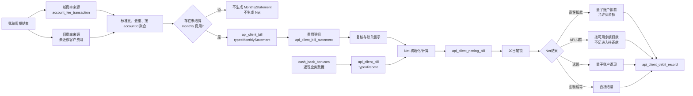
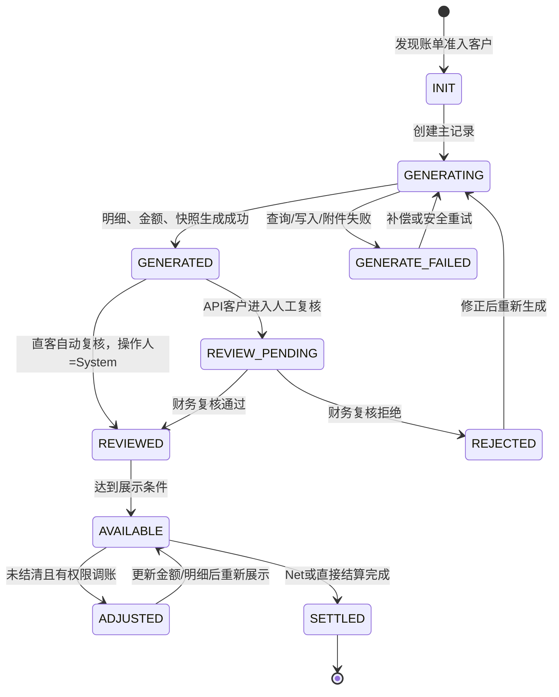
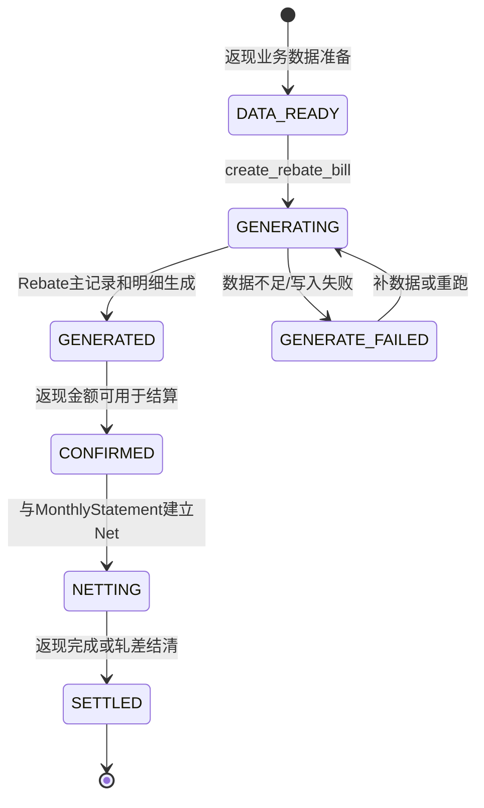
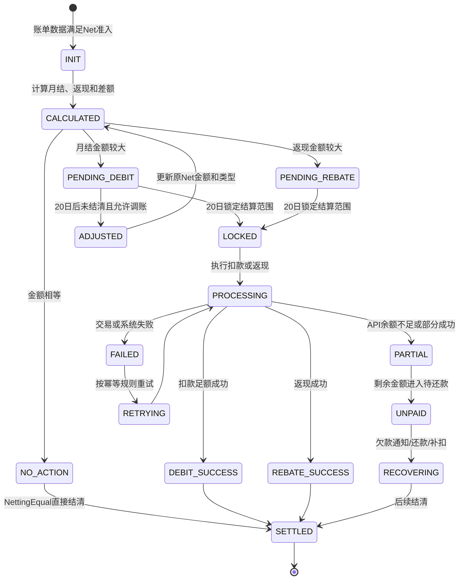
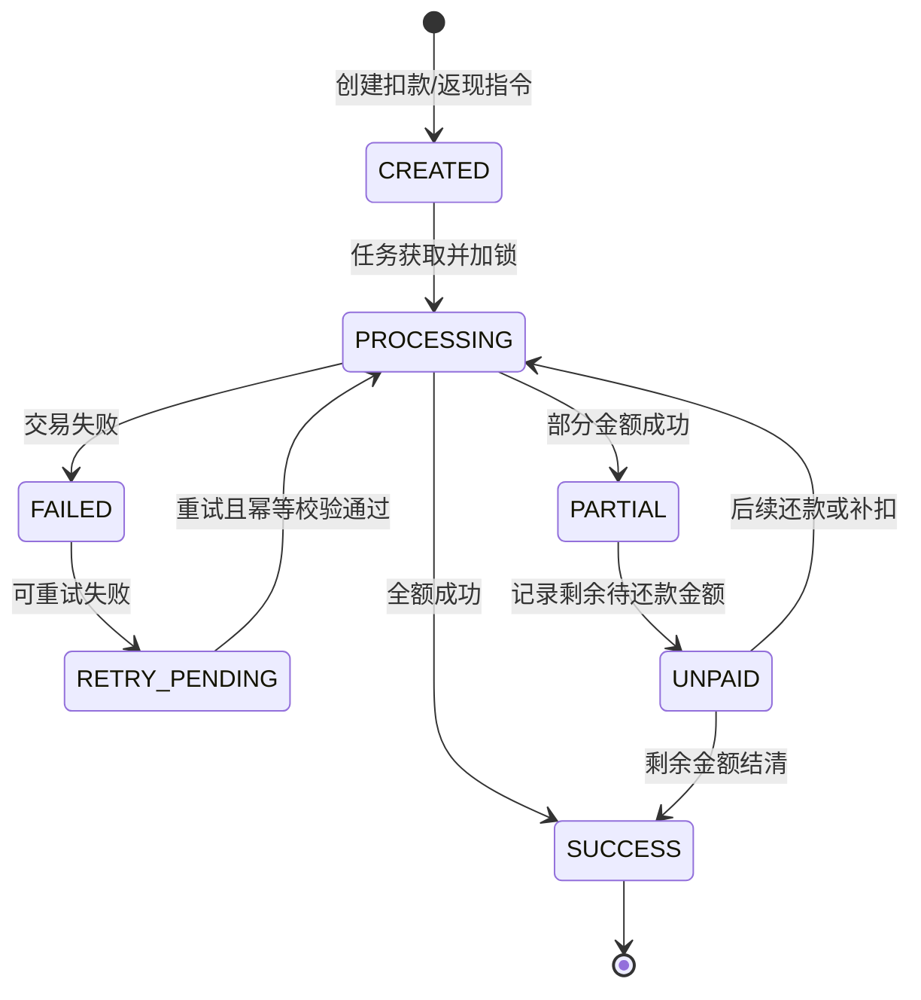
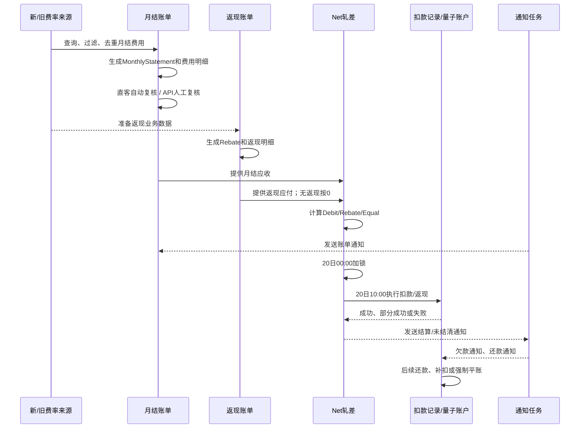

# 直客账单需求分析

> 本文用于直客月结账单的需求评审、代码分析、任务核对和开发拆分。
>
> 更新日期：2026-09-18

## 1. 一页结论

本需求不是重新建设一套直客账单，而是把直客月结费用接入现有客户账单、返现和 Net 轧差体系。现有 `api_client_*` 表和任务虽然名称带有 API，但已经被代码、Flink、报表和脚本广泛使用，本次不做物理重命名。

最终方案：

1. 直客按 `accountId` 识别，定义为非 API 客户。
2. 账单生成时同时查询新费率和旧费率来源，避免未迁移客户遗漏。
3. 只有账单周期内存在未结算月结费用的直客才生成 `MonthlyStatement`；无月结费用不生成空账单，也不生成 Net。
4. 直客无返现时仍生成 Net，使用 `rebate_id = NULL`、`rebate_amount = 0`，结果为 `NettingDebit`。
5. 直客和 API 客户继续复用 `api_client_bill`、`api_client_bill_statement`、`cash_back_bonuses`、`api_client_netting_bill`、`api_client_debit_record` 等现有模型。
6. `api_client_bill` 需要记录账单生成时的客户类型快照，账户后续类型变化不影响历史账单。
7. 直客账单自动复核，操作人为 `System`；API 客户维持原人工复核流程。
8. 直客扣款沿用量子账户允许负余额的能力；具体欠款通知、强制平账和风险控制复用范围需要查代码确认。
9. 20 日结算优先使用当前运行中的 Net 加锁和 Net 扣款任务；截图显示普通账单扣款任务处于 STOP，不能直接作为新流程入口。

## 2. 背景、目标和范围

### 2.1 当前问题

直客月结费用过去有独立的待办和扣款处理，API 客户使用月账单、返现和 Net 流程，导致账单口径、扣款、通知和对账存在两套实现。直客需要接入统一账单入口，并保留其自动复核和可透扣差异。

### 2.2 本次范围

- 直客月结费用接入统一月结账单生成。
- 直客账单自动复核并记录系统操作人。
- 直客参与返现和 Net 轧差；无返现时仍可生成扣款型 Net。
- Admin 客户账单查询、复核、导出和受控调账。
- Merchant 账单菜单、账单查看、明细下载、还款和还款记录。
- 账单、返现、Net、扣款结果的邮件和站内信通知。
- 新旧费率来源的双查询、标准化、去重和审计追溯。

### 2.3 不在本次范围内

- 不重命名既有 `api_client_*` 表、字段、Flink 作业或历史枚举。
- 不改变现有费用计算公式、返现标准和客户报价规则。
- 不删除历史账单，不因展示口径调整重新触发历史扣款或返现。
- 不把 OpenAPI V3 的 `collection_fee_settlement` 返现模型直接等同于 `api_client_bill` 的 `Rebate`。

## 3. 业务口径

### 3.1 客户识别

直客以 `accountId` 为核心识别条件，定义为非 API 客户。账单生成时将客户类型写入账单快照；之后账户类型变化不回溯修改历史账单。

### 3.2 费用来源

客户没有全部迁移到新费率系统，因此必须分别查询两套来源：

| 来源 | 查询原则 | 结果处理 |
|---|---|---|
| 新费率系统 | `account_fee_transaction` 中账单周期内、`deduction_node = 'monthly'`、未结算的费用 | 标准化为统一费用对象 |
| 旧费率系统 | 原有 API/直客月结费用和待收记录 | 标准化为统一费用对象 |

两套结果不能直接相加。统一费用对象至少保留 `account_id`、`source_system`、`source_id/transaction_id`、`fee_id`、`fee_name`、`deduction_node`、金额、结算状态和账单月份，用稳定业务键去重并支持原始记录追溯。

### 3.3 账单准入

- 有未结算月结费用：生成 `api_client_bill.type = MonthlyStatement`。
- 无未结算月结费用：不生成空账单，不生成 Net。
- 直客的“是否生成账单”按账单周期内费用判断，不按账户是否属于直客统一批量生成。

### 3.4 金额口径

```text
有效金额 = adjust_amount 非空时取 adjust_amount，否则取 amount
```

计算、列表、PDF、CSV/ZIP 和客户端展示统一使用有效金额。0 金额费用项可以不展示，但不能因此改变账单总额。费用范围包括交易/渠道费用、月低消、活跃卡费、非活跃卡费、MVC、失败费、验证费、制卡/邮寄费、退款/ATM 费用和财务调账等已纳入月结的项目。

### 3.5 返现和 Net

月结账单和返现账单是两个独立的 `api_client_bill` 主记录：

| 记录 | `type` | 作用 |
|---|---|---|
| 月结账单 | `MonthlyStatement` | 汇总应收月结费用 |
| 返现账单 | `Rebate` | 汇总客户应得返现 |

Net 计算规则：

| 月结账单与返现的关系 | Net 类型 | 处理 |
|---|---|---|
| 月结金额 > 返现金额 | `NettingDebit` | 对客户扣款 |
| 月结金额 < 返现金额 | `NettingRebate` | 向客户返现 |
| 金额相等 | `NettingEqual` | 结清，不产生实际扣款 |
| 无返现账单 | `NettingDebit` | `rebate_id = NULL`、`rebate_amount = 0` |

## 4. 现有模型和兼容策略

| 对象 | 作用 | 本次处理 |
|---|---|---|
| `api_client_bill` | 月结和返现账单主记录 | 复用；增加/使用客户类型快照和账单类型 |
| `api_client_bill_statement` | 费用明细 | 复用；写入统一月结费用 |
| `cash_back_bonuses` | 返现业务明细 | 复用；保证毛利返现进入返现总额和明细 |
| `api_client_netting_bill` | 月结与返现轧差结果 | 复用；直客和 API 均生成 |
| `api_client_debit_record` | 实际扣款/返现落地记录 | 复用；记录账单来源、Net 和客户类型差异 |
| `bill_history_config` | 生成时配置和明细快照 | 必须保留，支持调整追溯和安全重生成 |

### 4.1 为什么不改 `api_client` 名称

这些表名和字段已经被 Java、Flink、BI、财务报表、数据同步、定时任务、脚本和监控依赖。直接改名会造成历史数据断链、下游 SQL 失败和双写不一致。本次采用：

- 物理表名保持不变，业务语义按“客户账单”理解。
- 新增代码类、DTO、VO 和文档可使用 `CustomerBill`、`CustomerNettingBill` 等通用命名。
- 需要扩展时优先新增客户类型、来源系统、账单来源等兼容字段。
- 若未来必须改名，先做依赖盘点、视图/别名、双读双写、历史回放、观察期和回滚方案。

## 5. 端到端流程

本节把一次账单周期拆成四类记录：月结账单、返现账单、Net 轧差账单和实际扣款记录。四者不是四套独立业务，而是前后关联的四层记录：



没有月结费用时不生成空账单；有月结费用但没有返现账单时，仍生成 `NettingDebit`，返现金额按 0 处理。

### 5.1 月结账单 `MonthlyStatement` 生命周期

#### 5.1.1 生成入口和前置条件

当前截图确认的主任务是 `quantum_card_api_customer_bill`，每月 10 日 00:00 执行；`create_month_bill` 是每日 10:15 的指定月份补生成任务，但当前 STOP。代码入口需要以 `ApiCustomerJob.billJobHandler()` 和 `apiClientBillService.initBill()` 为准。

生成前必须完成：

1. 确定账单月份和账单周期边界。
2. 以 `accountId` 判断非 API 直客及 API 客户范围。
3. 分别查询新费率和旧费率来源。
4. 过滤账单周期内、`deduction_node = 'monthly'` 且未结算的费用。
5. 按稳定业务键去重，不能把两套来源的同一费用相加两次。
6. 统一使用 `adjust_amount` 非空取 `adjust_amount`，否则取 `amount`。

#### 5.1.2 生成和状态流转

以下是业务状态，实际代码枚举名称需要开发前映射确认：



| 阶段 | 记录和动作 | 约束 |
|---|---|---|
| `INIT/GENERATING` | 创建主记录，查询费用并写明细 | 不可展示为可支付账单 |
| `GENERATED` | 总额、明细、`bill_history_config` 和附件生成 | 未复核时不能进入正式结算 |
| `REVIEW_PENDING` | API 客户等待财务复核 | 不可作为最终账单 |
| `REVIEWED` | 直客自动复核；API 财务复核 | 继续等待展示/通知条件 |
| `AVAILABLE` | 客户可查询、下载并参与 Net | 未结清时可按规则调账 |
| `ADJUSTED` | 使用调整金额或人工费用重新计算 | 已结清账单不可调账 |
| `SETTLED` | Net、扣款或返现完成 | 禁止再次调账或重复扣款 |

生成失败时不能静默生成不完整账单。主记录已落库但明细或附件失败时，保留主记录并安全重试；同一 `accountId + billing_period + bill_type` 不能产生重复有效账单。

### 5.2 返现账单 `Rebate` 生命周期

返现不是月结明细中的负数行，而是独立的 `api_client_bill` 主记录，类型为 `Rebate`，明细来源于 `cash_back_bonuses` 等返现业务数据。

当前时间链路是：`cash_back` 每月 3 日 09:00 准备返现数据，`create_rebate_bill` 每月 18 日 00:00 生成返现历史账单。返现数据的审核条件、人工触发方式和重跑入口仍需查代码。



没有返现数据不等于月结账单失败。此时可以不生成 `Rebate` 主记录，但 Net 必须按 `rebate_amount = 0` 处理，不能漏掉直客月结扣款。

### 5.3 Net 轧差账单生命周期

Net 是某客户某账单月份的“月结应收和返现应付”的结算结果，不是新的费用来源。它至少关联一个 `MonthlyStatement`、一个 `Rebate` 或空返现标识、客户、账单月份、结算类型和最终资金动作。

业务上，Net 应在账单数据达到可计算条件后初始化；当前截图确认 20 日 00:00 加锁、20 日 10:00 执行扣款/返现。`api_bill_bill_notice` 是否负责 Net 初始化，需要通过代码调用链确认。



| 环节 | 直客 | API 客户 |
|---|---|---|
| Net 生成 | 有月结费用即可生成，返现可为空 | 沿用原有月结/返现准入 |
| 余额不足 | 允许量子账户为负，继续透扣 | 只扣可用余额，不足部分待还款 |
| 未结清 | 需要确认是否完全复用欠款通知/还款链路 | 沿用现有欠款和上月补扣链路 |
| 调账 | 与 API 一致，更新原 Net，保留 `old_type` 和日志 | 当前采用原记录更新方式 |

### 5.4 实际扣款记录 `api_client_debit_record` 生命周期

Net 是结算决定，`api_client_debit_record` 是实际资金动作。一次 Net 可以对应多笔扣款/返现记录，但每笔都必须回溯到同一个 Net、账单月份、账户和扣款来源。



必须保证重试不重复创建成功交易，直客负余额扣款和 API 部分扣款有明确来源标识，已结清 Net 不再被欠款恢复任务捞取。

### 5.5 一次账单周期的完整时序



关键顺序是：先形成账单，再形成返现，再形成 Net，最后执行资金动作。任何补生成或重跑都不能跳过账单关联、状态校验和幂等校验直接扣款。

## 6. 时间线和定时任务

### 6.1 当前已从 XXL-JOB 截图确认的任务

Cron 为 Quartz 六字段格式。状态以截图为准：

| ID | Bean/任务 | Cron | 状态 | 说明 |
|---:|---|---|---|---|
| 136 | `cash_back` | `0 0 9 3 * ?` | RUNNING | 每月 3 日 09:00，返现数据/订单准备 |
| 204 | `quantum_card_api_customer_bill` | `0 0 0 10 * ?` | RUNNING | 每月 10 日 00:00，API 月结账单 |
| 602 | `create_month_bill` | `0 15 10 * * ?` | STOP | 每日 10:15，指定月份补生成 |
| 811 | `create_rebate_bill` | `0 0 0 18 * ?` | RUNNING | 每月 18 日 00:00，返现历史账单 |
| 690 | `create_rebate_bill` | `0 0 0 20/7 * ?` | STOP | 每月 20 日起每 7 天补生成 |
| 489 | `quantum_card_api_customer_bill_notice` | `0 0 10 18 * ?` | RUNNING | 每月 18 日 10:00，API 账单通知 |
| 765 | `quantum_card_api_customer_netting_bill_debit_lock` | `0 0 0 20 * ?` | RUNNING | 每月 20 日 00:00，轧差加锁 |
| 773 | `quantum_card_api_customer_netting_bill_debit` | `0 0 10 20 * ?` | RUNNING | 每月 20 日 10:00，轧差扣款/返现 |
| 763 | `quantum_card_api_customer_last_month_netting_bill_debit_lock` | `0 0 0 21 * ?` | RUNNING | 每月 21 日 00:00，上月轧差补扣加锁 |
| 896 | `debitDailyNotifyForAccount` | `0 0 10 * * ?` | RUNNING | 每日 10:00，账户欠款通知 |
| 894 | `debitBillNotify` | `0 0 10 1,15 * ?` | RUNNING | 每月 1、15 日 10:00，欠款账单通知 |
| 892 | `debitBillRepayment` | `0 0 10 2,16 * ?` | RUNNING | 每月 2、16 日 10:00，欠款账单还款 |
| 890 | `processForceDeductionNegativeBalance` | `0 0 0/2 * * ?` | RUNNING | 每 2 小时，负余额强制平账 |
| 678 | `month_bill_debit_notice` | `0 0 10 * * ?` | RUNNING | 每日 10:00，月结账单还款通知 |
| 775 | `month_netting_bill_debit_notice` | `0 0 10 * * ?` | RUNNING | 每日 10:00，轧差未结清通知 |
| 787 | `upgrade_to_the_billing_feature` | `0 0 10 10 * ?` | STOP | 每月 10 日 10:00，账单功能升级通知 |
| 934 | `repair_history_netting_offset_records` | `0 0 0 20/7 * ?` | STOP | 每月 20 日起每 7 天，轧差洗数 |
| 662/487 | 普通账单扣款锁/扣款 | `0 0 0 20 * ?` / `0 0 10 20 * ?` | STOP | 普通账单扣款链路当前停止 |

由截图可得到的主时间线：3 日准备返现数据，10 日生成月结账单，18 日生成返现账单并通知，20 日轧差加锁和结算，之后按日发送未结清通知并按既有欠款任务恢复。

### 6.2 仍需核对的任务信息

截图只确认了 Cron、任务名称和状态，以下信息仍需在后台和代码中补录：执行器、参数、路由策略、超时、重试、最近成功/失败记录，以及 `accountIds`、`billMonths`、`months` 等任务参数。

仍需确认的任务/入口包括：`api_bill_bill_notice`、`init_bill_statement_temp`、`re_create_rebate_bill`、`discount`，以及各任务是否已经按客户类型过滤直客。

## 7. Admin 和 Merchant 需求

### 7.1 Admin

- 客户账单作为统一入口，支持客户类型、账户、账单月份、账单类型、状态和金额筛选。
- 账单列表展示账单总额、返现、Net 类型、扣款状态、客户类型和生成时间。
- 支持费用明细、返现明细、Active Card Details、PDF/CSV/ZIP 下载。
- 直客账单生成后自动复核；API 维持原人工复核。
- 20 日后未结清账单调整沿用 API 规则：财务角色、原因必填、操作留痕；已结清账单不可修改。
- 调账后当前 API 直接更新原 Net，保留 `old_type` 和操作日志；直客保持一致，建议同时记录调整前后金额。

### 7.2 Merchant

- 非 API 直客开放账单菜单和账单查询权限。
- 支持月结账单、返现账单、Net 结果、明细下载、还款和还款记录。
- 无月结费用的直客不展示空账单或“No fee”伪账单。
- 统一中英文通知，避免旧活跃卡扣费通知和统一账单通知重复。

## 8. 数据、接口和实现影响

### 8.1 数据库

- 复用现有账单、明细、返现、Net、扣款和历史配置表。
- 增加或确认客户类型快照、来源系统、原始费用 ID、账单来源等字段；新增字段必须兼容旧数据。
- 所有费用明细、返现、Net 和扣款记录支持通过账户、账单月份和原始来源追溯。

### 8.2 服务和任务

- 账单生成服务增加直客筛选和新旧费用双查询，不复制一套 API 账单服务。
- 返现、Net、扣款、通知任务优先复用现有实现，通过客户类型分支处理差异。
- 各任务必须幂等：同账户、同月份、同来源记录重跑不生成重复账单、Net 或扣款。
- 直客旧待办扣款链路必须明确停用或兼容边界。

### 8.3 接口和前端

- 对外字段先保持兼容，不因为内部表名带 `api_client` 而强制改接口。
- 新增客户类型、账单类型和 Net 类型字段时，采用兼容新增和灰度发布。
- 下载文件、通知模板和页面展示使用统一有效金额口径。

## 9. 状态、异常和幂等

### 9.1 关键状态

需要核对现有枚举的真实值和迁移关系，至少覆盖：账单草稿/生成/复核/已通知、返现生成/确认、Net 初始化/加锁/扣款/返现/结清/待还款、扣款成功/失败/部分成功。

### 9.2 关键异常

| 场景 | 要求 |
|---|---|
| 一套费用来源查询失败 | 默认不能静默生成不完整账单；记录批次并支持补偿，最终方案需确认 |
| 两套来源出现重复 | 按稳定业务键去重，保留来源和原始 ID |
| 账单生成重跑 | 不重复生成有效账单或明细 |
| Net 扣款重试 | 不重复扣款，每笔交易可追溯到同一 Net |
| 附件生成失败 | 保留账单主记录，支持安全重试 |
| 通知发送失败 | 不回滚资金交易，记录失败并支持补发 |
| 已结清账单调账 | 拒绝操作并留下审计记录 |

## 10. 验收清单

### 10.1 账单和费用

- [ ] 新费率和旧费率客户均能正确生成月结账单，双查询不漏不重。
- [ ] 有月结费用的直客生成 `MonthlyStatement`，无月结费用的不生成空账单。
- [ ] `adjust_amount`、0 金额过滤、PDF/CSV/ZIP、客户端展示金额一致。
- [ ] 费用明细可追溯到来源系统和原始记录。

### 10.2 返现和 Net

- [ ] 有返现/无返现、月结大于返现、返现大于月结、金额相等四类场景均正确。
- [ ] Net 类型、金额、账单关联和扣款记录一致。
- [ ] 直客自动复核，API 原流程不变。

### 10.3 扣款、欠款和通知

- [ ] 直客允许按既有能力透扣为负，API 余额不足继续进入待还款流程。
- [ ] 任务重跑、扣款重试和部分成功不会重复扣款。
- [ ] 月结通知、轧差通知、欠款通知不重复，直客不再收到旧活跃卡扣费通知。
- [ ] 强制平账、欠款还款和补扣任务是否覆盖直客已验证。

### 10.4 调整和历史

- [ ] 20 日后调整权限、原因、操作日志和金额前后值符合 API 规则。
- [ ] 已结清账单不可调整；未支付 Net 调账更新原记录并保留变更痕迹。
- [ ] 历史账单展示回填不触发重新扣款和返现。

## 11. 当前待办

### P0：开发前必须完成

- [ ] 查清账单生成、返现生成、Net 初始化、加锁、扣款和扣款落库的代码调用链。
- [ ] 确认直客是否已被各运行中任务覆盖，以及客户类型过滤位置。
- [ ] 确认新旧费用来源的稳定去重键、部分失败策略和结算状态更新时机。
- [ ] 确认直客欠款通知、还款、强制平账与 Net 来源标识的关系。
- [ ] 确定历史统一展示的起始月份和数据回填方案。

### P1：联调前完成

- [ ] 补录 XXL-JOB 参数、执行器、重试和最近执行结果。
- [ ] 核对 `re_create_rebate_bill`、`init_bill_statement_temp`、`discount` 是否仍有效。
- [ ] 准备 API 客户、直客、仅月结无返现直客、无月结费用账户四类测试数据。
- [ ] 完成通知模板、发送对象、语言和去重规则确认。

### P2：上线后观察

- [ ] 观察首个账单周期的账单数量、来源覆盖率、重复率、Net 数量、扣款成功率和通知失败率。
- [ ] 核对财务对账、Flink/BI 数据同步和历史报表口径。

## 12. 建议开发拆分

1. **现状核对**：代码调用链、表结构、任务参数、Flink/BI 依赖和旧直客扣款边界。
2. **模型准备**：客户类型快照、来源字段、费用标准化对象、去重和账单历史快照。
3. **统一月结账单**：双来源查询、直客准入、自动复核、明细和附件。
4. **返现与 Net**：无返现 Net、Net 类型计算、加锁、直客透扣和 API 待还款兼容。
5. **后台、客户端、通知**：查询筛选、展示下载、还款、模板和权限。
6. **联调验收**：四类测试账户、任务重跑、扣款重试、调账、历史数据和财务对账。

## 13. 参考代码和资料

- `qbit-core/src/main/java/com/qbit/job/qbitcard/ApiCustomerJob.java`
- `qbit-core/src/main/java/com/qbit/job/qbitcard/ArrearsRecoverJob.java`
- `account_fee_transaction` 表结构和费用生成逻辑
- XXL-JOB 管理后台中本文件第 6 节列出的任务截图
- 原始直客月结账单需求及关联附件
