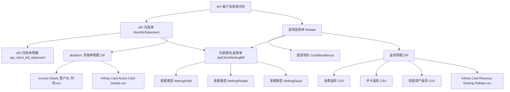
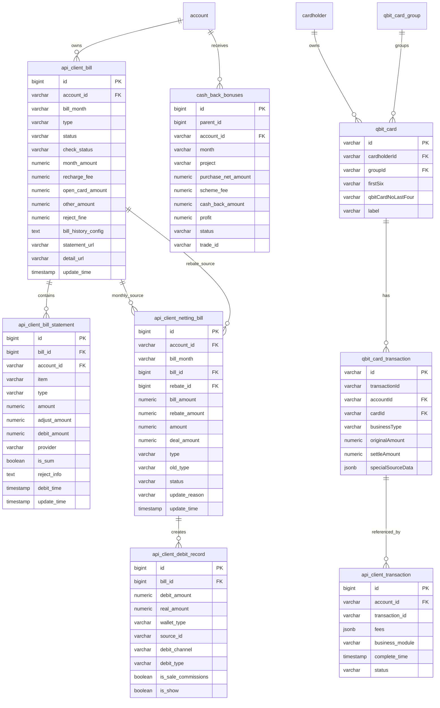
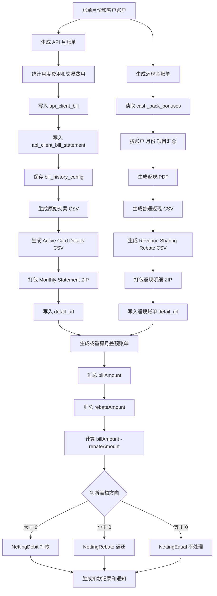
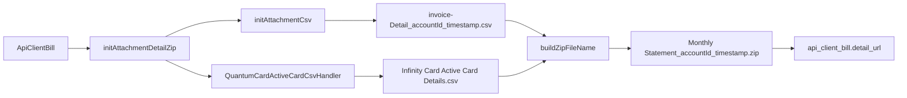
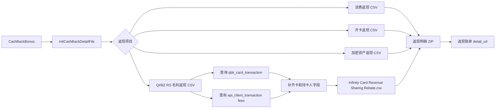
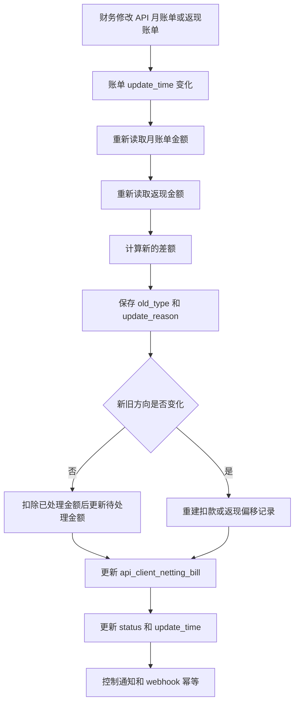

# API 客户三类月账单完整说明

> 文档更新时间：2026-09-11

本文档以当前 `qbit-assets/qbit-core` 源码为准，重点记录 API 月账单、返现金账单和月差额账单的生成链路、数据口径、文件结构、接口行为和验证方式。文档中的“当前实现”与“建议修正”分开描述，避免把规划内容误认为已经完成。

## 1. 文档范围

本文档基于 `qbit-assets/qbit-core` 当前代码整理，覆盖 API 客户月度账单相关的三类业务：

1. API 月账单（`MonthlyStatement`）
2. 返现金账单（`Rebate`）
3. 月差额/轧差账单（`ApiClientNettingBill`）

重点说明账单生成、金额来源、返现项目、差额计算、账单明细文件、Active Card Details、账单更新时间以及当前实现中的注意事项。

## 2. 三类账单关系总览



三类账单的职责不同：

| 类型 | 主要用途 | 核心数据表 | 明细文件 | 是否参与差额 |
|---|---|---|---|---|
| API 月账单 | 汇总客户当月应收 API 服务费用 | `api_client_bill`、`api_client_bill_statement` | 月账单明细 ZIP | 是 |
| 返现金账单 | 汇总并展示客户应得返现 | `api_client_bill`（`type=Rebate`）、`cash_back_bonus` | 返现账单 PDF + 返现明细 ZIP | 是 |
| 月差额/轧差账单 | 用月账单和返现金额计算最终应扣/应返 | `api_client_netting_bill`、`api_client_debit_record` | 页面明细和扣款记录 | 结果 |

## 3. API 月账单

### 3.1 生成入口

定时任务入口：

```text
qbit-core/src/main/java/com/qbit/job/qbitcard/ApiCustomerJob.java
createBillJobHandler()
```

当前任务读取账户 ID 和账单月份后调用：

```java
apiClientBillService.initBill(accountIds, billMonth);
```

Service 入口：

```text
qbit-core/src/main/java/com/qbit/common_all/api/client/bill/service/impl/ApiClientBillServiceImpl.java
initBill(List<String> accountIds, String billMonth)
initApiBill(List<QuantumCardApiCustomerVO> customers, DateTime start, DateTime end)
```

生成步骤：

1. 根据账单月份计算月初和月末时间。
2. 查询 API 客户配置及账户信息。
3. 查询月度费用报价和交易统计。
4. 生成 `ApiClientBill` 主账单。
5. 生成 `ApiClientBillStatement` 费用明细。
6. 生成 `billHistoryConfig` 快照。
7. 生成月账单明细 ZIP，并将地址写入 `api_client_bill.detail_url`。
8. 批量保存账单和账单明细。

### 3.2 月账单金额构成

月账单金额由月度费用明细汇总得到，常见项目包括：

- 月服务费
- 交易费
- FX Fee
- 充值费
- 开卡费
- 额外费用
- 拒付罚款
- 最低容量承诺费（MVC）
- 其他配置费用

对应的账单明细保存到：

```text
api_client_bill_statement
```

关键字段：

| 字段 | 含义 |
|---|---|
| `bill_id` | 所属 API 月账单 ID |
| `account_id` | 客户账户 ID |
| `amount` | 费用金额 |
| `item` | 费用展示名称 |
| `type` | 费用类型 |
| `provider` | 渠道或供应商 |
| `is_sum` | 是否为汇总项 |
| `adjust_amount` | 调账金额 |
| `debit_amount` | 已扣款金额 |
| `debit_time` | 扣款时间 |
| `update_time` | 费用明细更新时间 |

### 3.3 `billHistoryConfig` 的作用

`api_client_bill.bill_history_config` 用于保存账单生成时的历史配置快照。它不能只看当前客户配置，因为财务可能在账单生成后修改费用或返现配置，后续重新生成明细时需要基于账单当时的配置。

当前实体注释已经说明：

```text
MonthlyStatement：月度账单生成时的历史配置信息
Rebate：返现账单配置
```

因此，返现明细下载时会解析该字段中的 `InitRebateCashbackInfo`，再按快照中的项目生成返现明细文件。

### 3.4 月账单明细文件结构

月账单的最终 `detailUrl` 应指向 ZIP，而不是单独 CSV。当前生成位置：

```text
ApiClientBillServiceImpl.initAttachmentDetailZip(ApiClientBill apiClientBill)
```

ZIP 内部包含：

```text
invoice-Detail_{accountId}_{timestamp}.csv
Infinity Card Active Card Details.csv
```

其中：

- 原始交易明细由 `initAttachmentCsv()` 生成。
- 活跃卡明细由 `QuantumCardActiveCardCsvHandler` 生成。
- `buildZipFileName()` 负责最终压缩包上传。
- `detailUrl` 保存最终 ZIP 地址。

CSV 仍然存在，但它是 ZIP 内部组成文件；对外账单明细地址应该是 ZIP。

### 3.5 文件命名规则

账单尚未落库时，`apiClientBill.id` 可能为空，因此不能使用：

```java
"invoice-Detail_" + apiClientBill.getId() + ".csv"
```

否则会生成：

```text
invoice-Detail_null.csv
```

推荐命名：

```text
invoice-Detail_{accountId}_{yyyyMMddHHmmssSSS}.csv
Monthly Statement_{accountId}_{yyyyMMddHHmmssSSS}.zip
```

时间优先使用账单创建时间；账单尚未执行 MyBatis 插入填充时，使用当前生成时间兜底。

### 3.6 Active Card Details

处理器：

```text
qbit-core/src/main/java/com/qbit/common_all/assets/service/report/csv/QuantumCardActiveCardCsvHandler.java
```

数据查询 Mapper：

```text
qbit-core/src/main/resources/mapper/quantum/card/ApiClientBillStatementMapper.xml
getActiveCardDetails
```

查询条件：

- `accountId`
- 账单月开始时间
- 账单月结束时间

该文件用于展示账单周期内活跃卡信息，最终作为单独 CSV 放入月账单 ZIP。

### 3.7 月账单下载接口

Admin 入口：

```text
POST /api/admin/quantum/card/openapi/customer/download/statement/csv
POST /api/admin/quantum/card/openapi/customer/download/statement/detail
```

Merchant 入口：

```text
POST /api/merchant/quantum/card/openapi/customer/download/statement/detail
```

当前业务目标：

- `detailUrl` 有值：直接下载已有 ZIP。
- `detailUrl` 为空：调用 `initAttachmentDetailZip()` 生成 ZIP，并回写 `detailUrl`。
- 不再在兜底分支生成单独的最终 CSV。

虽然 Admin 的历史接口路径仍包含 `/csv`，但如果它读取的是 `detailUrl`，当前文件实际是 ZIP。后续如允许改 API 语义，建议将路径改为 `/download/statement/detail`，但本次不要求修改既有路径。

## 4. 返现金账单

### 4.1 生成入口

定时任务入口：

```text
qbit-core/src/main/java/com/qbit/job/qbitcard/ApiCustomerJob.java
createRebateBillJobHandler()
```

Service 入口：

```text
ApiClientBillServiceImpl.dealCashBackBonusHistoryData(...)
CashBackBonusServiceImpl.initCashBackDetailFile(...)
```

返现金账单主记录仍然保存在：

```text
api_client_bill
```

其中：

```text
type = Rebate
bill_history_config = 返现项目快照
detail_url = 返现明细 ZIP 地址
```

### 4.2 返现 PDF

生成入口：

```text
CashBackBonusServiceImpl.exportCashBackBonusesInvoiceV2(...)
```

返现 PDF 汇总目前需要区分：

- 消费返现
- 开卡返现
- 加密资产法币交易返现
- Infinity Card Revenue Sharing Rebate

毛利返现不应继续混入普通消费返现展示，应在 PDF 中作为独立项目展示，至少要保证汇总金额、项目名称和明细来源独立。

毛利返现项目：

```text
QUANTUM_CARD_QI_RS_PROFIT_CASH_BACK
QUANTUM_CARD_BZ_RS_PROFIT_CASH_BACK
```

对应展示名称应为：

```text
Infinity Card Revenue Sharing Rebate
```

### 4.3 返现明细 ZIP

返现明细生成入口：

```text
CashBackBonusServiceImpl.initCashBackDetailFile(...)
```

典型 ZIP 结构：

```text
消费返现 CSV
开卡返现 CSV
加密资产返现 CSV
Infinity Card Revenue Sharing Rebate.csv
```

毛利返现由独立处理器生成：

```text
QuantumCardRevenueSharingCashbackCsvHandler
```

该处理器同时查询两类来源：

1. `qbit_card_transaction`：卡交易相关 Scheme Fee。
2. `api_client_transaction`：API 交易记录中的各类 Fee，包括 `schemeSignatureFee`。

### 4.4 毛利返现交易明细字段

CSV 目标字段包括：

```text
VerifiedName
DisplayId
Transaction Time
Completion Time
AccountId
TransactionId
Transaction status
Transaction type
Card BIN
Card ID
CardLastFour
Cardholder Name
Card label
Budget name
OriginAmount
SettleAmount
Fee
Transaction currency
Transaction Notes
```

字段来源规则：

| 字段 | 来源 |
|---|---|
| `VerifiedName`、`DisplayId` | `account` |
| `Transaction Time`、金额、`Card ID` | `qbit_card_transaction` |
| `Card BIN`、`CardLastFour`、`Card label` | `qbit_card` |
| `Cardholder Name` | `cardholder` |
| `Budget name` | `qbit_card_group` |
| API 签名费金额 | `api_client_transaction.fees` 中 `schemeSignatureFee` |
| 卡交易 RS Fee | `qbit_card_transaction.specialSourceData` |

特别规则：

- `transactionId` 是 CSV 展示字段。
- `qbitCardTransactionId` 是 Java 内部关联查询字段，不导出。
- 卡交易明细的展示 `transactionId` 取 `qbit_card_transaction.transactionId`。
- API Fee 明细的 `transactionId` 取 `api_client_transaction.transaction_id`，该值实际对应 `qbit_card_transaction.id`。
- `00000000-0000-0000-0000-000000000000` 不参与卡交易查询。
- 签名费无法关联卡交易时，交易时间使用 `completeTime`。
- `OriginAmount`、`SettleAmount` 为空时导出为 `0`。
- 能关联卡交易时，`Transaction type` 取 `qbit_card_transaction.businessType`；无法关联时保留来源类型，例如 `schemeSignatureFee`。

## 5. 月差额/轧差账单

### 5.1 数据模型

主表：

```text
api_client_netting_bill
```

相关表：

```text
api_client_bill
api_client_bill_statement
api_client_debit_record
```

核心关联：

```text
api_client_netting_bill.bill_id   -> API 月账单
api_client_netting_bill.rebate_id -> 返现金账单
```

### 5.2 差额计算

核心计算公式：

```text
差额基础值 = 月账单金额 - 返现金额
```

类型判断：

| 条件 | 类型 | 含义 |
|---|---|---|
| 月账单金额 > 返现金额 | `NettingDebit` | 客户还需要补缴差额 |
| 月账单金额 < 返现金额 | `NettingRebate` | 客户应获得返还差额 |
| 月账单金额 = 返现金额 | `NettingEqual` | 无需扣款或返还 |

金额处理：

- `NettingDebit`：差额为正数。
- `NettingRebate`：差额为负数或按当前 VO 规则展示为返现金额。
- `NettingEqual`：金额为 `0`。
- 空的月账单金额、返现金额、已处理金额按 `0` 处理。

### 5.3 差额账单重算

核心实现：

```text
ApiClientBillStatementServiceImpl.updateNettingBill(...)
```

重算步骤：

1. 根据关联月账单重新计算月账单金额。
2. 读取关联返现金额。
3. 重新判断差额类型。
4. 更新 `bill_amount`、`rebate_amount`、`amount`。
5. 记录旧类型 `old_type`。
6. 类型变化时重建相关扣款/偏移记录。
7. 已部分处理的差额账单需要重置或保护已处理金额，避免重复扣款。
8. 更新账单的 `update_time`，供 Admin 查询和审计。

### 5.4 差额类型变化

典型变化：

```text
NettingDebit  -> NettingRebate
NettingRebate -> NettingDebit
NettingDebit  -> NettingEqual
NettingRebate -> NettingEqual
```

类型变化时需要关注：

- 原扣款记录是否需要删除或改金额。
- 原返现记录是否需要删除或重新生成。
- `PartSettled` 是否回到 `Pending`。
- `deal_amount` 是否清零或保留。
- 是否重复发送通知。

### 5.5 已处理金额保护

差额重算必须区分：

- 尚未处理金额。
- 已处理金额。
- 当前应处理金额。
- 重算后新增或减少的金额。

建议遵循：

```text
新的待处理金额 = 新差额金额 - 已处理金额
```

但当差额方向发生变化时，不能简单沿用旧扣款记录，应按类型变化流程重建偏移记录，并记录变化原因。

### 5.6 差额账单查询与更新时间

差额账单查询 Mapper：

```text
qbit-core/src/main/resources/mapper/quantum/card/ApiClientNettingBillMapper.xml
```

月账单查询 Mapper：

```text
qbit-core/src/main/resources/mapper/quantum/card/ApiClientBillMapper.xml
```

Admin 月账单查询需要返回：

```text
updateTime
```

该字段用于记录财务在月账单生成后进行调整的时间，帮助判断差额账单为什么被重新计算。数据库字段来源是：

```text
api_client_bill.update_time
```

差额账单本身也应使用：

```text
api_client_netting_bill.update_time
```

前端展示时建议明确区分：

- 月账单更新时间：原始 API 月账单最后修改时间。
- 返现金账单更新时间：返现账单最后修改时间。
- 差额账单更新时间：差额结果最后重算时间。

## 6. 事务与生成时序

当前月账单生成大致顺序：

```text
计算金额
  ↓
构建 ApiClientBill
  ↓
生成账单明细 ZIP
  ↓
写入 detailUrl
  ↓
保存 ApiClientBill
  ↓
保存 ApiClientBillStatement
```

注意：文件上传属于外部 OSS 操作，而 `initApiBill` 使用事务保存数据库数据。若 OSS 凭证为空，会在生成 CSV 或 ZIP 时失败，常见错误为：

```text
java.lang.NullPointerException: 参数"credentials"为空指针
```

该错误属于 OSS 配置或客户端凭证初始化问题，不是账单金额或交易类型问题。

## 7. 当前 CSV/ZIP 清单

### 7.1 API 月账单

最终文件：

```text
Monthly Statement_{accountId}_{timestamp}.zip
```

内部文件：

```text
invoice-Detail_{accountId}_{timestamp}.csv
Infinity Card Active Card Details.csv
```

### 7.2 返现金账单

最终文件：

```text
Cashback Detail_{displayId}_{month}-{timestamp}.zip
```

内部文件可能包括：

```text
消费返现 CSV
开卡返现 CSV
加密资产法币交易返现 CSV
Infinity Card Revenue Sharing Rebate.csv
```

### 7.3 差额账单

当前主要是账单列表、账单明细和扣款记录查询，不是通过月账单 `detailUrl` 生成同类交易 ZIP。差额账单的重点是金额、方向、状态、已处理金额和更新时间。

差额账单不是一张简单的相减记录，而是把两张来源账单绑定在同一个轧差单中：

```text
api_client_netting_bill.bill_id -> MonthlyStatement
api_client_netting_bill.rebate_id -> Rebate
```

初始化时，系统会从月账单费用明细汇总应收金额，从返现金账单历史配置汇总返现金额，再计算：

```text
nettingBaseAmount = billAmount - rebateAmount
```

计算方向按当前实现为：

| `nettingBaseAmount` | `type` | `amount` | 业务含义 |
|---:|---|---:|---|
| 大于 0 | `NettingDebit` | 正数 | 客户还需要补缴 |
| 小于 0 | `NettingRebate` | 转为负数 | 客户应获得返还 |
| 等于 0 | `NettingEqual` | 0 | 无需扣款或返还 |

当前初始化和自动处理的主要代码位置：

```text
ApiClientNettingBillServiceImpl.initApiClientNettingBill(...)
ApiClientDebitRecordServiceImpl.debitNetting(...)
ApiClientDebitRecordServiceImpl.dealAutoMultiWalletNettingDebit(...)
```

## 8. 测试建议

### 8.1 API 月账单

- 账单金额正常时生成 `detailUrl`。
- `detailUrl` 是 `.zip`，不是 `.csv`。
- ZIP 包含 `invoice-Detail` 和 Active Card Details。
- 账单生成前没有 ID 时，内部文件名不能包含 `null`。
- Active Card 没有数据时，ZIP 仍能正常生成原始交易明细。
- OSS 凭证缺失时能明确记录生成失败。

### 8.2 返现金账单

- 消费返现仍然正常生成。
- 开卡返现仍然正常生成。
- 加密资产返现仍然正常生成。
- QI RS 和 BZ RS 生成独立的 `Infinity Card Revenue Sharing Rebate.csv`。
- 毛利返现 PDF 汇总独立展示，不重复计入消费返现。
- `bill_history_config` 能还原当时返现项目。

### 8.3 毛利返现交易明细

- `qbit_card_transaction` 交易能补齐卡、持卡人和 Budget 信息。
- `api_client_transaction` 签名费能按 `transaction_id` 关联卡交易主键。
- 空 UUID 不查询卡交易，交易时间使用完成时间。
- 关联成功后 `type` 使用卡交易 `businessType`。
- `OriginAmount` 和 `SettleAmount` 为空时导出为 `0`。
- `transactionId` 展示值和内部查询值分离。

### 8.4 差额账单

- 月账单金额大于返现金额：`NettingDebit`。
- 月账单金额小于返现金额：`NettingRebate`。
- 两者相等：`NettingEqual`。
- 重复重算不会重复生成扣款记录。
- 已处理金额不会被重复扣除。
- 差额方向变化时，旧记录能正确处理。
- Admin 列表返回月账单和差额账单更新时间。

## 9. 当前代码检查重点

1. `detailUrl` 已按月账单 ZIP 设计，不能在任何月账单兜底分支重新写入单 CSV 地址。
2. ZIP 内部 CSV 可以存在，但外部下载地址必须是 ZIP。
3. `buildAttachmentCsv` 如果继续保留，方法名和文件名必须避免把 ZIP 标记为 CSV。
4. `api_client_bill.id` 在账单保存前可能为空，文件名不能依赖它。
5. 毛利返现交易的展示 ID 和卡交易关联 ID 必须保持分离。
6. 交易类型应优先由 `qbit_card_transaction.businessType` 回填，不能在 XML 中复制复杂判断。
7. `bill_history_config` 是账单快照，不能用当前实时配置替代历史配置。
8. OSS 凭证问题需要通过环境配置解决，不应通过账单业务逻辑绕过上传。
9. 本次需求不修改 pom，不新增测试依赖，不改变已有 API 路径，不执行 commit 或 push。

## 10. 当前实现核验结果

### 10.1 文件地址和文件内容

当前月账单创建逻辑在 `extracted(...)` 中调用 `initAttachmentDetailZip(...)`，因此 `api_client_bill.detail_url` 的目标应为 ZIP。ZIP 内部仍然是多个文件，出现 CSV 文件名不代表外层账单地址是 CSV：

```text
外层：Monthly Statement_{accountId}_{timestamp}.zip
内部：invoice-Detail_{accountId}_{timestamp}.csv
内部：Infinity Card Active Card Details.csv（有数据时）
```

`downloadStatementCsv(...)` 是历史命名。当前如果 `detailUrl` 不为空，直接通知该地址；如果为空，兜底也调用 `initAttachmentDetailZip(...)`。因此该方法当前实际也会下载 ZIP，后续可以考虑重命名服务方法或补充接口注释，但不建议仅为了命名修改既有 API 路径。

### 10.2 文件名不能使用账单 ID

账单文件在 `ApiClientBill` 保存前生成时，MyBatis 的 INSERT 字段填充尚未执行，`id`、`createTime` 都可能为空。内部明细文件不能依赖：

```java
apiClientBill.getId()
```

否则会生成 `invoice-Detail_null.csv`。推荐统一使用账户 ID和文件生成时间，例如：

```text
invoice-Detail_2fd1d1f0-684b-4a9d-a36a-c6c7558aeda0_20260911000123000.csv
Monthly Statement_2fd1d1f0-684b-4a9d-a36a-c6c7558aeda0_20260911000123000.zip
```

同一次 ZIP 生成应尽量复用同一个时间戳，避免外层 ZIP 和内部 CSV 出现不同时间。

### 10.3 生成失败的优先排查项

如果日志出现：

```text
java.lang.NullPointerException: 参数 credentials 为空指针
```

应先检查 OSS 客户端初始化和运行环境配置。该异常发生在 CSV/ZIP 上传阶段，通常会导致 `detailUrl` 没有正确生成，不代表账单金额计算或交易查询失败。

如果出现：

```text
invoice-Detail_null.csv
```

应检查文件名是否仍然引用 `apiClientBill.getId()`，以及账单是否在 `saveBatch(...)` 前就生成了附件。

### 10.4 三类账单的最终边界

本次账单需求涉及三个独立层面：

1. 账单金额：API 月账单、返现金账单、轧差账单的金额来源和重算规则。
2. 账单明细：原始交易 CSV、Active Card Details、Revenue Sharing Rebate CSV，以及它们各自的字段来源。
3. 文件封装：最终 `detailUrl` 使用 ZIP，CSV 作为 ZIP 内部明细文件保留。

其中，`qbit_card_transaction` 和 `api_client_transaction` 的毛利返现查询属于返现明细层，不应改变原有 API 月账单消费交易条件；`schemeSignatureFee` 只是 API Fee 来源的一类，能关联卡交易时再由 Java 回填卡交易类型和卡信息。

## 11. 表结构关系图和业务流程图

### 11.1 账单核心表关系图



说明：`api_client_netting_bill.bill_id` 和 `rebate_id` 都指向 `api_client_bill.id`，但分别代表月账单和返现金账单。`api_client_transaction.transaction_id` 在毛利返现明细中用于关联 `qbit_card_transaction.id`；它和卡交易对外展示的 `transactionId` 不是同一个字段。

### 11.2 三类账单总流程图



### 11.3 API 月账单明细 ZIP 流程图



### 11.4 返现账单明细 ZIP 流程图



### 11.5 月差额账单重算流程图



## 12. 相关代码索引

### API 月账单

- `qbit-core/src/main/java/com/qbit/job/qbitcard/ApiCustomerJob.java`
- `qbit-core/src/main/java/com/qbit/common_all/api/client/bill/service/impl/ApiClientBillServiceImpl.java`
- `qbit-core/src/main/resources/mapper/quantum/card/ApiClientBillMapper.xml`
- `qbit-core/src/main/resources/mapper/quantum/card/ApiClientBillStatementMapper.xml`

### 返现金账单

- `qbit-core/src/main/java/com/qbit/common_all/funding/service/impl/CashBackBonusServiceImpl.java`
- `qbit-core/src/main/java/com/qbit/common_all/funding/service/impl/CashBackBonusServiceImpl.java:initCashBackDetailFile`
- `qbit-core/src/main/java/com/qbit/common_all/assets/service/report/csv/QuantumCardRevenueSharingCashbackCsvHandler.java`
- `qbit-core/src/main/java/com/qbit/common_all/assets/service/report/csv/QuantumCardActiveCardCsvHandler.java`
- `qbit-core/src/main/resources/mapper/slave/QuantumAccountSlaveMapper.xml`

### 月差额/轧差账单

- `qbit-core/src/main/java/com/qbit/common_all/api/client/bill/service/impl/ApiClientNettingBillServiceImpl.java`
- `qbit-core/src/main/java/com/qbit/common_all/api/client/bill/service/impl/ApiClientBillStatementServiceImpl.java`
- `qbit-core/src/main/resources/mapper/quantum/card/ApiClientNettingBillMapper.xml`
- `qbit-core/src/main/resources/mapper/quantum/card/ApiClientDebitRecordMapper.xml`
