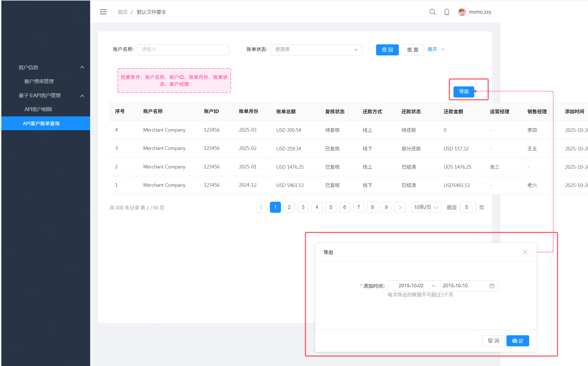

# 月结账单列表页导出功能

需求原型：https://codesign\.qq\.com/s/547026595385562

# 需求说明

1. API客户管理—客户月结账单列表页，增加 **导出** button \(同其他列表页\)；

2. API客户管理—客户月结账单列表页，对导出条件 **添加时间** 进行最大范围限制，只能导出三个自然月区间的数据；\(在添加时间起始时间选框中限制，且只能选日期\)

3. 导出功能，对检索结果进行导出，导出字段信息如下附件

4. button操作成功后，同步生成报表及下载链接\(admin站内信通知\)。

5. 导出文件格式：xlsx，
文件命名格式：ApiClient\_Monthly\_Bill\_2024\-10\-23\.xlsx  \(当前导出日期\)

[ApiClient Monthly Bill\.xlsx](图片和附件/ApiClient%20Monthly%20Bill.xlsx)

# 字段说明

|字段名称|数据库中对应的字段|说明|
|---|---|---|
|Account ID|displayId|账户ID，从account里查询|
|Account Name||账户名称，从account里查询|
|Bill Month|bill\_month|账单月份|
|Bill Amount||账单总额，api\_client\_bill\_statement表里该客户该账单月份的所有费用项之和|
|Settle Type|debit\_type|还款方式|
|Check Status|check\_status|复核状态|
|Settle Status|status|还款状态|
|Settled Amount||还款金额|
|BD||销售经理|
|AM||运营经理|
|Created Time|create\_time|添加时间，UTC\+8|
|Updated Time|update\_time|更新时间，UTC\+8|
|Top up fee|topUpFee|量子账户充值手续费，api\_client\_bill\_statement\.type|
|FX Fee|fxFee|FX手续费，api\_client\_bill\_statement\.type|
|Refund Client Fee |refundClientFee|退款客户退款手续费，api\_client\_bill\_statement\.type|
|Cross Border Fee|crossBorderFee|跨境手续费，api\_client\_bill\_statement\.type|
|Card Production Fee|cardProductionFee|制卡费？？？？api\_client\_bill\_statement\.type|
|ATM Withdrawal Fee|atmWithdrawalFee|ATM取现手续费，api\_client\_bill\_statement\.type|
|Settlement fee|settlementFee|结算手续费，api\_client\_bill\_statement\.type|
|Decline Fee|declineFee|交易失败手续费，api\_client\_bill\_statement\.type|
|Monthly Commitment|monthlyCommitment|月低消，api\_client\_bill\_statement\.type|
|Postage Fee|postageFee|邮寄费，api\_client\_bill\_statement\.type|
|Apple Pay Auth Fee|applePayAuthFee|Apple pay授权费，api\_client\_bill\_statement\.type|
|Reversal Fee|reversalFee|撤销手续费，api\_client\_bill\_statement\.type|
|Monthly Card Fee|monthlyCardFee|卡月费，api\_client\_bill\_statement\.type|
|Card Creation|cardCreationFee|开发费，api\_client\_bill\_statement\.type|
|Refund Fee|refundFee|退款手续费，api\_client\_bill\_statement\.type|
|Auth Fee|authFee|授权费，api\_client\_bill\_statement\.type|
|Additional Fee|additionalFee|其他费用，api\_client\_bill\_statement\.type|
|Manual Addition|add|api\_client\_bill\_statement\.type=Add的所有item对应的金额之和|

# admin页面改造

