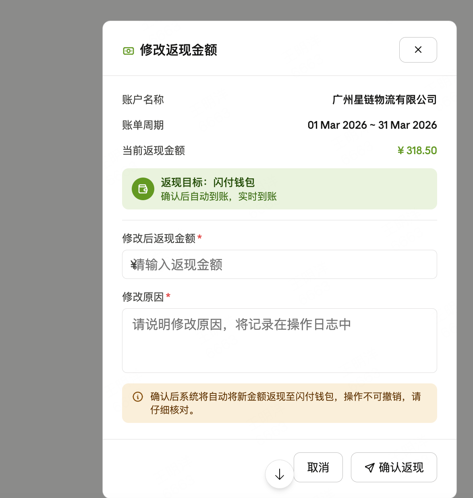

# 月账单/返现Net 四期需求

# 一、需求背景

目前月账单存在20日自动差额扣款后，月账单仍会变更的情况，所以需要在后台开发兜底功能，且需要同步推送客户端最新的差额计算订单；

# 二、需求说明

- 原客户月账单里修改

放开20 号后调账金额的，财务可调20 号之后的订单

提交之后应收月结金额更新，此时差额需要重新计算并重推客户端；

- 在差额里增加修改返现订单入口；

1. 手动返现：修改订单后，返现大于账单，需要财务人工录入返现金额，触发返现，增加一个重新返现按钮；

交互如下：

返现后系统更新为已结清状态，记账金额按新的返现金额更新；

2. 具体规则

- 已经结清订单不允许修改金额，入口灰显；已经结清需要财务线下解决；

- 修改金额时间仅支持本月 20 日到本月月底最后一号，不能跨月，只能修改当月

- 财务修改的任何行为均需要增加操作日志记录；

- 修改之后需要按财务修改后的金额重新计算，无论是月账单大于或小于返现/暂停邮件/站内信通知，由财务人工处理，但客户端需要重推新的差额订单；

- 记账金额同时按照新的差额逻辑进行更新；

# 三、财务流程关注：

举例a：月账单大于返现情况

原月账单金额 **100**，返现 **50**,  差额 **50 **应收，20 日只结清 30，剩余 20；

财务修改金额为 50 ，返现 50 ，差额为 0，多扣的 30需要财务手动退款；

举例b：月账单小于于返现情况

原月账单金额 100，返现 150,  差额 50 应付 ，20 日返现 50 

财务修改金额为 50 ，返现 150 ，差额为 100，还需要财务手工给客户返现到闪付钱包补 50；

原始订单（锁定，不可修改）

扣款：100   返现：50   实付：50   状态：已结清

调整单（财务生成，关联原单）

返现补差：\+100             状态：已返现至闪付钱包

操作人：财务张三   时间：xxx   原因：xxx

账单汇总（客户视角）

扣款合计：100

返现合计：150（50 原始 \+ 100 调整）

实付合计：\-50 → 显示「平台待返还 ¥50」

