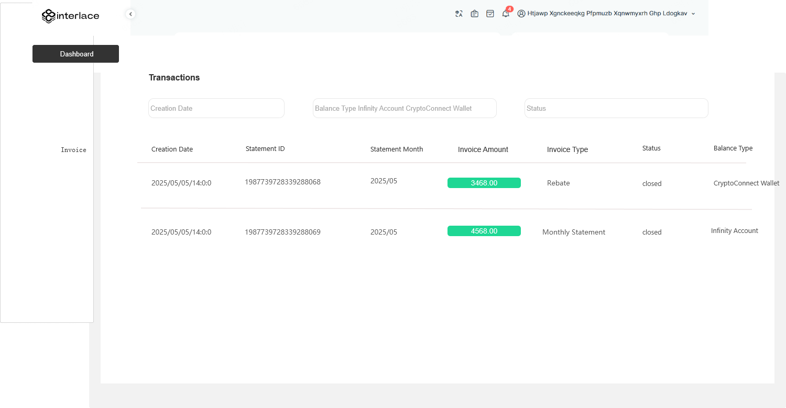

# 月账单需求Ⅱ期\-客户端部分V0\.2

# 一\.需求背景


基于Ⅰ期的需求实现（详看V0\.1 PRD Part），已经完成了Rebate 总账单\&明细以及现有月账单明细部分，分别支持admin后台的下载，Ⅱ期主要目标是在客户端查看账单及明细以及月账单支付流程；


[月账单优化产品方案V0\.1版](https://axss9gjoff.feishu.cn/wiki/AfYiwPis4ipnSDkBm8Jc73eDnBc)  包含所有计算逻辑及明细展示逻辑！Ⅱ期开发前必须要了解Ⅰ期实现的逻辑，因为Ⅱ期实现的需求不赘述Ⅰ期需求说明，谢谢各位！！！

# 二\.业务流程

## 2\.1 目前现状

1. 返现：目前返现推送时间和节点：返现汇总账单完成后，完成返现后发送客户站内信\&邮件，每月10号左右；

2. 月账单：目前月账单汇总账单，15日通过邮件发送给客户账单内容


## 2\.2 梦想中的实现

实际业务中其实包含三种业务场景（Qbit\&interlace）

1）仅开通月结，未开通返现

\-\-\-\-\-按照原来的流程，生成账单让客户下载PDF\&明细即可，增加支付流程；

2）仅开通返现，未开通月结；

\-\-\-\-\-按照原来的流程，生成账单让客户下载PDF\&明细即可，按原来的流程即可；

3）既开通返现又开通月结

\-\-\-\-\-生成返现\&月结账单，让客户分别下载PDF\&明细即可，增加月结的支付流程；


**所以优化后：**


⭐月结账单支付流程：月结账单admin在18号之前财务确认后，19日晚上24：00生成最终的Invoice月账单及明细，支付按钮亮起，引导客户支付该账单，客户可选择主动支付（兼容自动扣款逻辑）；

因为涉及到客户应付部分的金额，实际业务场景不会一次性扣除（余额不足等原因），20日早上10点会自动扣量子账户余额，客户可以选择1个月内去客户端主动支付，如一直存在欠款，每周定期发送站内信（从支付第一笔订单时间起，系统校验第二周的此时发送站内信/邮件提醒，以此类推）

⭐返现\&月账单\-属于内部流程，研发无需关注

由于返现和月账单生成账单时间节点不同，一定是财务/资金确认后的账单和明细（admin会有最后一级审核记录）为准，以避免总账单一直调整和明细对不上的情况；

返现：需要内部运营人员在每个月10日之前确认完最终账单及明细，走完所有审核流程！

10号之前取admin最后确认后的汇总账单\+明细展示在客户端，9号24：00取

月账单：需要内部运营人员在每个月18日之前确认完最终账单及明细，走完所有审核流程！

19日24：00取最新的汇总\+明细，客户端统一展示账单汇总\+明细展示给客户

⭐如果客户从线下打款还款，财务需要手工去冲销待还款资金，所以系统需要兼容线上\+线下还款部分的逻辑


- 状态机\-\-判断逻辑

# 三\.方案实现

## 3\.1 invoice月账单

### 总体说明

在客户端新增一个invoice 菜单，支持下载月账单PDF 总账单（包含返现\+现有月账单）及对应的CSV明细下载；

### 涉及改造模块

- 涉及interlace:直客/Mor/gateway/dist客户端的改造（Qbit直客/Mor）

- 涉及版本 **国内VS海外版**

- 客户端需新增invoice 菜单，因为invoice一般会涉及客户资金的收付，具有权威性，客户可在这个菜单查看关于月账单的汇总\+明细并且确认支付；

- 原invoice会包含会新增返现的汇总（目前月结汇总不包含实收部分，举例：运营配置月结时间是在月中旬，账单汇总会将实收部分的费用剔除，仅保留月结应收部分的账单明细并计算汇总金额）\-\-现有逻辑不涉及开发；

- invoice默认语言为英文\-interlace，~~Qbit需要中文；~~

- 返现模块的改动：1）需要取最终admin审核最后确认的生成invoice ,需要展示对应的Invoice ID（包含多个返现类型）2）需要返回返现时间：以最终打给量子/加密账户的到账时间点计算；3）状态机对应详看状态机模块；

- 如客户月账单日超过1个月未还款，系统自动进行量子账户的余额扣款！一个月内通过站内信/邮件进行提醒并引导客户到客户端主动支付！

- 客户端权限功能还未迁移完，则默认给管理员开通该菜单；后续添加管理员给操作员开通所属菜单\+按钮权限。


#### 3\.2 客户端

- 提示文案直客和gateway/dist不同：\-前端注意

1. 直客：

CN:D月的发票是使用D\-1月的数据生成的，涵盖您主体下所有涉及返现及月结的交易。我们将在每月20号按照发票总额自动扣除您的量子账户余额；返现会自动线下打款到您的量子账户/加密钱包中；

E\.g:The invoice for month D is generated using the data from month D\-1 and covers all transactions under your entity involving rebates and monthly settlements\. On the 20th of each month, the total invoice amount will be automatically deducted from your Infinity account balance;Rebates will be automatically transferred offline to yourInfinity account or crypto wallet

2. gateway/dist

CN:D月的发票是使用D\-1月的数据生成的，涵盖您自己的交易和所有子商户的交易。我们将在每月20号按照发票总额自动扣除您的量子账户余额；返现会自动线下打款到您的量子账户/加密钱包中；

E\.g:The invoice for month D is generated from month D\-1 data and covers your own transactions plus those of all sub\-merchants\. On the 20th of each month, the full invoice amount will be auto\-debited from your Infinity account balance, Rebates will be automatically transferred offline to yourInfinity account or crypto wallet


- Invoice 查询条件：

1. ~~账户ID必输/账户名称\-仅针对dist ，因为gateway明细已经包含sub；~~

2. 月份\-下拉

3. 账单类型：月结账单\&返现

请注意：当账单类型是返现的时候，状态仅默认Settled一种状态

- Download Invoice \-PDF格式，

4. 状态： Settled/Pending Payment/Partially Paid/No Fee   已支付/待支付/部分已付/无支付项


1. 仅开通返现\-展示返现PDF

2. 仅开通月账单\-展示月账单PDF


- 返现\&月结Report\-CSV格式,目前admin已经实现~~，~~~~但是需要改造，需要对现有明细拆分~~~~：~~

1. 直客/MOR/gateway（已经包含子户）原明细不动；

2. ~~dist：需要按照master做拆分明细，按照不同的master拆分对应的返现/月结的明细，这个比较复杂；~~

- 支付账单 \-仅月账单场景需要支付，则系统校验应付金额，推送站内信消息后，链接至invoice ,并引导客户点击Pay the Invoice；

- 交易记录可以跳转至交易列表，展示还款这个交易类型对应的明细表；

- 切记，客户端invoice /明细前提一定是admin复核通过的账单才能推送至客户端！！！！

- CSV文件最大100W条，大于100W条需要多个文件生成，压缩文件下载；

- 账单如果没生成，不展示对应按钮\-No fee的状态

- 扣款时间返现取到账时间/月账单取客户支付时间/系统扣款成功的时间；

- 月账单是在每个月20日早上时间10：00发生自动扣款，客户端校验10点自动扣款是否还清剩余金额，如有欠款引导客户主动支付；

#### 3\.3客户端展示样例

原型链接：http://www\.axshare\.site/JOO0SA?g=4

UI链接：https://www\.figma\.com/design/IyGApG6bNn0ueTis5nXzam/Distributor?node\-id=3043\-7050\&t=gjSbYIfa17Qj76SY\-1

1. PDF展示：按现有PDF格式展示给客户即可；

2. 菜单展示：

- Qbit 版本


- Interlace 版本


- Qbit 版本


- Interlace 版本



- 管理员操作权限

管理员需要给操作分配权限：

**发票查看**

下载发票（不区分月结和返现）

下载发票明细（不区分月结和返现）

支付扣款记录

**发票操作**

支付账单


#### 3\.4 admin端

改造现有返现审核逻辑，需要配置审核流，审核流流转至对应的审核人进行确认，最终完成返现：


是否支持每一级审核人

一级审核人：魏老师\-看的是确认按钮，流程流转到下一个  /可以按权限配置，可配置多人  操作权限 可修改金额 取消账单 备注

二级审核人：孙天赐\-看到确认按钮，流程流转到下一个  /     可以按权限配置，可配置多人操作权限 可修改金额 取消账单 备注

三级审核人：周娜\-看到确认按钮，流程流转到下一个 /           可以按权限配置，可配置多人操作权限 可修改金额 取消账单 备注

最终完成打款：李娟\-看到完成按钮，流程流转到下一个 /           可以按权限配置，可配置多人操作权限 可修改金额 


同时需要记录操作日志，查看


### 3\.站内信/邮件推送账单

1. 原返现\+月账单站内信/邮件内容不动；返现是每个月10号以后，返现成功发站内信/邮件；月账单是固定邮件 ，每月15日发送；

2. 月账单20日自动扣款成功（满足全额的场景）发送站内信/邮件，内容如下：

3. 兼容线下还款扣款场景


```xml
--中文版本--
标题：月结账单扣款通知  

<h3>尊敬的 <%verifiedName%>：</h3> 
账单月份：<%statementMonth%>
账单总额：<%Total Statement Amount%> 
扣款金额：<%Debited Amount%>
扣款日期：<%Debit Date%>
账单状态：<%Status%>
      
您的账单已经还款完成，如有任何疑问可以联系您的客户经理。


--英文版本--
Title: Monthly Statement Debit Notification

<h3>Dear <%verifiedName%>,</h3>

This is to inform you that your monthly statement has been successfully paid. Please find the details below:

Statement Month: <%statementMonth%>
Total Statement Amount: <%Total Statement Amount%>
Debited Amount: <%Debited Amount%>
Debit Date: <%Debit Date%>
Status: <%Status%>

If you have any questions, please contact your account manager.
```

3. 月账单20日扣款部分成功（未满足全额的场景）发送站内信/邮件，内容如下：

4. 兼容线下还款扣款场景


```xml
--中文版本--
标题：月结账单扣款通知  

<h3>尊敬的 <%verifiedName%>：</h3> 
账单月份：<%statementMonth%>
账单总额：<%Total Statement Amount%> 
已还金额：<% Amount paid%> 
扣款日期：<%Debit Date%>
账单状态：<%Status%>
剩余还款金额：<%Remaining Repayment Amount%>
      


您的账单已经部分还款完成，请您登录客户端完成剩余账单金额的还款，如有任何疑问可以联系您的客户经理。


--英文版本--
Title: Monthly Statement Debit Notification

<h3>Dear <%verifiedName%>,</h3>

This is to inform you that your monthly statement has been partially paid. Please find the details below:

Statement Month: <%statementMonth%>
Total Statement Amount: <%Total Statement Amount%>
Amount Paid: <%AmountPaid%>
Debit Date: <%Debit Date%>
Status: <%Status%>
Remaining Amount Due: <%Remaining Repayment Amount%>

Please log in to the portal to complete payment for the remaining balance.
If you have any questions, please contact your account manager.
```


4. 提醒篇：20扣款以后，如有待还款金额， 举例 ：11月20号已完成部分还款 ，11月27日发送站内信/邮件，内容如下：


```xml
--中文版本--
标题：月结账单还款通知  

<h3>尊敬的 <%verifiedName%>：</h3> 
账单月份：<%statementMonth%>
发票总额：<%MonthlystatementAmount%>     
已还金额：<% Amount paid%>  
剩余还款金额：<%  Amount remaining%>  
账单状态：<%Status%>

您的月账单还存在剩余还款金额，请您登录客户端完成剩余账单金额的还款，避免造成您的账户冻结，影响您的业务，有任何问题可以联系我们的客户经理！


--英文版本--
Title: Monthly Statement Payment Reminder

<h3>Dear <%verifiedName%>,</h3>

This is to inform you that there is an outstanding balance on your monthly statement. Please find the details below:

Statement Month: <%statementMonth%>
Total Statement Amount: <%MonthlyStatementAmount%>
Amount Paid: <%AmountPaid%>
Remaining Amount Due: <%AmountRemaining%>
Status: <%Status%>

Your monthly statement has an outstanding balance. Please log in to the portal and make the remaining payment to avoid account suspension and any impact on your services. If you need assistance, contact your account manager.


```

5. 提醒篇：20扣款以后，如有待还款金额， 超过1个月，举例 ：11月20号已完成部分还款 ，12月20日仍未还款，系统自动扣剩余款项，并扣款成功，发送站内信/邮件，内容如下：

```xml
--中文版本--
标题：月结账单还款成功通知  

<h3>尊敬的 <%verifiedName%>：</h3> 
账单月份：<%statementMonth%>
账单总额：<%MonthlystatementAmount%>     
已还金额：<% Amount paid%>  
剩余还款金额：<%  Amount remaining%> 
账单状态： <% Status%> 

您的月账单剩余金额已经扣款成功，有任何问题可以联系我们的客户经理！


--英文版本--
Title: Monthly Statement Payment Successful

<h3>Dear <%verifiedName%>,</h3>

Your monthly statement for the period below has been successfully processed. Please find the details below:

Statement Month: <%statementMonth%>
Total Statement Amount: <%MonthlystatementAmount%>
Amount Paid: <%Amount paid%>
Remaining Amount Due: <%Amount remaining%>
Status: <%Status%> 

If you have any questions, please contact your account manager.
```

6. 提醒篇：20扣款以后，如有待还款金额， 超过1个月，举例 ：11月20号已完成部分还款 ，12月20日仍未还款，系统自动扣剩余款项，并扣款失败，发送站内信/邮件，内容如下：

```xml
--中文版本--
标题：月结账单还款失败通知  

<h3>尊敬的 <%verifiedName%>：</h3> 
账单月份：<%statementMonth%>
账单总额：<%MonthlystatementAmount%>     
已还金额：<% Amount paid%>  
剩余还款金额：<%  Amount remaining%> 
账单状态： <% Status%>  

您的月账单剩余金额已经还款失败，请您尽快登录客户端完成剩余账单金额的还款，避免造成您的账户冻结，影响您的业务，有任何问题可以联系我们的客户经理！


--英文版本--
Title: Monthly Statement Payment Failed

<h3>Dear <%verifiedName%>,</h3>

This is to inform you that the payment of your monthly statement for the period below has failed. Please find the details below:

Statement Month: <%statementMonth%>
Total Statement Amount: <%MonthlystatementAmount%>
Amount Paid: <%Amount paid%>
Remaining Amount Due: <%Amount remaining%>
Status: <%Status%>

Your monthly bill payment failed，Please log in to the portal and complete the payment for the remaining balance. Failure to settle the outstanding amount may result in account restrictions.

If you have any questions, please contact your account manager.
```


8. 月账单明细下载慢，需要客户等待结果\-下载成功，站内信通知客户结果

邮件推送：您的月账单明细/返现明细已经下载完成，请您登录客户端\-站内信查看明细附件，如有任何疑问可以联系您的客户经理。

Your monthly invoice details/rebate details have been downloaded\. Please log in to the client portal and check the attachment in your inbox messages\. If you have any questions, feel free to contact your account manager\.

```xml
--中文版本--
标题：月结账单明细/返现明细下载完成状态通知  -本来就是两个模板

<h3>尊敬的 <%verifiedName%>：</h3> 
账单明细月份：<%Sep%>
下载账单类型：<%Rebate%>   返现明细/月结账单明细
下载结果状态 <%success%>    成功
      
您的月账单明细已经下载完成，请您点击保存并下载11月返现明细，如有任何疑问可以联系您的客户经理。
                                      11月月结账单明细


--英文版本--
Title: Monthly Statement / Rebate Summary Download Completed

<h3>Dear <%verifiedName%>,</h3>

This is to inform you that your statement is ready for download.

Statement Month: <%statementMonth%>
Statement Type: <%Rebate%>  Monthly Statement / Rebate Summary
Download Status: Successful

Your monthly invoice details have been downloaded. Please click to save and download the November invoice (Rebate/Monthly Statement).


If you have any questions, please contact your account manager.
```


9. 月账单/返现明细下载慢，需要客户等待结果\-下载失败，站内信通知客户结果


```xml
--中文版本--
标题：月结账单明细/返现明细下载失败通知  

<h3>尊敬的 <%verifiedName%>：</h3> 
账单明细月份：<%Sep%>
下载账单类型：<%Rebate%>    返现明细/月结账单明细
下载结果状态 <%fail%>     失败
      
您的账单明细下载失败，请您尽快客户端重新进行明细下载，如有任何疑问可以联系您的客户经理。


--英文版本--
Title: Monthly Statement / Rebate Summary Download Failed

<h3>Dear <%verifiedName%>,</h3>

This is to inform you that your statement download has failed.

Statement Month: <%statementMonth%>
Statement Type: <%Rebate%>  Monthly Statement / Rebate Summary
Download Status: Failed

Your statement details download failed. Please log in to the portal and download the details again. If you have any questions, contact your account manager .
 
```

10. 月结发票/返现发票下载慢，需要客户等待结果\-下载成功，站内信通知客户结果

邮件推送：您的月结发票/返现发票已经下载完成，请您登录客户端\-站内信查看明细附件，如有任何疑问可以联系您的客户经理。

Your monthly invoice/ Rebate invoice have been downloaded\. Please log in to the client portal and check the attachment in your inbox messages\. If you have any questions, feel free to contact your account manager\.

```xml
--中文版本--
标题：月结发票/返现发票下载完成状态通知  -本来就是两个模板

<h3>尊敬的 <%verifiedName%>：</h3> 
账单明细月份：<%Sep%>
下载账单类型：<%Rebate%>   月结发票/返现发票
下载结果状态 <%success%>    成功
      
您的月结发票/返现发票已经下载完成，请您点击保存并下载11月发票（返现），如有任何疑问可以联系您的客户经理。
                                      11月发票（月结账单）


--英文版本--
Title: Monthly invoice / Rebate invoice Download Completed

<h3>Dear <%verifiedName%>,</h3>

This is to inform you that your statement is ready for download.

Statement Month: <%statementMonth%>
Statement Type: <%Rebate%>  Monthly invoice / Rebate invoice
Download Status: Successful

Your monthly invoice details have been downloaded. Please click to save and download the November invoice (Rebate/Monthly Statement).


If you have any questions, please contact your account manager.
```


11. 月账单明细下载慢，需要客户等待结果\-下载失败，站内信通知客户结果


```xml
--中文版本--
标题：月结发票/返现发票下载失败通知  

<h3>尊敬的 <%verifiedName%>：</h3> 
账单明细月份：<%Sep%>
下载账单类型：<%Rebate%>    月结发票/返现发票
下载结果状态 <%fail%>     失败
      
您的月结发票/返现发票下载失败，请您尽快客户端重新进行明细下载，如有任何疑问可以联系您的客户经理。


--英文版本--
Title: Monthly invoice/ Rebate invoice Download Failed

<h3>Dear <%verifiedName%>,</h3>

This is to inform you that your monthly invoice/ Rebate invoice download has failed.

Statement Month: <%statementMonth%>
Statement Type: <%Rebate%>  Monthly invoice / Rebate invoice
Download Status: Failed

Your monthly invoice/ Rebate invoice download failed. Please log in to the portal and download the details again. If you have any questions, contact your account manager .
 
```

飞书预警：超过1个月通知内部群（财务，资金\.\.）

您有一条新通知！title:"量子卡API客户××月账单超过1个月仍欠款名单"


data:\{\[账户ID:156147,账户名称:睿思創新投資管理有限公司,欠款金额:93\.00\],

\[账户ID:456274,账户名称:香港酷購環球科技有限公司,欠款金额:2301\.46\],

\[账户ID:561004,账户名称:KOGNICON LIMITED,欠款金额:1965\.00\],

\[账户ID:744345,账户名称:ORENDA FINANCIAL SERVICES LIMITED,欠款金额:650\.62\],

\[账户ID:301277,账户名称:inspirodev LLC,欠款金额:2862\.39\],

\[账户ID:698266,账户名称:GEMX CO LIMITED,欠款金额:16\.81\],

\[账户ID:262639,账户名称:Fivebelts INC,欠款金额:1028\.22\],

\[账户ID:238996,账户名称:Midaspay SP Limited,欠款金额:10000\.00\],


### 4\.异常账单处理流程\-@魏凡祎

- 20号后，无论你怎么保证账单是最终的，但是仍然会有业务不遵守或者客户执意不认可的情况：


手段：月账单和返现都是支持更新账单总额的，可以把最新的总账单发给客户，但是客户端是否要更新？因为明细是固定的无法重新更新，可以admin后，增加一个重新推送账单的功能？本期可以考虑线下发给客户，和客户确认后，则多退少补。


- 老板突然增加了一个费项，汇总增加了，该费项如果涉及有明细，但是涉及明细无法增加，因为有可能明细已经生成了，这种——

告诉老板下个迭代增加明细，我也没有好的办法（包含梁大神），除非线下给BI重新计算明细线下发给客户！


## 总之不要妄想汇总和明细是一定保证对的上，但是需要有合理的理由和解决方案（如何安抚客户是一门艺术）！


