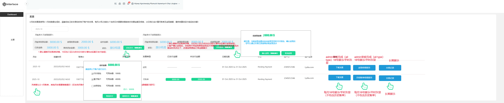

# 月账单需求Ⅲ期\-增加Net逻辑V0\.3

# 一\.需求背景


基于前两期的需求实现（详看V0\.1\&0\.2 PRD Part），客户端已经完成了Rebate 总账单\&明细以及现有月账单明细部分下载，Ⅲ期期主要目标是合并返现和月账单账单及计算Net，支持客户在客户端支付差额部分。

# 二\.业务流程

## 2\.1 目前现状

1. 返现：目前返现推送时间和节点：返现汇总账单完成后，完成返现后发送客户站内信\&邮件，每月10号左右，即客户端展示返现账单及明细按钮；

2. 月账单：目前月账单汇总账单，15日通过邮件发送给客户账单内容，20日会推送客户端展示给客户月账单和明细并做自动扣款处理；

2025年\-2026年2月账单因为不涉及net的计算，各走各的流程。

## 2\.2 实现路径


**2月账单处理流程：详见jira\-\-**

https://qbitnetwork\.atlassian\.net/browse/OP\-762

**避免月账单冲突，我们按时间线来避免新老逻辑切换造成逻辑冲突：**

2025年1月12日上线后，历史账单\+2016年1月账单，2月账单均按老逻辑展示，包含支付流程，这个务必记住！！！！！


实际业务中其实包含三种业务场景（Qbit\&interlace）

1）仅开通月结，未开通返现

\-\-\-\-\-按照原来的流程，生成账单让客户下载PDF\&明细即可，按原来的流程该推送推送！

2）仅开通返现，未开通月结

\-\-\-\-\-按照原来的流程，生成账单让客户下载PDF\&明细即可，按原来的流程该推送推送！

3）既开通返现又开通月结

\-\-\-\-生成总的账单让客户下载分别下载返现及月账单的PDF\&明细，并支持客户主动支付；


原逻辑不变！！


**2026年3月账单，按照新逻辑展示，计算Net部分，客户端需要做好交互！！！！**


⭐1）仅开通月结，未开通返现场景

\-\-\-\-\-10日生成账单 

\-\-\-\-18日客户端放开账单账单\+明细给客户check; 

\-\-\-\-19日0点客户端放开账单账单支付按钮；

\-\-\-\-20日上午10点按照账单账单金额进行全额扣款，从量子账户统一扣；

2）仅开通返现，未开通月结

\-\-\-\-\-5日左右生成账单 

\-\-\-\-10日左右返现生成明细，返现至闪付钱包，返现完成后发站内信/邮件；


⭐3）既开通返现又开通月结

\-\-\-\-生成总的账单让客户下载分别下载返现及月账单的PDF\&明细

\-\-\-\-\-重点在这里，涉及本次重点改的部分，账单合并，计算net, 即收入\>返现（客户需支付我们费用） 或者 收入\<返现（即我们需支付客户费用）

\-\-\-\-\-10日生成返现/月结账单 

\-\-\-\-18日客户端放开账单账单\+明细给客户check; 

\-\-\-\-19日0点客户端放开账单账单支付按钮；

\-\-\-\-20日上午10点按照账单账单金额进行全额扣款，从量子账户统一扣Net part

\-\-\-\-客户主动支付，可选量子，闪付and 加密钱包

具体展示逻辑看客户端交互即可！


# 三\.方案实现

## 3\.1 Billing月账单

- Billing 层主要记录关于账单业务相关信息

- Transation 主要记录和Billing处理资金扣款

- 财务对账\&BI计算销售收入一般不对Net,需要对的是Billing的应付/应收的金额，但客户都需要关注，客户端需要展示对应的Billing 应收，应付，Net 的金额，点击支付，触发交易，在交易流水里可以看到对应的Net实付/实收的流水；

- 一笔Net对应多笔交易流水，因存在多个资产账户扣款，且我方系统自动扣款，故需要每笔交易流水备注需要备注扣款来源：月账单扣款


### 总体说明

Billing 菜单，2026年3月账单按新逻辑处理；

### 涉及改造模块

- 涉及interlace:直客/Mor/gateway/dist客户端的改造

- 涉及版本 **国内VS海外版**

- 增加一张差额表，存储返现及月账单差额的计算，按月计算即可，不累加计算；且Net计算只要账单有变动，Net金额自动更新；

举例：客户11月账单，12月20日计算差额的时候，月账单120，返现100，差额是20，我们需要扣掉客户的量子账户20，但是客户余额不足，只有10元，还剩10未扣，直到1月，客户仍然未还，12月账单已经出来，1月计算差额的时候不要累加11月账单未还的10元！！按月计算Net,不影响下个月计算

但异常情况下：如果月账单和返现计算差额后，需要我侧扣除月账单，客户账上余额不足，未扣成功，剩余支付部分需要按新逻辑进行站内信通知和邮件通知！

- 3月返现账单无需资金在后台点击完成返现，过了前面对所有类型的审核即可，客户在20号以后如对返现有疑问，可以反馈疑问，返现线下资金处理；

- 返现账单状态需要展示/待返现/已返现两种状态:

在客户未点击确认返现之前，均是待返现状态，直到完成返现后，状态变更为已返现；

- 默认所有返现从闪付钱包账务处理/月账单默认量子自动扣；主动支付可选

- 月账单和返现18日取当时的Net值，但如在20日月账单还未终审，提现/月账单支付/返现按钮前端不允许展示！！！@周丞

- 主动支付：按照客户所选账户类型进行支付：

——》If 客户选择某一个足额扣的账户，直接按该账户进行扣款；

举例：

月账单Net 6000 $

闪付钱包：6000 $ 用户选择

量子账户：1000  $

加密钱包：1000  $


交易扣款扣闪付钱包6000$即可；


---

If 客户选择全选支付：扣款优先级：闪付——》量子——》加密

举例：

月账单Net 6000 $

闪付钱包：4000 $ 用户选择

量子账户：1000  $用户选择

加密钱包：2000  $用户选择


交易扣款扣闪付：4000$

交易扣款扣量子：1000$

交易扣款扣加密：1000$

---

If 客户选择部分支付，允许用户部分支付；

举例：

月账单Net 6000 $

闪付钱包：4000 $ 用户选择

量子账户：1000  $用户选择

加密钱包：2000  


交易扣款扣闪付：4000$

交易扣款扣量子：1000$


#### 3\.2 客户端

- Billing 列表展示

1. 2026年3月账单需要默认3月账单内容，包含返现\+月账单；

2. 2026年3月之前账单平铺即可，按最新的月份账单展示即可；

- Billing 月份选择\-搜索

1. 2026年3月账单展示内容按新逻辑展示内容\-即差额部分；

2. 2026年3月之前账单逻辑不动；

- 计算差额部分展示：

18日出账单后展示评估差额，不需要展示支付按钮，支持客户提前check账单差额；

19日东八区23点59分59秒计算Net后展示支付按钮；如月账单大于返现，需要一直展示支付按钮，直到结清为止；账单小于返现确认返现按钮同时展示；

如月账单小于于返现，需要一直展示确认返现按钮，客户点击确认返现后，即可入账至闪付钱包；


#### 3\.3客户端展示样例

原型链接：http://www\.axshare\.site/JOO0SA?g=4

UI链接：https://www\.figma\.com/design/IyGApG6bNn0ueTis5nXzam/Distributor?node\-id=3043\-7050\&t=gjSbYIfa17Qj76SY\-1

英文：[Distributor多语言](https://axss9gjoff.feishu.cn/wiki/Xo8MwxUYdiZzWQkn6JZcAbnZnye)

- Dashboard

左侧推送通知：

1. 包含所有客户端

2. 针对差额场景19日24点开始提醒（前提一定是月账单and返现终审后），当月提醒一次即可；不提醒历史订单；

直到客户手动关闭or点击账单链接结束提醒；@周丞 到下个月19日24号自动关闭


- 账单



#### 3\.4 admin端

在API客户管理下增加一个新的菜单（放在月账单下）


#### 3\.5 站内信/邮件推送账单/webhook   @周丞@金筱滢

1. 返现：只开返现需要按照原模板自动返现~~，但是站内信/邮件需要提示客户返到闪付钱包；~~

2. 月账单：只开月账单15日账单继续推送即可；

针对3月账单Net part 改变如下：

月账单大于返现，差额部分20日自动扣款成功（满足全额的场景）发送站内信/邮件，内容如下：


```xml
--中文版本--
标题：账单支付成功通知  

<h3>尊敬的 <%verifiedName%>：</h3> 
账单月份：<%statementMonth%>
返现金额：<%Rebate Billing amount%> 
月账单金额：<%Monthly settlement Billing amount%> 
待支付金额（差额）：<%Outstanding repayment balance%>
扣款金额：<%Debited Amount%>
扣款日期：<%Debit Date%>
扣款账户：量子账户
账单状态：<%Status%>
      
您的账单待付金额已经全部支付完成，如有任何疑问可以联系您的客户经理。


--英文版本--
Title: Billing Repayment Successful

<h3>Dear <%verifiedName%>,</h3>

Please find the details of your billing repayment below:

Billing Month: <%statementMonth%>
Rebate Amount: <%Rebate amount%> 
Monthly Statement Amount: <%Monthly settlement amount%> 
Outstanding Amount (Net Difference): <%Outstanding repayment balance%>
Debited Amount: <%Debited Amount%>
Debit Date: <%Debit Date%>
Debit Account: Infinity Account
Billing Status: <%Status%>

The outstanding amount of your monthly billing has been successfully debited from your account, and the billing has been fully settled.
If you have any questions, please contact your account manager.
```

3. 月账单20日扣款部分成功（未满足全额的场景）发送站内信/邮件，内容如下：

兼容线下还款扣款场景


```xml
--中文版本--
标题：账单还款通知  

<h3>尊敬的 <%verifiedName%>：</h3> 
账单月份：<%statementMonth%>
返现金额：<%Rebate Billing amount%> 
月账单金额：<%Monthly settlement Billing amount%> 
待支付金额（差额）：<%Outstanding repayment balance%>
已支付金额：<% Amount paid%> 
剩余待付金额：<%Remaining Repayment Amount%>
扣款日期：<%Debit Date%>
扣款账户：量子账户
账单状态：<%Status%>

您的账单已经部分支付完成，请您登录客户端完成剩余账单待付金额，如有任何疑问可以联系您的客户经理。


--英文版本--
Title: Billing Repayment Notification

<h3>Dear <%verifiedName%>,</h3>

Please find the details of your billing repayment below:

Billing Month: <%statementMonth%>
Rebate Amount: <%Rebate amount%> 
Monthly Statement Amount: <%Monthly statement amount%> 
Outstanding Amount (Net Difference): <%Outstanding repayment balance%>
Amount Paid: <% Amount paid%> 
Remaining Amount Due: <%Remaining Repayment Amount%>
Debit Date: <%Debit Date%>
Debit Account: Infinity Account
Billing Status: <%Status%>

Your billing has been partially settled. Please log in to the portal to complete the payment of the remaining amount.
If you have any questions, please contact your account manager.
```


4. 提醒篇：20扣款以后，如有待还款金额， 举例 ：11月20号已完成部分还款 ，11月27日发送站内信/邮件，内容如下：


```xml
--中文版本--
标题：账单未结清通知

<h3>尊敬的 <%verifiedName%>：</h3> 
账单月份：<%statementMonth%>
返现金额：<%Rebate Billing amount%> 
月账单金额：<%Monthly settlement Billing amount%> 
账单待付金额（差额）：<%Outstanding repayment balance%>
已支付金额：<%Amount paid%>     
剩余待付金额：<%Amount remaining%>  
账单状态：<%Status%>

您的账单还存在剩余待付金额，请您登录客户端完成剩余账单待付金额，避免造成您的账户冻结，影响您的业务，有任何问题可以联系我们的客户经理！


--英文版本--
Title: Billing Repayment Notification

<h3>Dear <%verifiedName%>,</h3>

Please find the details of your outstanding billing balance below:

Billing Month: <%statementMonth%>
Rebate Amount: <%Rebate amount%> 
Monthly Statement Amount: <%Monthly settlement amount%> 
Outstanding Amount (Net Difference): <%Outstanding repayment balance%>
Amount Paid: <% Amount paid%> 
Remaining Amount Due: <%Remaining Repayment Amount%>
Billing Status: <%Status%>

There is still an outstanding balance on your billing. Please log in to the portal to complete the payment of the remaining amount to avoid any potential account restrictions.
If you have any questions, please contact your account manager.

```

5. 提醒篇：20扣款以后，如有待还款金额， 超过1个月，举例 ：11月20号已完成部分还款 ，12月20日仍未还款，系统自动扣剩余款项，并扣款成功，发送站内信/邮件，内容如下：

```xml
--中文版本--
标题：账单已结清通知

<h3>尊敬的 <%verifiedName%>：</h3> 
账单月份：<%statementMonth%>
返现金额：<%Rebate Billing amount%> 
月账单金额：<%Monthly settlement Billing amount%> 
待支付金额（差额）：<%Outstanding repayment balance%>
已支付金额：<%Amount paid%>     
剩余待付金额：<%Amount remaining%>  
扣款日期：<%Debit Date%>
扣款账户：量子账户
账单状态：<%Status%> 

您的账单剩余金额已经扣款成功，有任何问题可以联系我们的客户经理！


--英文版本--
Title: Billing Fully Settled Notification

<h3>Dear <%verifiedName%>,</h3>

Please find the settlement details of your billing below:

Billing Month: <%statementMonth%>
Rebate Amount: <%Rebate amount%> 
Monthly Statement Amount: <%Monthly statement amount%> 
Outstanding Amount (Net Difference): <%Outstanding repayment balance%>
Amount Paid: <% Amount paid%> 
Remaining Amount Due: <%Remaining Repayment Amount%>
Debit Date: <%Debit Date%>
Debit Account: Infinity Account
Billing Status: <%Status%>

The remaining outstanding balance of your billing has been successfully debited, and the billing is now fully settled.
If you have any questions, please contact your account manager.
```

6. 提醒篇：20扣款以后，如有待还款金额， 超过1个月，举例 ：11月20号已完成部分还款 ，12月20日仍未还款，系统自动扣剩余款项，并扣款失败，发送站内信/邮件，内容如下：

```xml
--中文版本--
标题：账单还款失败通知  

<h3>尊敬的 <%verifiedName%>：</h3> 
账单月份：<%statementMonth%>
返现金额：<%Rebate Billing amount%> 
月账单金额：<%Monthly settlement Billing amount%> 
待支付金额（差额）：<%Outstanding repayment balance%>
已支付金额：<% Amount paid%>   
剩余待付金额：<%  Amount remaining%> 
扣款日期：<%Debit Date%>
扣款账户：量子账户
账单状态： <% Status%>  

您的账单剩余待付金额支付失败，请您登录客户端完成剩余账单待付金额，避免造成您的账户冻结，影响您的业务，有任何问题可以联系我们的客户经理！


--英文版本--
Title: Billing Repayment Failed Notification

<h3>Dear <%verifiedName%>,</h3>

Please find the details of your billing repayment status below:

Billing Month: <%statementMonth%>
Rebate Amount: <%Rebate amount%> 
Monthly Statement Amount: <%Monthly statement amount%> 
Outstanding Amount (Net Difference): <%Outstanding repayment balance%>
Amount Paid: <% Amount paid%> 
Remaining Amount Due: <%Remaining Repayment Amount%>
Debit Date: <%Debit Date%>
Debit Account: Infinity Account
Billing Status: <%Status%>

The automatic debit was unsuccessful due to insufficient balance. Please log in to the portal to complete the payment to avoid potential account restrictions.
If you have any questions, please contact your account manager.
```

7. 差额返现通知\-成功@金筱滢@周丞


```xml
--中文版本--
标题：账单返现成功通知  

<h3>尊敬的 <%verifiedName%>：</h3> 
账单月份：<%statementMonth%>
返现金额：<%Rebate Billing amount%> 
月账单金额：<%Monthly settlement Billing amount%> 
返现金额（差额）：<%Outstanding repayment balance%>
返现日期：<%Rebate Date%>
返现账户：闪付钱包
账单状态： <%Status%>  

您本月账单返现金额已经成功到账，有任何问题可以联系我们的客户经理！


--英文版本--
Title: Billing Rebate Processed

<h3>Dear <%verifiedName%>,</h3>

Please find the details of your billing rebate below:

Billing Month: <%statementMonth%>
Rebate Amount: <%Rebate amount%> 
Monthly Statement Amount: <%Monthly statement amount%> 
Rebated Amount (Net Difference): ：<%Outstanding repayment balance%>
Rebate Date: <%Rebate Date%>
Rebate Account: InstaPay Wallet
Status: <%Status%>

The rebate amount for your monthly billing has been successfully processed.
If you have any questions, please contact your account manager.
```


飞书预警：

您有一条新通知！title:"量子卡API客户××月账单超过1个月仍欠款名单"


data:\{\[账户ID:156147,账户名称:睿思創新投資管理有限公司,欠款金额:93\.00\],

\[账户ID:456274,账户名称:香港酷購環球科技有限公司,欠款金额:2301\.46\],

\[账户ID:561004,账户名称:KOGNICON LIMITED,欠款金额:1965\.00\],

\[账户ID:744345,账户名称:ORENDA FINANCIAL SERVICES LIMITED,欠款金额:650\.62\],

\[账户ID:301277,账户名称:inspirodev LLC,欠款金额:2862\.39\],

\[账户ID:698266,账户名称:GEMX CO LIMITED,欠款金额:16\.81\],

\[账户ID:262639,账户名称:Fivebelts INC,欠款金额:1028\.22\],

\[账户ID:238996,账户名称:Midaspay SP Limited,欠款金额:10000\.00\],


飞书预警@周丞

您有一条新通知！title:"量子卡API客户××月账单返现失败名单"


data:\{\[账户ID:156147,账户名称:睿思創新投資管理有限公司,返现金额:93\.00 返现状态：失败\],


#### 3\.5 英文翻译相关


邮件内容：——4月10日 @周丞


Qbit 邮件内容：


**关于"账单支付与管理"功能升级的通知**

尊敬的客户：

"账单支付与管理"功能已完成升级，已于2026年4月正式生效。4月18日起，您可通过该功能查看3月账单。


本次升级引入了差额结算机制，对同时开通月账单及返现功能的客户适用：系统将自动合并计算月账单应付金额与返现应收金额，以差额作为最终结算金额。


更新后的账单管理具体流程如下：

**每月18日 — 账单与返现查看** 登录客户端，进入"账单"菜单，即可查看上月账单及返现的汇总与明细信息。

**每月20日 — 差额结算与处理**

- **账单金额大于返现金额：** 系统将自动从您的量子账户余额中扣除差额部分。如余额不足，您可通过客户端选择其他支付方式完成付款。

- **返现金额大于账单金额：** 请在客户端确认应收返现金额，确认后差额部分将自动发放至您的闪付钱包。


更多功能说明请参阅帮助中心：[账单功能介绍](https://www.qbitnetwork.com/help/140cd8ff-d5db-4950-82e5-e9df66bcd31e)。如有疑问，欢迎联系您的客户经理或客服团队。


interlace邮件内容：

**Upgrade to the Billing Feature**


Dear \<%verifiedName%\>,


We would like to inform you that the **Billing** feature has been upgraded and is effective as of April 2026\. Starting from April 18, you can access your March billing in the upgraded Billing module\.


This upgrade introduces a net settlement mechanism for clients who have both the monthly statement and rebate features enabled\. The system automatically calculates the net amount between the monthly statement and the rebate, with the difference used as the final settlement amount\.


The updated process is as follows:

1. **On the 18th of each month,** you can view the summary and details of the monthly statement and rebate for the previous month in the Billing module\.


2. **On the 20th of each month**, the net amount is calculated and processed\.

- If the monthly statement amount exceeds the rebate amount, the outstanding balance will be automatically deducted from your Infinity Account\. If the balance is insufficient, payment can be completed using other available payment methods in the portal\.

- If the rebate amount exceeds the monthly statement amount, please confirm the rebate amount in the portal\. Once confirmed, the remaining amount will be credited to your InstaPay Wallet\.


For more information, please refer to the Support Center: [Billing Feature Overview](https://www.interlace.money/support-center?articleId=342699d5-693b-40da-9fde-94907f1bd057&id=cdb9df30-889e-4112-980a-562c2520e7c8)\.  


\[Interlace Template\]


18 日 邮件内容：

### 邮件主题：  \*月账单提醒

您好！

您\*月度账单已生成，账单信息如下：

账单月份： \*

返现金额： \*

月账单金额： \*

待支付/待返现金额（差额）： \*


请及时登录门户查看您的账单，如您的账单是待支付状态，我司将于 20 日系统自动从您的量子账户扣除金额，同时，您也可以通过门户选择其他方式支付您的账单。


如有疑问，可以联系我们的客户服务经理，感谢您的支持！


interlace 团队

时间：\*\*\*\*


eg:

Subject:\[Month\] Monthly Billing Reminder

Dear \[Name\],


Your \[Month\] monthly Billing  has been generated\. Please find your billing details below:


• Billing Month: \[Month\]

• Rebate Amount: \[Amount\]

• Monthly Bill Amount: \[Amount\]

• Outstanding Balance / Rebate Due: \[Amount\]


Please log in to the portal at your earliest convenience to review your bill\.


If your billing is in "Pending Payment" status, the outstanding amount will be automatically deducted from your Quantum account on the 20th\. Alternatively, you may log in to the portal to select a different payment method\.


Should you have any questions, please do not hesitate to reach out to your dedicated Client Services Manager\. Thank you for your continued support\!


Best regards,

The Interlace Team

\[Date\]


