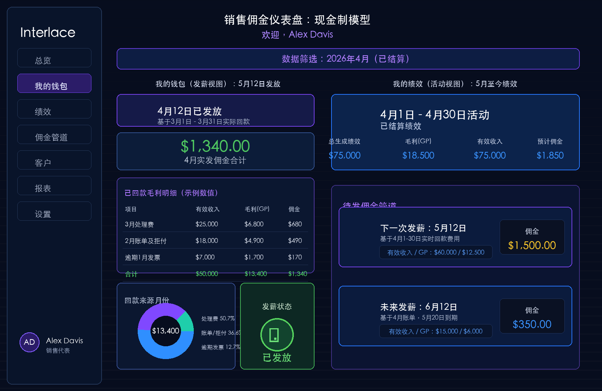
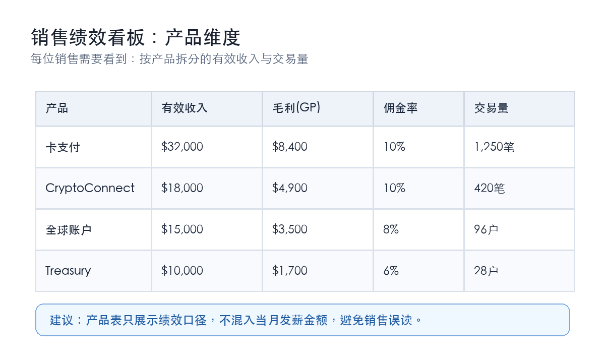
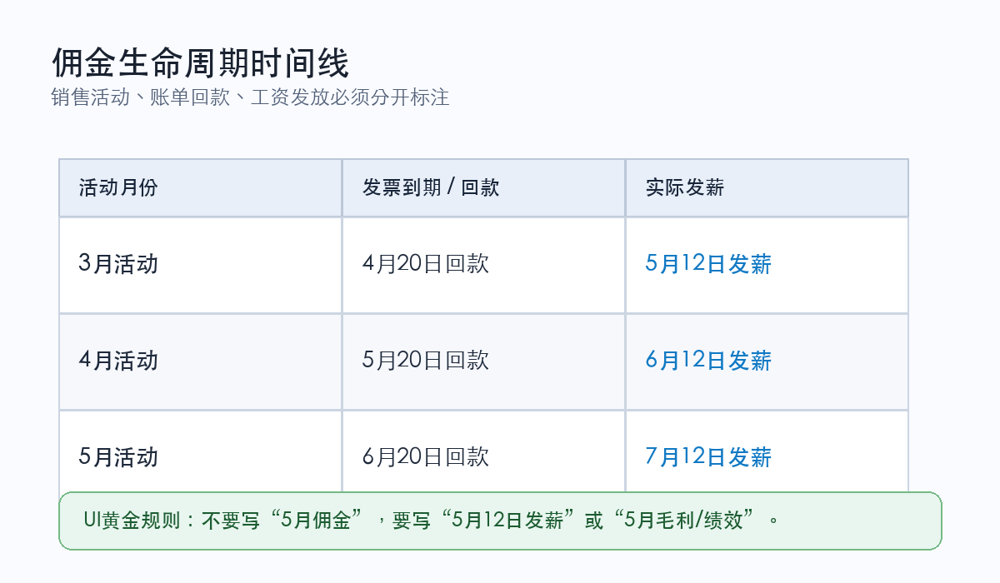

SALES COMMISSION DASHBOARD

销售佣金仪表盘设计说明

现金制佣金模型下的双视图设计：把“现在创造的绩效”和“现在到账的工资”拆开表达。

| 目标读者 | 销售代表、销售主管、财务/结算团队、产品与BI团队 |
| --- | --- |
| 核心问题 | 现金制佣金存在时间错位：本月销售行为、本月回款、本月工资并不一定来自同一批客户活动。 |
| 设计原则 | 必须拆分“发薪视图”和“绩效视图”，并用清晰日期替代模糊月份标签。 |
| 输出范围 | 中文说明文档、中文仪表盘示意图、产品维度看板、佣金生命周期时间线。 |

# 1. 背景：现金制佣金为什么容易误解

现金制模型的难点在于“时间旅行”：销售在5月看到自己正在创造5月收入，但5月工资可能来自4月实际到账的现金，而这批现金又可能来自3月的客户活动。

如果仪表盘只写“5月佣金”，销售会自然理解成“5月做出来的钱”，但财务口径可能指“5月12日发放的钱”。这两种说法都合理，却指向不同事实。

| 关键结论 仪表盘必须把“我现在正在创造什么”（绩效）和“我现在即将拿到什么”（钱包/发薪）完全分开，避免把活动月份、回款月份、发薪日期混在同一张图里。 |
| --- |

# 2. Sales Commission Dashboard 指标口径定义

以下口径来自产品提供的计算逻辑。文档中统一把英文指标保留在括号里，方便后续和数据表、BI字段、产品页面对齐。

| 指标名 | 销售部门 | 计算公式 / 口径 | 备注 |
| --- | --- | --- | --- |
| Real-time processing | 销售一部、销售二部 | 量子卡收入（充值手续费需按 consumption amount 拆分到各个渠道；排除实体卡邮寄费、月账单）+ 全球账户收入（入金、付款、汇差）。 | 用于实时处理收入口径。 |
| Real-time processing | 海外销售一部、海外销售二部 | 量子卡收入（排除实体卡邮寄费、月账单）+ 全球账户收入（入金、付款、汇差）+ 加密账户收入（承兑）+ 粒子理财收入。 | 海外团队包含加密账户与粒子理财。 |
| Effective Revenue | 销售一部、销售二部、海外销售一部、海外销售二部 | 同核心数据看板一致。 | 保持与核心看板口径一致。 |
| Gross Profit | 销售一部、销售二部、海外销售一部 | 同核心数据看板一致。当月总计算结果为负时按 0 处理；单客户负值不影响其他客户。 | 销售一部/二部新增实体卡制卡费毛利：QI卡/张 =（实际收到的制卡费 - 4）* 0.15；其余部门毛利不计实体卡。 |
| Gross Profit | 海外销售二部 | 同核心数据看板一致。单客户算出来是多少就是多少，客户之间可以互相影响。 | 海外销售二部不使用“当月总负数归零、单客户不影响其他客户”的同一处理方式。 |
| Regular billing & conditional declined fees | 销售一部、销售二部、海外销售一部、海外销售二部 | 所有当月账单金额。 | 排除低消、KYC 手续费。 |
| Past due Invoice | 销售一部、销售二部、海外销售一部、海外销售二部 | 历史所有月账单在当月实际收到的金额。 | 排除低消、KYC 手续费。 |
| Commission | 销售一部、销售二部、海外销售一部 | Gross Profit * Commission Rate（按客户/产品活跃天数匹配对应档位）。 | 最后当月总计算出来为负就为 0；单客户不影响其他客户。 |
| Commission | 海外销售二部 | Gross Profit * Rate。直邀客户 Rate = 0.2；非直邀客户 Rate = 0.1。 | 直邀：客户邀请码与销售邀请码一致。非直邀：客户邀请码不一致、为空或其他不满足一致条件。特殊：id='0aa5962b-cecd-43d1-974e-ac181f1403e9' 的 Aliniex UAB，当 salesId='1ca4e51c-b57a-497d-a5e4-166d29ac2709'（Rob）时按直邀。 |

## 2.1 Commission Rate：销售一部、销售二部、海外销售一部

以下佣金率适用于销售一部、销售二部、海外销售一部。活跃天数统一按“下个月第一天 - 对应产品激活/上线时间”计算。

| Product | Commission Base | 0-180天 | 181-365天 | 366-1095天 | 活跃天数取值 |
| --- | --- | --- | --- | --- | --- |
| 量子卡：各类手续费、虚拟卡/实体卡卡费、卡活跃月费 | 产品毛利 | 12.00% | 6.00% | 3.60% | 下个月第一天 - 客户量子卡激活时间。例：激活日 2月1日；算4月收入用 5月1日 - 2月1日，算5月收入用 6月1日 - 2月1日。 |
| 加密账户：承兑 | 产品毛利 | 12.00% | 6.00% | 3.60% | 下个月第一天 - 客户加密激活时间。 |
| 全球账户：payin、payout、fx | 产品毛利 | 12.00% | 6.00% | 3.60% | 下个月第一天 - 客户全球账户激活时间。 |
| 粒子理财 | 产品毛利 | 20.00% | 6.00% | 3.60% | 下个月第一天 - 粒子理财激活时间。 |
| 收单 | 产品毛利 | 12.00% | 6.00% | 3.60% | 暂无销售，先不处理。 |
| ScanToPay | 产品毛利 | 12.00% | 6.00% | 3.60% | 暂无销售，先不处理。 |
| API费用：一次性合规及接入费、卡面设计费、白标系统部署费 | 实际收费 | 15.00% | 15.00% | 15.00% | 下个月第一天 - API上线时间。 |
| API费用：月费（技术服务费） | 实际收费 | 10.00% | 10.00% | 0.00% | 下个月第一天 - API上线时间。 |

# 3. 双视图仪表盘

建议把销售端拆成两个并列区域或两个页签。两个视图可以共享筛选条件，但标题、指标、解释文案必须各自使用独立口径。

图1：中文化的双视图佣金仪表盘示意图

## 3.1 我的钱包：发薪视图

这个视图回答“本次工资会打多少钱、为什么是这个金额”。它面向结算结果，重点是日期、回款区间和已收现金来源。

| 主标题 | 即将发放：5月12日发薪 |
| --- | --- |
| 佣金合计 | $X,XXX |
| 计算依据 | 基于4月1日 - 4月30日实际回款现金。 |
| 明细来源 | 3月处理费发票、3月条件拒付费用、2月逾期发票等在4月到账的项目。 |
| 用户价值 | 销售能立即知道：这次工资来自哪一批工作，而不是误以为全部来自5月活动。 |

## 3.2 我的绩效：活动视图

这个视图回答“我本月正在创造多少有效收入和毛利”。它面向经营动作，即使这些收入还没有开票、回款，也应被清楚标记为当前绩效。

标题：5月至今（MTD）绩效。

核心指标：累计有效收入、毛利（GP）、预计佣金。

状态标签：当前未开票，说明5月账单通常要到6月才发出。

管道组件：显示6月12日、7月12日等未来发薪预估，让销售知道后续资金流向。

# 4. 产品维度绩效看板

销售绩效页还需要按产品拆分有效收入与交易量。产品表建议只展示绩效口径，发薪金额放在钱包页，避免销售把“产品贡献”误读成“本月到账工资”。

图2：产品维度收入与交易量看板示意图

# 5. 佣金生命周期时间线

为了让销售团队快速理解现金制佣金，可以把下面的生命周期表做成仪表盘里的提示卡、问号说明或帮助中心短文。

图3：活动月份、回款日期与发薪日期的对应关系

# 6. UI命名规则

| 黄金规则 永远不要只写“5月佣金”。现金到账场景写“5月12日发薪”；绩效经营场景写“5月毛利”或“5月至今绩效”。 |
| --- |

| 不要使用 | 推荐使用 | 适用场景 |
| --- | --- | --- |
| 5月佣金 | 5月12日发薪 | 钱包/工资到账 |
| 本月佣金 | 5月至今绩效 | 销售活动与经营表现 |
| 待支付佣金 | 6月12日预计发薪 | 佣金管道与预测 |

# 7. 落地清单

销售登录后默认看到两个清晰入口：我的钱包、我的绩效。

每个金额旁边必须展示口径：回款区间、活动月份、是否已开票、是否已发薪。

产品维度只承载有效收入、毛利、交易量等绩效指标。

佣金管道展示未来发薪日期，并说明基于哪一段活动或回款。

所有截图、帮助文案、提示气泡统一使用中文口径命名。
