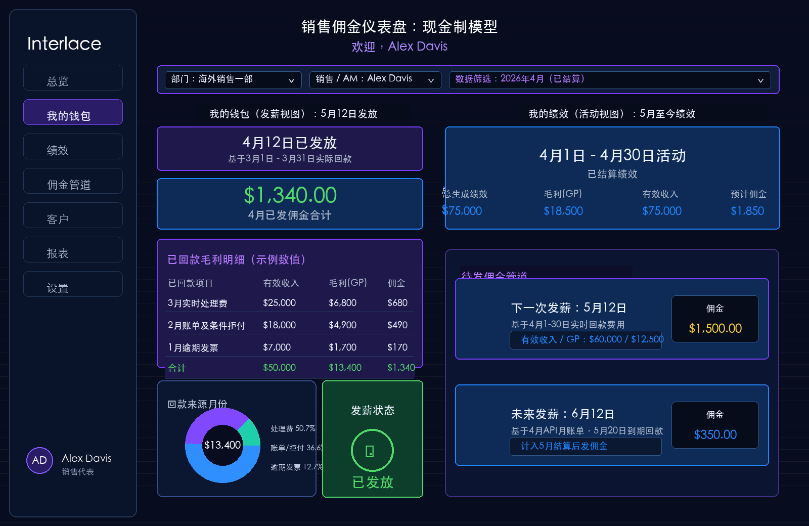

# 销售佣金发薪看板需求文档

## 摘要

本需求用于建设销售佣金发薪与绩效看板，核心目标是解决现金制佣金模型下的时间错位问题：销售活动发生月份、客户回款月份、页面可见快照时间、实际发薪日期并不完全一致。

看板需要明确区分两类视角：

- **佣金发薪快照**：回答“本次 12 号发多少钱、基于哪个结算月、怎么算出来”。
- **销售绩效明细**：回答“销售在某个活动月份创造了多少收入、毛利和预计佣金”。

页面命名和交互必须避免使用“某月佣金”这类模糊表达，统一使用“结算月份”“快照生成时间”“发薪日期”“活动月份”“回款月份”等明确口径。

## 1. 背景与问题

销售佣金采用现金制或接近现金制的计算方式时，会天然存在时间错位：

- 销售在某个月产生客户活动和产品收入。
- 客户可能在下一个月或更晚才实际付款。
- 系统每月固定日期跑数并生成可展示快照。
- 公司每月固定日期发薪。

例如：

```text
2026年6月结算数据
-> 2026年7月8日跑数并固化快照
-> 2026年7月12日发薪
```

因此，页面不能简单写“7月佣金”或“6月佣金”。这会导致销售无法判断该金额到底指：

- 6月创造的绩效；
- 6月实际回款；
- 7月12日发放的工资；
- 7月页面里可见的快照。

## 2. 核心业务规则

### 2.1 发薪日期

发薪日期固定为每月 **12号**。

每个发薪批次对应上一个已结算数据月份。例如：

| 结算月份 | 快照生成日期 | 发薪日期 |
|---|---|---|
| 2026年6月 | 2026年7月8日 | 2026年7月12日 |
| 2026年7月 | 2026年8月8日 | 2026年8月12日 |
| 2026年8月 | 2026年9月8日 | 2026年9月12日 |

### 2.2 数据起始月份

系统查询数据从 **2026年6月** 开始。

历史事件可以在底层记录，但前后端均需要加限制，不对用户展示 2026年6月以前的可查询数据。

### 2.3 快照机制

暂定每月 **8号** 运行代码并入库。

每月 8号需要保存一份页面可展示数据快照。快照生成后，对应结算月份的数据不再变动，保证用户回看历史页面时看到的结果一致。

快照至少需要记录：

- 结算月份；
- 快照生成时间；
- 发薪日期；
- 查看对象；
- 数据权限范围；
- 汇总指标；
- 发薪来源明细；
- 佣金计算结果；
- 页面展示状态。

### 2.4 页面展示状态

建议按结算月份状态展示：

| 状态 | 含义 | 页面表现 |
|---|---|---|
| 未开放 | 早于 2026年6月，或无权限查看 | 不允许查询 |
| 待结算 | 当前月份尚未到 8号快照日 | 可按产品决策选择是否展示预测，默认不进入发薪快照页 |
| 已结算 | 8号快照已生成 | 可展示发薪快照 |
| 已发放 | 12号发薪完成 | 快照继续保留，状态更新为已发放 |

## 3. 角色与权限

### 3.1 页面可见角色

以下角色可访问销售佣金看板：

- 销售；
- AM；
- 销售主管；
- 超级管理员。

AM 在本需求中视为一种销售角色，不单独设计一套页面。

### 3.2 数据权限

| 角色 | 数据范围 | 顶部筛选 |
|---|---|---|
| 销售 | 仅自己 | 结算月份 |
| AM | 仅自己 | 结算月份 |
| 销售主管 | 自己及下属销售 / AM | 查看对象、结算月份 |
| 超级管理员 | 部门及部门下所有销售 / AM | 部门、查看对象、结算月份 |

### 3.3 UI 权限变化

不同角色进入页面时，页面标题和筛选器需要动态变化：

| 角色 | 页面标题 | 筛选器 |
|---|---|---|
| 销售 / AM | 我的佣金发薪 | 结算月份 |
| 销售主管 | 佣金发薪 | 查看对象、结算月份 |
| 超级管理员 | 佣金发薪管理 | 部门、查看对象、结算月份 |

销售和 AM 不需要看到部门和人员筛选器。

销售主管可以查看自己及下属，但页面按单个销售 / AM 展示，不做团队聚合。

超级管理员可以先选部门，再选部门下单个销售 / AM 查看，不做部门聚合。

## 4. 销售收入与佣金计算口径

### 4.1 计算链路

销售佣金的主计算链路如下：

```text
Real-time processing
= 产品收入合计

Effective Revenue
= Real-time processing - Client Rebate

Gross Profit / GP
= Effective Revenue - COGS

Commission
= Gross Profit / GP × Commission Rate
```

按产品拆分时：

```text
总佣金
= Σ（单产品可计佣毛利 × 该产品佣金率）
 + Σ（API实际收费 × API佣金率）
```

### 4.2 收入组成

| 产品 / 模块 | 收入内容 | 备注 |
|---|---|---|
| 量子卡 | 卡交易相关收入、充值手续费、虚拟卡或实体卡卡费、卡活跃月费等 | 充值手续费需按 consumption amount 拆到各渠道；排除实体卡邮寄费、月账单 |
| 全球账户 | 入金、付款、汇差收入 | 可按客户、销售维度拆分 |
| 加密账户 | 承兑收入 | 海外销售团队适用 |
| 粒子理财 / Treasury | 理财相关收入 | 海外销售团队适用 |
| API 费用 | 一次性 API 费、月度 API 费、月结手续费等 | API 费用按实际收费及对应费率计佣 |
| Regular billing & conditional declined fees | 当月账单金额 | 排除低消、KYC 手续费 |
| Past due Invoice | 历史月账单在当前结算月实际收到的金额 | 按当前结算月实际回款拆分 |

### 4.3 常规产品佣金率

适用范围：

- 销售一部；
- 销售二部；
- 海外销售一部。

| 活跃天数 | 佣金率 |
|---|---:|
| 0 - 180 天 | 12% |
| 181 - 365 天 | 6% |
| 366 - 1095 天 | 3.6% |

活跃天数计算：

```text
活跃天数 = 下个月第一天 - 产品激活时间
```

不同产品使用各自的激活时间：

- 量子卡：客户量子卡激活时间；
- 加密账户：客户加密账户激活时间；
- 全球账户：客户全球账户激活时间；
- 粒子理财：粒子理财激活时间；
- API 费用：API 上线时间。

### 4.4 粒子理财佣金率

| 活跃天数 | 佣金率 |
|---|---:|
| 0 - 180 天 | 20% |
| 181 - 365 天 | 6% |
| 366 - 1095 天 | 3.6% |

### 4.5 API 费用佣金率

| API 费用类型 | 佣金基础 | 0 - 180 天 | 181 - 365 天 | 366 - 1095 天 |
|---|---|---:|---:|---:|
| API 一次性费用 | 实际收费 | 15% | 15% | 15% |
| API 月费 | 实际收费 | 10% | 10% | 0% |

API 一次性费用包括：

- 一次性合规费；
- 接入费；
- 卡面设计费；
- 白标系统部署费。

API 月费包括：

- 技术服务费；
- 月度 API 费用。

### 4.6 海外销售二部特殊规则

海外销售二部佣金按直邀关系计算：

```text
佣金 = GP × Rate
```

其中：

| 客户类型 | Rate |
|---|---:|
| 直邀客户 | 20% |
| 非直邀客户 | 10% |

直邀客户判断：

```text
客户邀请码 = 销售邀请码
```

非直邀客户判断：

```text
客户邀请码 != 销售邀请码
或客户邀请码为空
或其他不满足一致条件的情况
```

特殊处理：

```text
客户 id = '0aa5962b-cecd-43d1-974e-ac181f1403e9'
且销售 id = '1ca4e51c-b57a-497d-a5e4-166d29ac2709'
时，按直邀客户计算。
```

### 4.7 负毛利处理

不同部门负毛利处理规则不同：

| 部门 | 处理规则 |
|---|---|
| 销售一部、销售二部、海外销售一部 | 最后当月总计算出来为负则置 0；单客户不影响其他客户 |
| 海外销售二部 | 单客户算出来是多少就是多少，客户之间可以互相影响 |

量子卡模块如果按渠道拆分后为负，需要按渠道置 0，单客户不影响其他客户。

### 4.8 特殊成本处理

#### 实体卡制卡费毛利

适用：

- 销售一部；
- 销售二部。

公式：

```text
QI卡制卡费毛利 = (实际收到的制卡费 - 4) × 0.15
```

其他部门毛利不计算实体卡部分。

#### 海外销售一部加密承兑成本

当 fee > 0 时：

```text
加密承兑成本 = original_amount × usd_rate × 0.09%
```

#### 海外销售二部加密承兑成本

```text
加密承兑成本 = original_amount × usd_rate × 0.09%
```

## 5. 页面结构

本需求只有 **一个销售佣金页面**，不是三个独立页面。

页面的核心逻辑是：不同角色进入同一个页面，通过数据权限和筛选器看到不同销售人员的数据。

```text
销售 / AM：默认看自己
销售主管：可筛选自己及下属销售 / AM
超级管理员：可筛选部门及部门下销售 / AM
```

页面不做团队聚合，不展示团队汇总。主管和超级管理员看到的是某个具体销售 / AM 的佣金发薪快照，只是他们拥有更多可筛选对象。

### 5.1 单页面定位

该页面回答：

```text
本次 12 号发多少钱？
基于哪个结算月份？
快照什么时候生成？
金额由哪些来源组成？
```

该页面以“佣金发薪快照”为主，不混入团队汇总看板，也不混入当前自然月绩效详情，避免混淆。

#### 页面顶部

销售 / AM 视角：

```text
页面标题：我的佣金发薪
筛选器：结算月份
查看对象：系统默认当前登录人，不展示筛选器
```

销售主管视角：

```text
页面标题：佣金发薪
筛选器：查看对象、结算月份
查看对象范围：自己及下属销售 / AM
```

超级管理员视角：

```text
页面标题：佣金发薪管理
筛选器：部门、查看对象、结算月份
查看对象范围：部门下销售 / AM
```

#### 关键时间信息

页面需要显式展示：

```text
结算月份：2026年6月
快照生成：2026年7月8日
发薪日期：2026年7月12日
```

推荐展示为三段式时间链路：

```text
6月数据结算 -> 7月8日快照固化 -> 7月12日发薪
```

#### 核心指标卡

建议展示：

| 指标 | 说明 |
|---|---|
| 本次发薪佣金 | 该发薪批次最终发放金额 |
| 有效收入 | 当前快照内可计佣有效收入 |
| 毛利 GP | 当前快照内可计佣毛利 |
| 调整 / 扣减 | 如有人工调整、扣减、补发，需要单独展示 |
| 发薪状态 | 待发放 / 已发放 |

#### 发薪来源明细

表格建议字段：

| 字段 | 说明 |
|---|---|
| 来源类型 | 处理费、账单/拒付、逾期发票、API费用等 |
| 产品模块 | 量子卡、全球账户、加密账户、粒子理财、API等 |
| 客户 | 客户名称或客户 ID |
| 活动月份 | 收入实际产生的月份 |
| 回款月份 | 实际收到款项的月份 |
| 有效收入 | Effective Revenue |
| COGS | 成本 |
| 毛利 GP | Effective Revenue - COGS |
| 佣金率 | 对应产品、部门、活跃天数后的费率 |
| 佣金金额 | 本行贡献的佣金 |
| 备注 | 特殊规则说明 |

### 5.2 页面内绩效明细

同一个页面内可以保留“绩效明细”区域，但它是当前所选销售 / AM 在当前结算月份下的明细，不是独立页面，也不是团队聚合页。

该区域回答：

```text
当前所选销售 / AM 在该结算月份下有哪些产品收入、毛利和佣金来源？
```

绩效明细需要服务于发薪解释：销售看到本次发薪金额后，可以继续看金额由哪些产品、客户、活动月份、回款月份组成。

可选筛选：

- 产品模块；
- 客户；
- 来源类型；
- 活动月份；
- 回款月份。

核心指标：

- Real-time processing；
- Effective Revenue；
- Gross Profit / GP；
- 预计佣金；
- 交易量；
- 客户数。

产品维度明细：

| 字段 | 说明 |
|---|---|
| 产品 | 量子卡、CryptoConnect、全球账户、Treasury、API等 |
| 有效收入 | 产品维度 Effective Revenue |
| 毛利 GP | 产品维度 GP |
| 佣金率 | 产品适用费率 |
| 预计佣金 | 按当前口径计算的预计佣金 |
| 交易量 | 产品业务量 |

页面需要提示：

```text
当前明细用于解释本次发薪快照。
发薪金额以每月8号固化快照及12号发薪批次为准。
```

### 5.3 角色筛选差异

主管和超级管理员不进入单独的“团队 / 管理页面”，而是在同一个页面顶部多出筛选器。

| 角色 | 查看方式 | 是否聚合 |
|---|---|---|
| 销售 / AM | 固定当前登录人 | 否 |
| 销售主管 | 从自己及下属销售 / AM 中选择一个人查看 | 否 |
| 超级管理员 | 先选部门，再选择部门下某个销售 / AM 查看 | 否 |

如后续需要团队汇总、排名、部门汇总，应作为二期管理报表需求单独设计，不纳入本期页面。

### 5.4 页面示意图

以下示意图基于原始英文图翻译，保留原页面主体布局和原始月份关系。

> 说明：顶部筛选区增加 `部门`、`销售 / AM`、`数据筛选月份`；钱包明细按原图翻译为 `3月实时处理费`、`2月账单及条件拒付`、`1月逾期发票`。



### 5.5 发薪管道说明

发薪管道用于解释同一活动月份下，不同费用类型因为回款时间不同，会进入不同发薪批次。

以原图 `2026年4月` 数据为例：

| 管道 | 数据来源 | 发薪逻辑 |
|---|---|---|
| 下一次发薪：5月12日 | 4月1日-4月30日实时回款费用 | 4月已实际回款，进入4月结算，因此5月12日发佣金 |
| 未来发薪：6月12日 | 4月 API 月账单 | 5月20日到期回款后计入5月结算，因此6月12日发佣金 |

因此，`未来发薪` 不是下一个活动月份的绩效，而是当前活动月份中账单类收入因为回款滞后，进入后续发薪批次的佣金管道。

## 6. UI 命名规则

### 6.1 禁止模糊表达

不要使用：

- 6月佣金；
- 7月佣金；
- 本月佣金；
- 待支付佣金。

这些表达无法明确区分活动月份、回款月份、结算月份和发薪日期。

### 6.2 推荐表达

| 场景 | 推荐表达 |
|---|---|
| 发薪结果 | 2026年7月12日发薪 |
| 结算数据 | 2026年6月结算数据 |
| 快照 | 2026年7月8日快照 |
| 活动绩效 | 2026年6月活动绩效 |
| 预测 | 预计进入2026年8月12日发薪 |

### 6.3 页面提示文案

佣金发薪快照页建议提示：

```text
本页展示已结算快照数据。快照生成后不会因后续数据变化而改变。
```

绩效页建议提示：

```text
本页展示活动月份绩效，不代表当月实际发薪金额。
```

## 7. 数据快照建议结构

### 7.1 快照主表

建议字段：

| 字段 | 说明 |
|---|---|
| snapshot_id | 快照 ID |
| settlement_month | 结算月份 |
| snapshot_generated_at | 快照生成时间 |
| payout_date | 发薪日期 |
| role_scope_type | 权限范围类型 |
| department_id | 部门 ID |
| sales_id | 销售 / AM ID |
| snapshot_status | 快照状态 |
| total_effective_revenue | 有效收入合计 |
| total_gp | 毛利合计 |
| total_commission | 佣金合计 |
| adjustment_amount | 调整 / 扣减金额 |
| final_payout_amount | 最终发薪金额 |
| payout_status | 发薪状态 |
| created_at | 创建时间 |
| updated_at | 更新时间 |

### 7.2 快照明细表

建议字段：

| 字段 | 说明 |
|---|---|
| snapshot_detail_id | 快照明细 ID |
| snapshot_id | 快照 ID |
| sales_id | 销售 / AM ID |
| department_id | 部门 ID |
| customer_id | 客户 ID |
| customer_name | 客户名称 |
| source_type | 来源类型 |
| product_type | 产品模块 |
| activity_month | 活动月份 |
| collection_month | 回款月份 |
| effective_revenue | 有效收入 |
| cogs | 成本 |
| gp | 毛利 |
| commission_base | 计佣基数 |
| commission_rate | 佣金率 |
| commission_amount | 佣金金额 |
| active_days | 活跃天数 |
| rule_code | 使用的规则编码 |
| remark | 备注 |

## 8. 前后端限制

### 8.1 前端限制

前端需要限制：

- 不允许选择 2026年6月以前的结算月份；
- 销售 / AM 不展示部门和人员筛选器；
- 销售主管仅展示自己及下属；
- 超级管理员可展示部门和人员筛选；
- 未生成快照的结算月份不展示正式发薪快照；
- 发薪快照页不混入当前活动月绩效详情。

### 8.2 后端限制

后端需要限制：

- 所有查询必须校验角色和数据权限；
- 不返回 2026年6月以前的展示数据；
- 不能仅依赖前端隐藏字段控制权限；
- 快照生成后，历史快照查询必须读取快照表，不重新实时计算；
- 主管和超级管理员查询时，需要基于可见人员范围校验筛选对象，不返回无权限人员数据。

## 9. 验收标准

### 9.1 时间口径验收

- 用户选择 `2026年6月` 结算月份时，页面展示 `2026年7月12日发薪`。
- 页面清楚展示 `2026年7月8日快照生成`。
- 页面不出现“7月佣金”这类模糊命名。

### 9.2 权限验收

- 销售只能看到自己的数据。
- AM 只能看到自己的数据。
- 销售主管可以看到自己和下属销售 / AM。
- 超级管理员可以按部门和人员查看。
- 无权限用户无法通过接口获取不可见人员数据。

### 9.3 快照验收

- 每月 8号生成并保存快照。
- 快照生成后，回看该结算月份页面数据不发生变化。
- 发薪状态可以从待发放更新为已发放，但金额口径不被重新计算覆盖。

### 9.4 UI 验收

- 佣金发薪快照页只解释本次 12号发薪。
- 页面内绩效明细区域解释当前发薪金额的产品、客户、活动月份和回款月份来源。
- 主管和超级管理员的筛选器随角色变化。
- 主管和超级管理员通过筛选查看单个销售 / AM，不展示团队或部门聚合。
- 页面能解释发薪金额由哪些来源组成。

## 10. 待确认事项

以下事项需要在进入详细开发方案前确认：

1. 是否允许在 8号前展示当前月份预测数据。
2. 佣金调整 / 扣减是否需要人工录入入口。
3. 发薪状态是否由财务系统回写，还是由本系统维护。
4. 销售主管的上下级关系以哪个组织架构表为准。
5. AM 是否全部使用销售同一套组织关系和激活规则。
6. 导出报表是否需要包含客户级明细。
7. 是否需要保留历史事件但不展示的审计查询入口。
